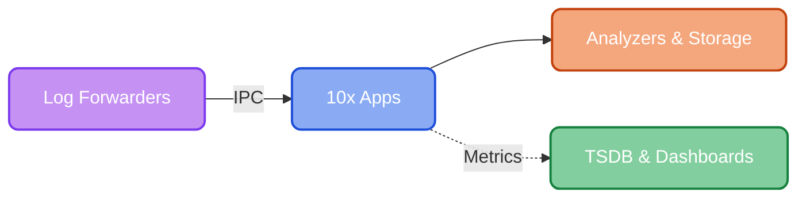

# Apps

The 10x [Engine](https://doc.log10x.com/engine/) executes built-in or custom apps without log data leaving your network.

Suggested adoption path:

:material-laptop: **Dev** — test locally on your own log files to preview savings

:material-pipe-leak: **Reporter** — identify which event types drive 80% of your cost

:material-pipe-valve: **Regulator** — filter noisy events and optionally compact them at the source

:material-cloud-arrow-right-outline: **Streamer** — store events in S3, select and stream to log analytics on-demand

## :material-pipe-leak: Reporter

Identify which event types account for the most volume and cost before events ship to your platform.

Runs as a lightweight sidecar DaemonSet (Fluent Bit + 10x engine) that tails container logs in parallel with your existing forwarder.

[Overview](https://doc.log10x.com/apps/reporter){ .md-button .md-button--primary } · [Architecture](https://doc.log10x.com/apps/reporter/#architecture) · [FAQ](https://doc.log10x.com/apps/reporter/faq/) · [Live Demo :octicons-link-external-16:](https://console.log10x.com?demo=true&step=3&apps=reporter,regulator&timeframe=year&volume=20&cost=2.50&highlight=reporter)

___

## :material-pipe-valve: Regulator

Budget policies drop noisy events before they reach your analytics platform — up to 80% reduction. Enable optimization mode (`regulatorOptimize: true`) to also losslessly compact surviving events for an additional 50-65% volume reduction.

[Overview](https://doc.log10x.com/apps/regulator){ .md-button .md-button--primary } · [Architecture](https://doc.log10x.com/apps/regulator/#architecture) · [FAQ](https://doc.log10x.com/apps/regulator/faq/) · [Live Demo :octicons-link-external-16:](https://console.log10x.com?demo=true&step=3&apps=reporter,regulator&timeframe=year&volume=20&cost=2.50&highlight=regulator)

___

## :material-cloud-arrow-right-outline: Streamer

Keep all events in S3 at ~$0.023/GB instead of paying analytics platform ingestion rates. Stream only what you need to your analytics platform on-demand — 70-80% lower analytics cost.

[Overview](https://doc.log10x.com/apps/streamer){ .md-button .md-button--primary } · [Architecture](https://doc.log10x.com/apps/streamer/#architecture) · [FAQ](https://doc.log10x.com/apps/streamer/faq/) · [Live Demo :octicons-link-external-16:](https://console.log10x.com?demo=true&step=4&apps=reporter,regulator,streamer&timeframe=year&volume=20&cost=2.50)

___

## :material-laptop: Dev

**Start here** — Preview savings on your actual log files before deploying. Supports local files, stdin, Forward protocol input, and remote analyzer APIs (Splunk, Elasticsearch, Datadog, CloudWatch).

[Overview](https://doc.log10x.com/apps/dev){ .md-button .md-button--primary } · [FAQ](https://doc.log10x.com/apps/dev/faq/) · [Live Demo :octicons-link-external-16:](https://console.log10x.com?demo=true)

___

## :material-cogs: Compiler *(optional)*

The [default library](https://doc.log10x.com/compile/pull/#default-symbols) covers 150+ industry-standard frameworks. Run the compiler for custom application code or 3rd party frameworks not covered.

[Overview](https://doc.log10x.com/apps/compiler){ .md-button .md-button--primary } · [Architecture](https://doc.log10x.com/apps/compiler/#architecture) · [FAQ](https://doc.log10x.com/apps/compiler/faq/) · [Deploy](https://doc.log10x.com/apps/compiler/deploy/)
