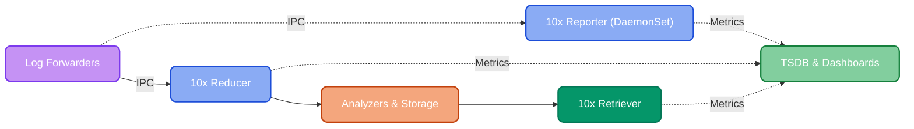

# Apps

Start with the [**MCP Server**](https://doc.log10x.com/manage/mcp-server/) — install it into Claude Desktop / Code / Cursor and it'll guide you through installing each of the apps below based on k8s discovery of your environment. You can also install and run these apps manually; MCP just makes it faster and safer by knowing your stack.

Suggested adoption path (guided by the [MCP Server](https://doc.log10x.com/manage/mcp-server/)):

:material-laptop: **Dev** — preview savings on your own log files (MCP can fetch and run it for you)

:material-chart-bar: **Reporter** — pinpoint the event types driving 80% of cost (MCP generates the Helm values)

:material-pipe-valve: **Reducer** — filter noisy events and losslessly compact survivors (MCP proposes filter configs)

:material-cloud-arrow-right-outline: **Retriever** — store events in S3, stream on-demand (MCP recommends the setup)

## :material-laptop: Dev

Preview savings on your actual log files before deploying. Installs locally or via Docker — or ask MCP to fetch and invoke it for you.

___

## :material-chart-bar: Reporter

See which event types drive 80% of your analytics platform cost, observed **pre-SIEM** from the forwarder stream. Deploys as a **DaemonSet** alongside your forwarder — not as a sidecar inside it. Not in the critical log path.

**MCP can generate tailored Helm values** — ask "set me up with the Reporter" after installing the MCP Server.

___

## :material-pipe-valve: Reducer

Execution arm. **Two modes**, one app:

- **Filter** (lossy): drop events matching a rule — up to 80% volume reduction. Safe defaults are deny; explicit allow required.
- **Compact** (lossless): replace events with a compact wire-form that the downstream SIEM plugin expands at query time. 50–80% reduction (64% on K8s OTel logs), no dashboard/query changes. Requires the expand plugin installed in [Splunk](https://doc.log10x.com/apps/reducer/splunk/) or [Elasticsearch](https://doc.log10x.com/apps/reducer/elasticsearch/).

**MCP can propose filter configs per pattern** based on the Reporter's cost attribution.

___

## :material-cloud-arrow-right-outline: Retriever

Keep all events in S3 at ~$0.023/GB instead of paying analytics platform ingestion rates. Stream only what you need to your analytics platform on-demand — 70-80% lower analytics cost.

**MCP can recommend the Terraform + Helm pair** for your environment.

___

## :material-link-variant: Related

- **Install the orchestrator:** [MCP Server](https://doc.log10x.com/manage/mcp-server/) — starts the adoption journey, then guides you through each app above
- **Generating custom symbols?** See [Compile](https://doc.log10x.com/compile/) — the AOT symbol generation pipeline. Optional.
