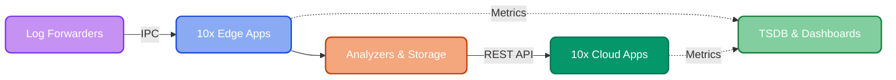

# Apps

The 10x [Engine](https://doc.log10x.com/engine/) executes built-in or custom apps without log data leaving your network.

Suggested adoption path:

:material-laptop: **Dev** — test locally on your own log files to preview savings

:material-chart-bar: **Cloud Reporter** — pinpoint the event types driving 80% of analytics platforms cost

:material-pipe-wrench: **Edge Apps** — filter and losslessly compact events at the source

:material-cloud-arrow-right-outline: **Storage Streamer** — store events in S3, select and stream to log analytics on-demand

## :material-laptop: Dev

**Start here** — Preview savings on your actual log files before deploying. Installs locally or via Docker.

[Overview](https://doc.log10x.com/apps/dev){ .md-button .md-button--primary } · [FAQ](https://doc.log10x.com/apps/dev/faq/) · [Live Demo :octicons-link-external-16:](https://console.log10x.com?demo=true)

___

## :material-chart-bar: Cloud Reporter

See which event types drive 80% of your analytics platform cost.

Agentless — samples Splunk, Elasticsearch, Datadog, or CloudWatch via REST API.

[Overview](https://doc.log10x.com/apps/cloud/reporter){ .md-button .md-button--primary } · [Architecture](https://doc.log10x.com/apps/cloud/reporter/#architecture) · [FAQ](https://doc.log10x.com/apps/cloud/reporter/faq/) · [Live Demo :octicons-link-external-16:](https://console.log10x.com?demo=true&step=5&apps=reporter,regulator,optimizer,streamer&timeframe=month&volume=20&cost=2.50)

___

## :material-pipe-leak: Edge Reporter

Identify which event types account for the most volume and cost before events ship to your platform.

Runs as a sidecar alongside Fluentd, Fluent Bit, Filebeat, or OTel.

[Overview](https://doc.log10x.com/apps/edge/reporter){ .md-button .md-button--primary } · [Architecture](https://doc.log10x.com/apps/edge/reporter/#architecture) · [FAQ](https://doc.log10x.com/apps/edge/reporter/faq/) · [Live Demo :octicons-link-external-16:](https://console.log10x.com?demo=true&step=3&apps=reporter-edge,regulator,optimizer&timeframe=month&volume=20&cost=2.50&highlight=reporter)

___

## :material-pipe-valve: Edge Regulator

Budget policies drop noisy events before they reach your analytics platform — up to 80% reduction.

[Overview](https://doc.log10x.com/apps/edge/regulator){ .md-button .md-button--primary } · [Architecture](https://doc.log10x.com/apps/edge/regulator/#architecture) · [FAQ](https://doc.log10x.com/apps/edge/regulator/faq/) · [Live Demo :octicons-link-external-16:](https://console.log10x.com?demo=true&step=3&apps=reporter-edge,regulator,optimizer&timeframe=month&volume=20&cost=2.50&highlight=regulator)

___

## :material-pipe-wrench: Edge Optimizer

Losslessly compact events 50-80% before shipping (64% on K8s OTel logs). No changes to existing dashboards or queries.

[Overview](https://doc.log10x.com/apps/edge/optimizer){ .md-button .md-button--primary } · [Architecture](https://doc.log10x.com/apps/edge/optimizer/#architecture) · [FAQ](https://doc.log10x.com/apps/edge/optimizer/faq/) · [Live Demo :octicons-link-external-16:](https://console.log10x.com?demo=true&step=3&apps=reporter-edge,regulator,optimizer&timeframe=month&volume=20&cost=2.50&highlight=optimizer)

___

## :material-cloud-arrow-right-outline: Storage Streamer

Keep all events in S3 at ~$0.023/GB instead of paying analytics platform ingestion rates. Stream only what you need to your analytics platform on-demand — 70-80% lower analytics cost.

[Overview](https://doc.log10x.com/apps/cloud/streamer){ .md-button .md-button--primary } · [Architecture](https://doc.log10x.com/apps/cloud/streamer/#architecture) · [FAQ](https://doc.log10x.com/apps/cloud/streamer/faq/) · [Live Demo :octicons-link-external-16:](https://console.log10x.com?demo=true&step=4&apps=reporter,regulator,optimizer,streamer&timeframe=month&volume=20&cost=2.50)

___

## :material-cogs: Compiler *(optional)*

The [default library](https://doc.log10x.com/compile/pull/#default-symbols) covers 150+ industry-standard frameworks. Run the compiler for custom application code or 3rd party frameworks not covered.

[Overview](https://doc.log10x.com/apps/compiler){ .md-button .md-button--primary } · [Architecture](https://doc.log10x.com/apps/compiler/#architecture) · [FAQ](https://doc.log10x.com/apps/compiler/faq/) · [Deploy](https://doc.log10x.com/apps/compiler/deploy/)
