Edge apps run within a single [10x Engine sidecar](https://doc.log10x.com/engine/launcher/sidecar/) process alongside your log forwarder. The forwarder pipes events to the engine (via stdin/socket), the engine processes them through one or more apps, and returns them to the forwarder for shipping to output destinations.

```mermaid
graph LR
    L["📄 Logs"] --> A["📥 Forwarder<br/>Fluentd · Filebeat · OTel"]
    A --> B["📊 Reporter<br/>Cost Analytics"]
    B --> C["🚫 Regulator<br/>Filter Noise"]
    C --> D["🗜️ Optimizer<br/>10x-Encode"]
    D --> E["📤 Forwarder<br/>Ships to Output"]

    classDef logs fill:#374151,stroke:#1f2937,color:#ffffff,stroke-width:2px,rx:8,ry:8
    classDef forwarder fill:#64748b,stroke:#475569,color:#ffffff,stroke-width:2px,rx:8,ry:8
    classDef reporter fill:#06b6d4,stroke:#0891b2,color:#ffffff,stroke-width:2px,rx:8,ry:8
    classDef regulator fill:#f59e0b,stroke:#d97706,color:#ffffff,stroke-width:2px,rx:8,ry:8
    classDef optimizer fill:#10b981,stroke:#059669,color:#ffffff,stroke-width:2px,rx:8,ry:8

    class L logs
    class A forwarder
    class B reporter
    class C regulator
    class D optimizer
    class E forwarder
```

Edge apps build progressively—each tier includes all capabilities of the previous:

- 📥 **[Forwarder](https://doc.log10x.com/run/input/forwarder/)** — Log shipper pipes events to the 10x sidecar (stdin/socket), receives processed events back, and ships to output
- 📊 **[Reporter](reporter/)** — Analyze event costs in real-time; events return unchanged (read-only)
- 🚫 **[Regulator](regulator/)** — + Rate-based filtering drops noisy telemetry before returning
- 🗜️ **[Optimizer](optimizer/)** — + Losslessly compacts events 50-80% before returning

