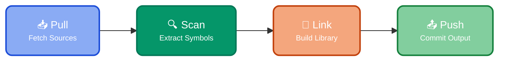

The `AOT compile` pipeline produces [symbol library](https://doc.log10x.com/compile/link/#symbol-library) files that enable the [run](https://doc.log10x.com/run/) stream processor pipeline to transform input events into typed [TenXObjects](https://doc.log10x.com/api/js/#TenXObject). To launch this pipeline use the [compiler app](https://doc.log10x.com/apps/compiler/).

The 10x Engine's [default library](https://doc.log10x.com/compile/pull/#default-symbols) covers 150+ frameworks. Running the compiler on your own environment's repos is **optional** and enables the runtime to increase its level of efficiency in aggregating and reducing event volume.

## :material-cog-transfer-outline: Workflow

This pipeline chains together the following key [units](https://doc.log10x.com/engine/pipeline/#units):

-   :material-source-pull:{ .lg .middle } __Pull__
  
    ---
  
    [Pull](https://doc.log10x.com/compile/pull/) input files from local disk and remote repos as well as existing symbol files to reuse.

-   :material-file-code-outline:{ .lg .middle } __Scan__
  
    ---
  
    [Scan](https://doc.log10x.com/compile/scan/) input files in an array of programming languages, text, and binary formats to produce symbol unit files.

-   :material-merge:{ .lg .middle } __Link__
  
    ---
  
    [Link](https://doc.log10x.com/compile/link/) symbol unit files into a symbol library artifact for runtime use.

-   :material-source-commit:{ .lg .middle } __Push__
  
    ---
  
    [Push](https://doc.log10x.com/compile/push/) output files to GitHub for use by subsequent _run_ and _compile_ pipelines.

### :material-source-pull: Pull

[Pull](https://doc.log10x.com/compile/pull/) existing symbol units, source code, and binary input files from [GitHub ](https://doc.log10x.com/compile/pull/github/),
[Helm](https://doc.log10x.com/compile/pull/helm/), [Docker](https://doc.log10x.com/compile/pull/docker/) and [Artifactory](https://doc.log10x.com/compile/pull/artifactory/) repos.
Pulling symbol units produced by previous invocations of the compile pipeline enables reuse to
avoid parsing previously processed source code/binary input files whose checksum has not changed. 

### :material-file-code-outline: Scan

[Scan](https://doc.log10x.com/compile/scan/) input files to extract [symbol](https://doc.log10x.com/run/transform/structure/#symbols) tokens representing low-cardinality values
shared across instances of a logical app/infra event originating from a source code location/binary executable. 
They are analogous to compiled artifacts (e.g., .jar, .so) and are GitHub/Artifactory committable. 
  
This phase utilizes a configurable set of [scanner](https://doc.log10x.com/compile/scan/) modules to parse input files in various formats.

### :material-merge: Link

[Link](https://doc.log10x.com/compile/link/) symbol units into a single output Symbol library file to generate shared [TenXTemplate](https://doc.log10x.com/run/template/#structure) schemas at runtime for input events. 

This phase is analogous to a [linker](https://en.wikipedia.org/wiki/Linker_(computing)) that 
takes one or more object files (i.e., symbol units) and combines them into a single library file.

### :material-source-commit: Push

[Push](https://doc.log10x.com/compile/push/) output symbol files to a target GitHub repo for reuse
by subsequent compile invocations and for cloud/edge apps at runtime from a central configuration repository.
