The `run` stream processor pipeline executes [apps](https://doc.log10x.com/apps/) that report on, regulate, and optimize events at the edge and in the cloud. To run this pipeline locally use the [dev](https://doc.log10x.com/apps/dev/) app.

## :material-cog-transfer-outline: Workflow

This pipeline chains together the following [units](https://doc.log10x.com/engine/pipeline/#units):

```mermaid
graph LR
    A["<div style='font-size: 16px;'>📚 Symbols</div><div style='font-size: 14px;'>Load Libraries</div>"] --> B["<div style='font-size: 16px;'>📥 Inputs</div><div style='font-size: 14px;'>Read Events</div>"]
    B --> C["<div style='font-size: 16px;'>🦋 Transform</div><div style='font-size: 14px;'>→ TenXObjects</div>"]
    C --> D["<div style='font-size: 16px;'>∑ Aggregate</div><div style='font-size: 14px;'>→ TenXSummaries</div>"]
    D --> E["<div style='font-size: 16px;'>⚡ Regulate</div><div style='font-size: 14px;'>Apply Policies</div>"]
    E --> F["<div style='font-size: 16px;'>📤 Output</div><div style='font-size: 14px;'>Send Results</div>"]
    
    classDef symbols fill:#9333ea88,stroke:#7c3aed,color:#ffffff,stroke-width:2px,rx:8,ry:8
    classDef inputs fill:#2563eb88,stroke:#1d4ed8,color:#ffffff,stroke-width:2px,rx:8,ry:8
    classDef transform fill:#059669,stroke:#047857,color:#ffffff,stroke-width:2px,rx:8,ry:8
    classDef aggregate fill:#ea580c88,stroke:#c2410c,color:#ffffff,stroke-width:2px,rx:8,ry:8
    classDef regulate fill:#dc262688,stroke:#b91c1c,color:#ffffff,stroke-width:2px,rx:8,ry:8
    classDef output fill:#16a34a88,stroke:#15803d,color:#ffffff,stroke-width:2px,rx:8,ry:8
    
    class A symbols
    class B inputs
    class C transform
    class D aggregate
    class E regulate
    class F output
```

-   :material-library-outline:{ .lg .middle } __Symbols__
  
    ---
  
    Load symbol library files produced by the compile pipeline.
  
    [:octicons-arrow-right-24: Learn more](https://doc.log10x.com/run/symbol/)

-   :material-set-merge:{ .lg .middle } __Inputs__
  
    ---
  
    Input log/trace events from log forwarders, analyzers, and object storage.
  
    [:octicons-arrow-right-24: Learn more](https://doc.log10x.com/run/input/)

-   :material-butterfly-outline:{ .lg .middle } __Transform__
  
    ---
  
    Transform input events into well-defined, typed TenXObjects.
  
    [:octicons-arrow-right-24: Learn more](https://doc.log10x.com/run/transform/)

-   :material-sigma:{ .lg .middle } __Aggregate__
  
    ---
  
    Aggregate TenXObjects into summaries to publish to metrics outputs.
  
    [:octicons-arrow-right-24: Learn more](https://doc.log10x.com/run/aggregate/)

-   :material-pipe-valve:{ .lg .middle } __Regulate__
  
    ---
  
    Regulate which TenXObjects to output based on local and environment-wide policies
  
    [:octicons-arrow-right-24: Learn more](https://doc.log10x.com/run/output/regulate/)

-   :material-set-split:{ .lg .middle } __Output__
  
    ---
  
    Output TenXObject and TenXSummaries to event/metric output destinations.
  
    [:octicons-arrow-right-24: Learn more](https://doc.log10x.com/run/output/)

