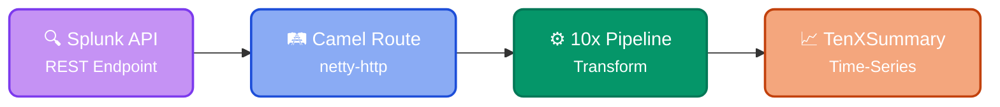

Configures a Cloud/On-premises Splunk input from which to read events to transform into typed [TenXObjects](https://doc.log10x.com/api/js/#TenXObject).

Instances of this [module](https://doc.log10x.com/engine/module/) define a connection to a hosted/on-premises
Splunk cluster from which events to retrieve, as well as the querying logic used
such as chronological direction, start values, time ranges, and page size
of each API request sent.

Splunk inputs commonly run within scheduled jobs (e.g., k8s CronJob)
to retrieve a recent sample amount of events (e.g., 200MB in the last 10min) to [transform](https://doc.log10x.com/run/transform/) into TenXObjects as part of the [Cloud Reporter](https://doc.log10x.com/apps/cloud/reporter/) app.

## Architecture

The Splunk input module uses [Apache Camel](https://camel.apache.org/) to poll the Splunk REST API:

<div style="text-align: center;">



</div>

🔍 **Splunk API**
:   Polls Splunk's [REST API](https://docs.splunk.com/Documentation/Splunk/latest/RESTREF/RESTsearch) at regular intervals to fetch search results

🛤️ **Camel Route**
:   Submits search jobs and retrieves results in configurable page sizes

⚙️ **10x Pipeline**
:   [Transforms](https://doc.log10x.com/run/transform/) raw events into structured TenXObjects with [symbol](https://doc.log10x.com/compile/scan/) enrichment

📈 **TenXSummary**
:   Outputs aggregated metrics to [time-series](https://doc.log10x.com/run/output/metric/) outputs

=== ":material-account-key-outline: Prerequisites"

    ??? tenx-user "Splunk User Permissions"

        The Splunk user account needs the following capabilities:

        - `search` - Execute searches
        - `rest_apps_management` - Access REST API
        - `list_inputs_edit` (optional) - For advanced input management

    ??? tenx-cloud "Network Requirements"

        - Outbound HTTPS access to Splunk management port (default: 8089)
        - For Splunk Cloud: Ensure your IP is allowlisted

=== ":material-wrench-outline: Troubleshooting"

    ??? tenx-troubleshoot "SSL Certificate Errors"

        **Error:** `PKIX path building failed` or `unable to find valid certification path`

        **Solution:** For self-signed certificates in dev/test environments:

        ```yaml
        splunk:
          - name: DevSplunk
            verifySSL: false
        ```

        For production, import the Splunk CA certificate into your Java truststore.

    ??? tenx-troubleshoot "Authentication Failures"

        **Error:** `401 Unauthorized` or `Authentication failed`

        **Checklist:**

        1. Verify username/password are correct
        2. Check user has required Splunk capabilities
        3. Ensure credentials are properly passed via environment variables
        4. Test credentials with curl:
           ```bash
           curl -k -u username:password https://splunk-host:8089/services/server/info
           ```

    ??? tenx-troubleshoot "No Results Returned"

        **Symptoms:** Pipeline starts but no events are processed

        **Checklist:**

        1. Verify the search query returns results in Splunk UI
        2. Check `totalEventsLimit` isn't set too low
        3. Ensure `enabled: true` is set (or not explicitly set to false)
        4. Review query time range matches available data

    ??? tenx-troubleshoot "Connection Timeouts"

        **Error:** `Connection timed out` or `Read timed out`

        **Solutions:**

        - Check network connectivity to Splunk host
        - Verify firewall rules allow port 8089
        - For Splunk Cloud, ensure IP allowlisting
        - Increase `totalDuration` for slow networks

    ??? tenx-troubleshoot "Rate Limiting"

        **Symptoms:** Intermittent failures, `429 Too Many Requests`

        **Solution:** Increase polling interval:

        ```yaml
        splunk:
          - name: RateLimited
            queryInterval: $=parseDuration("10s")
        ```

=== ":material-shield-lock-outline: Security"

    ??? tenx-auth "Credential Management"

        Never hardcode credentials in configuration files:

        ```yaml
        # Good - uses environment variables
        username: $=TenXEnv.get("SPLUNK_USERNAME")
        password: $=TenXEnv.get("SPLUNK_PASSWORD")

        # Bad - hardcoded credentials
        username: admin
        password: secret123
        ```

    ??? tenx-keyfiles "SSL/TLS"

        - Always use `protocol: https` (default)
        - Only disable `verifySSL` in development environments
        - For production with custom CAs, import certificates to Java truststore

    ??? tenx-config "Network Security"

        - Use VPN or private networking when possible
        - Restrict Splunk API access to known IP ranges
        - Consider using Splunk tokens instead of username/password where supported

