Datadog Agent inputs use a **file relay pattern** with [Fluent Bit + 10x](../fluentbit/) to report, regulate, and optimize events _before_ the Datadog Agent ships them to Datadog. This approach keeps the Datadog Agent as the forwarder (handling buffering, retries, metadata enrichment) while 10x processes events inline.

## Architecture

```mermaid
graph LR
    A["<div style='font-size: 14px;'>📝 App Logs</div><div style='font-size: 10px;'>Folder A</div>"] --> B["<div style='font-size: 14px;'>🔧 Fluent Bit</div><div style='font-size: 10px;'>+ 10x sidecar</div>"]
    B --> C["<div style='font-size: 14px;'>📂 Processed</div><div style='font-size: 10px;'>Folder B</div>"]
    C --> D["<div style='font-size: 14px;'>📤 DD Agent</div><div style='font-size: 10px;'>monitors B</div>"]
    D --> E["<div style='font-size: 14px;'>🐶 Datadog</div><div style='font-size: 10px;'>Intake API</div>"]

    classDef logs fill:#2563eb,stroke:#1d4ed8,color:#ffffff,stroke-width:2px,rx:8,ry:8
    classDef fluentbit fill:#ea580c,stroke:#c2410c,color:#ffffff,stroke-width:2px,rx:8,ry:8
    classDef processed fill:#7c3aed,stroke:#6d28d9,color:#ffffff,stroke-width:2px,rx:8,ry:8
    classDef agent fill:#632CA6,stroke:#4F2684,color:#ffffff,stroke-width:2px,rx:8,ry:8
    classDef datadog fill:#16a34a,stroke:#15803d,color:#ffffff,stroke-width:2px,rx:8,ry:8

    class A logs
    class B fluentbit
    class C processed
    class D agent
    class E datadog
```

### Data Flow

- 📝 **App Logs (Folder A)** - Application writes logs to original location
- 🔧 **Fluent Bit + 10x** - Reads from Folder A, processes events (report/regulate/optimize)
- 📂 **Processed Logs (Folder B)** - 10x writes processed output to new location
- 📤 **Datadog Agent** - Monitors Folder B with standard `logs_config`, handles forwarding
- 🐶 **Datadog** - Receives processed events via standard Intake API

### Why File Relay?

| Benefit | Description |
|---------|-------------|
| 🔧 **Standard Agent** | No custom plugins, no protocol changes |
| 🐶 **Agent Handles Enrichment** | Tagging, host metadata, and service correlation stay with the Agent |
| 🔒 **Agent Handles Reliability** | Buffering, retries, and backpressure stay with the Agent |
| ✅ **Proven Pattern** | Uses existing [Fluent Bit + 10x](../fluentbit/) integration |

### When to Use

This module is recommended for **VM/traditional infrastructure** where the Datadog Agent is already deployed for metrics, APM, and logs. For Kubernetes environments, consider using [Fluent Bit](../fluentbit/) or [OTel Collector](../otel-collector/) as the log forwarder and sending to Datadog via their HTTP API output plugin.

??? tenx-keyfiles "Key Files"

    This module uses the [Fluent Bit forwarder module](../fluentbit/) under the hood:

    | File | Purpose |
    |------|---------|
    | [`fluentbit/conf/tenx-optimize.conf`](https://github.com/log-10x/modules/blob/main/pipelines/run/modules/input/forwarder/fluentbit/conf/tenx-optimize.conf){target="_blank"} | Fluent Bit config for optimize mode |
    | [`fluentbit/conf/tenx-regulate.conf`](https://github.com/log-10x/modules/blob/main/pipelines/run/modules/input/forwarder/fluentbit/conf/tenx-regulate.conf){target="_blank"} | Fluent Bit config for regulate mode |
    | [`fluentbit/conf/tenx-report.conf`](https://github.com/log-10x/modules/blob/main/pipelines/run/modules/input/forwarder/fluentbit/conf/tenx-report.conf){target="_blank"} | Fluent Bit config for report mode |

For setup instructions, see the mode-specific documentation: [Report](report/), [Regulate](regulate/), [Optimize](optimize/).
