Read events from application logs to transform into typed [TenXObjects](https://doc.log10x.com/api/js/#TenXObject) and filter using local/centralized [regulator](https://doc.log10x.com/run/output/regulate) policies, before the Datadog Agent ships them to Datadog. This module is a component of the [Edge Regulator](https://doc.log10x.com/apps/edge/regulator/) app.

## Architecture

```mermaid
graph LR
    A["<div style='font-size: 14px;'>📝 App Logs</div><div style='font-size: 10px;'>Folder A</div>"] --> B["<div style='font-size: 14px;'>🔧 Fluent Bit</div><div style='font-size: 10px;'>tail input</div>"]
    B --> C["<div style='font-size: 14px;'>⚡ 10x Regulator</div><div style='font-size: 10px;'>filter policy</div>"]
    C --> D["<div style='font-size: 14px;'>📂 Processed</div><div style='font-size: 10px;'>Folder B</div>"]
    D --> E["<div style='font-size: 14px;'>📤 DD Agent</div><div style='font-size: 10px;'>monitors B</div>"]
    E --> F["<div style='font-size: 14px;'>🐶 Datadog</div><div style='font-size: 10px;'>Intake API</div>"]

    classDef logs fill:#2563eb,stroke:#1d4ed8,color:#ffffff,stroke-width:2px,rx:8,ry:8
    classDef fluentbit fill:#ea580c,stroke:#c2410c,color:#ffffff,stroke-width:2px,rx:8,ry:8
    classDef engine fill:#7c3aed,stroke:#6d28d9,color:#ffffff,stroke-width:2px,rx:8,ry:8
    classDef processed fill:#0891b2,stroke:#0e7490,color:#ffffff,stroke-width:2px,rx:8,ry:8
    classDef agent fill:#632CA6,stroke:#4F2684,color:#ffffff,stroke-width:2px,rx:8,ry:8
    classDef datadog fill:#16a34a,stroke:#15803d,color:#ffffff,stroke-width:2px,rx:8,ry:8

    class A logs
    class B fluentbit
    class C engine
    class D processed
    class E agent
    class F datadog
```

<div style="text-align: center;">



</div>

### Data Flow

- 📝 **App Logs (Folder A)** - Application writes ALL logs to original location
- 🔧 **Fluent Bit** - Reads from Folder A, passes events to 10x sidecar
- ⚡ **10x Regulator** - Applies rate/policy-based filtering, drops noisy events
- 📂 **Processed (Folder B)** - Only FILTERED events written to new location
- 📤 **DD Agent** - Monitors Folder B, forwards reduced volume to Datadog
- 🐶 **Datadog** - Receives filtered events (reduced volume)

### Key Characteristics

| Feature | Description |
|---------|-------------|
| 🚦 **Rate Limiting** | Filter events based on per-template rate limits |
| 📋 **Policy-Based** | Apply local or centralized filtering policies |
| 💰 **Cost Control** | Reduce Datadog ingestion volume and costs |
| 📤 **Agent Handles Delivery** | Datadog Agent manages buffering, retries, metadata enrichment |

### :material-swap-horizontal-circle-outline: File Relay Pattern

This [module](https://doc.log10x.com/engine/module/) configures a file relay where Fluent Bit reads application logs, passes them through a 10x [sidecar process](https://doc.log10x.com/engine/launcher/sidecar) for regulation, then writes only the filtered events to a folder that the Datadog Agent monitors. Noisy/repetitive events are dropped before reaching Datadog.

### :material-download-outline: Install

=== ":material-laptop: Nix/OSX"

    See the [Quickstart](#quickstart) below or the Log10x Edge Regulator [run instructions](https://doc.log10x.com/apps/edge/regulator/run/#datadog-agent)

## Quickstart

??? tenx-bootstrap "Step 1: Set Environment Variables"

    ```bash
    export TENX_MODULES=/etc/tenx/modules
    export FOLDER_A=/var/log/app
    export FOLDER_B=/var/log/processed
    ```

??? tenx-config "Step 2: Configure Fluent Bit"

    ```toml title="fluent-bit.conf"
    [SERVICE]
        Flush        1
        Log_Level    info

    [INPUT]
        Name         tail
        Path         ${FOLDER_A}/*.log
        Tag          app.logs

    # Include 10x regulator
    @INCLUDE ${TENX_MODULES}/pipelines/run/modules/input/forwarder/fluentbit/conf/tenx-regulate.conf

    # Write filtered events to Folder B for Datadog Agent
    [OUTPUT]
        Name         file
        Match        *
        Path         ${FOLDER_B}
        Format       plain
    ```

??? tenx-forwarderinputs "Step 3: Configure Datadog Agent"

    ```yaml title="datadog.yaml (logs_config section)"
    logs_enabled: true
    ```

    ```yaml title="conf.d/tenx.d/conf.yaml"
    logs:
      - type: file
        path: ${FOLDER_B}/*.log
        service: myapp
        source: myapp
    ```

??? tenx-run "Step 4: Run"

    ```bash
    fluent-bit -c fluent-bit.conf
    ```

    Compare the line counts in Folder A vs Folder B to see regulation in action.
