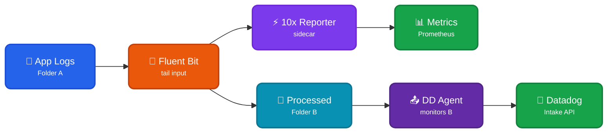

Read events from application logs to transform into typed [TenXObjects](https://doc.log10x.com/api/js/#TenXObject) to aggregate and report on, before the Datadog Agent ships them to Datadog. This module is a component of the [Edge Reporter](https://doc.log10x.com/apps/edge/reporter/) app.

## Architecture

<div style="text-align: center;">



</div>

### Data Flow

- 📝 **App Logs (Folder A)** - Application writes logs to original location
- 🔧 **Fluent Bit** - Reads from Folder A, passes events to 10x sidecar
- ⚡ **10x Reporter** - Transforms events into TenXObjects, aggregates metrics
- 📊 **Metrics Output** - Publishes time-series data to Prometheus/metrics backends
- 📂 **Processed (Folder B)** - Events written unchanged to new location
- 📤 **DD Agent** - Monitors Folder B, handles forwarding to Datadog
- 🐶 **Datadog** - Receives original events (unchanged)

### Key Characteristics

| Feature | Description |
|---------|-------------|
| 📊 **Read-Only** | Reporter observes events without modifying them |
| 🔗 **Parallel Flow** | Events flow to both metrics AND Datadog |
| 📈 **Metrics Publishing** | Aggregates and publishes to time-series backends |
| 📤 **Agent Handles Delivery** | Datadog Agent manages buffering, retries, metadata enrichment |

### :material-swap-horizontal-circle-outline: File Relay Pattern

This [module](https://doc.log10x.com/engine/module/) configures a file relay where Fluent Bit reads application logs, passes them through a 10x [sidecar process](https://doc.log10x.com/engine/launcher/sidecar) for reporting, then writes them to a folder that the Datadog Agent monitors. Events are unchanged - 10x only observes and reports metrics.

### :material-download-outline: Install

=== ":material-laptop: Nix/OSX"

    See the [Quickstart](#quickstart) below or the Log10x Edge Reporter [run instructions](https://doc.log10x.com/apps/edge/reporter/run/#datadog-agent)

## Quickstart

??? tenx-bootstrap "Step 1: Set Environment Variables"

    ```bash
    export TENX_MODULES=/etc/tenx/modules
    export FOLDER_A=/var/log/app
    export FOLDER_B=/var/log/processed
    ```

??? tenx-config "Step 2: Configure Fluent Bit"

    ```toml title="fluent-bit.conf"
    [SERVICE]
        Flush        1
        Log_Level    info

    [INPUT]
        Name         tail
        Path         ${FOLDER_A}/*.log
        Tag          app.logs

    # Include 10x reporter
    @INCLUDE ${TENX_MODULES}/pipelines/run/modules/input/forwarder/fluentbit/conf/tenx-report.conf

    # Write to Folder B for Datadog Agent
    [OUTPUT]
        Name         file
        Match        *
        Path         ${FOLDER_B}
        Format       plain
    ```

??? tenx-forwarderinputs "Step 3: Configure Datadog Agent"

    ```yaml title="datadog.yaml (logs_config section)"
    logs_enabled: true
    ```

    ```yaml title="conf.d/tenx.d/conf.yaml"
    logs:
      - type: file
        path: ${FOLDER_B}/*.log
        service: myapp
        source: myapp
    ```

??? tenx-run "Step 4: Run"

    ```bash
    fluent-bit -c fluent-bit.conf
    ```
