Filebeat modules execute as a [sidecar process](https://doc.log10x.com/engine/launcher/sidecar) to report, receive, and optimize events _before_ they ship to output (e.g., ElasticSearch).

## Architecture

```mermaid
graph LR
    A["<div style='font-size: 14px;'>📂 Input</div><div style='font-size: 10px;'>tail, k8s</div>"] --> B["<div style='font-size: 14px;'>🔧 script</div><div style='font-size: 10px;'>tenx-*.js</div>"]
    B --> C["<div style='font-size: 14px;'>⚡ 10x Pipeline</div><div style='font-size: 10px;'>Parse/Optimize/Receive</div>"]
    C --> D["<div style='font-size: 14px;'>🔌 Unix Input</div><div style='font-size: 10px;'>back to Filebeat</div>"]
    D --> E["<div style='font-size: 14px;'>📤 Output</div><div style='font-size: 10px;'>Elasticsearch</div>"]

    classDef input fill:#2563eb,stroke:#1d4ed8,color:#ffffff,stroke-width:2px,rx:8,ry:8
    classDef script fill:#ea580c,stroke:#c2410c,color:#ffffff,stroke-width:2px,rx:8,ry:8
    classDef engine fill:#7c3aed,stroke:#6d28d9,color:#ffffff,stroke-width:2px,rx:8,ry:8
    classDef socket fill:#0891b2,stroke:#0e7490,color:#ffffff,stroke-width:2px,rx:8,ry:8
    classDef output fill:#16a34a,stroke:#15803d,color:#ffffff,stroke-width:2px,rx:8,ry:8

    class A input
    class B script
    class C engine
    class D socket
    class E output
```

### Data Flow

| Component | Protocol | Description |
|-----------|----------|-------------|
| ⚡ 10x | Process launch | Launches Filebeat as subprocess |
| ⚡ 10x | Config parsing | Reads Filebeat's config paths from stdout |
| 🔧 script processor | JSON/stdout | `tenx-optimize.js` writes events to stdout |
| ⚡ 10x stdin | JSON | Reads and parses events from Filebeat's stdout |
| ⚡ 10x Pipeline | Internal | Processes event (report/receive/optimize) |
| 🔌 Unix socket | JSON | Writes processed events to Unix socket |
| 🔌 Filebeat unix input | JSON decode | Reads from socket, decodes JSON fields |
| 📤 Filebeat Output | Output | Sends to Elasticsearch with correct document IDs |

### Expected Event Format

The 10x Engine expects JSON events from Filebeat containing:

| Field | Description | Used For |
|-------|-------------|----------|
| `tenx` | Boolean marker (`true`) set by script processor | Event filtering via `sourceFilter` |
| `message` | The actual log message | Message extraction |

Unlike other forwarders, Filebeat uses `sourceFilter` with the pattern `\"tenx\":true` to identify events from the script processor versus internal Filebeat log messages.

!!! warning "Output Limitation: `output.console` is not supported"

    The 10x Engine reads events from Filebeat via a stdout pipe (`filebeat ... 2>&1 | tenx-edge run ...`).
    The script processor writes `"tenx":true`-marked events to stdout, and the engine uses `sourceFilter` to
    separate these from Filebeat's internal log messages.

    **`output.console` must not be used** when Log10x is enabled — it writes multi-line JSON to the same
    stdout pipe, corrupting event boundaries and causing JSON parsing errors in the engine.

    Supported outputs include `output.elasticsearch`, `output.logstash`, `output.file`, `output.kafka`,
    and any other output that does **not** write to stdout. For local testing without Elasticsearch,
    use `output.file`.

??? tenx-keyfiles "Key Files"

    | File | Purpose |
    |------|---------|
    | [`stream.yaml`](https://github.com/log-10x/modules/blob/main/pipelines/run/modules/input/forwarder/filebeat/stream.yaml) | Stdin input (Filebeat events + config parsing) + Unix socket output (loop back to Filebeat) |
    | [`log4j2.yaml`](https://github.com/log-10x/modules/blob/main/pipelines/run/modules/input/forwarder/filebeat/log4j2.yaml) | Log4j appenders for Filebeat-internal log messages (mirrors filebeat.yml's logging.*) |
    | [`script/tenx-receive.js`](https://github.com/log-10x/modules/blob/main/pipelines/run/modules/input/forwarder/filebeat/script/tenx-receive.js) | Filebeat script processor — marks + emits events to stdout, then cancels them so they loop back over the socket |
    | [`script/tenx-report.js`](https://github.com/log-10x/modules/blob/main/pipelines/run/modules/input/forwarder/filebeat/script/tenx-report.js) | Filebeat script processor — read-only variant that emits to stdout without canceling (Reporter mode) |
    | [`conf/tenxNix.yml`](https://github.com/log-10x/modules/blob/main/pipelines/run/modules/input/forwarder/filebeat/conf/tenxNix.yml) | Filebeat `unix` input snippet, Linux/macOS — referenced by Filebeat via `filebeat.config.inputs` AND parsed by the engine for the socket path |
    | [`conf/tenxWin.yml`](https://github.com/log-10x/modules/blob/main/pipelines/run/modules/input/forwarder/filebeat/conf/tenxWin.yml) | Same as above for Windows (uses `${TEMP}\tenx_filebeat.sock`) |
