Runs 10x Engine as a [sidecar](https://doc.log10x.com/engine/launcher/sidecar) to Filebeat for reporting, receiving, and optimizing events before they ship to their destination (Elasticsearch, Logstash, Kafka, S3, …). Filebeat's plugin model doesn't expose the Fluent Forward protocol used by other forwarders, so Log10x and Filebeat exchange events through Filebeat's own native extension points instead: a `script` processor on every input emits enriched events to Filebeat's stdout, and a `unix` input loads processed events back over a local socket. Filebeat runs as a child process of the sidecar (`filebeat -e 2>&1 | tenx ...`); works against any stock Filebeat build (Linux/macOS/Windows) and the `log10x-elastic/filebeat` Helm chart on Kubernetes.

## Architecture

```mermaid
graph LR
    A["<div style='font-size: 14px;'>📂 Inputs</div><div style='font-size: 10px;'>filestream, container, log</div>"] --> F["<div style='font-size: 14px;'>🧪 script processor</div><div style='font-size: 10px;'>tenx-*.js</div>"]
    F --> B["<div style='font-size: 14px;'>📤 stdout</div><div style='font-size: 10px;'>JSON line per event</div>"]
    B --> E["<div style='font-size: 14px;'>⚡ 10x Engine</div><div style='font-size: 10px;'>Receive/Optimize</div>"]
    E --> C["<div style='font-size: 14px;'>🔌 unix input</div><div style='font-size: 10px;'>/tmp/tenx_filebeat.sock</div>"]
    C --> D["<div style='font-size: 14px;'>📤 Outputs</div><div style='font-size: 10px;'>ES, Logstash, Kafka, S3</div>"]

    classDef input fill:#2563eb,stroke:#1d4ed8,color:#ffffff,stroke-width:2px,rx:8,ry:8
    classDef filter fill:#ea580c,stroke:#c2410c,color:#ffffff,stroke-width:2px,rx:8,ry:8
    classDef engine fill:#7c3aed,stroke:#6d28d9,color:#ffffff,stroke-width:2px,rx:8,ry:8
    classDef socket fill:#0891b2,stroke:#0e7490,color:#ffffff,stroke-width:2px,rx:8,ry:8
    classDef output fill:#16a34a,stroke:#15803d,color:#ffffff,stroke-width:2px,rx:8,ry:8

    class A input
    class B filter
    class C socket
    class D output
    class E engine
    class F filter
```

<div style="text-align: center;">



</div>

### Data Flow

- 📂 **Inputs** — Your existing Filebeat inputs (`filestream`, `container`, `log`, `journald`, …) collect events and pass them through any processors you've configured on the input (`add_kubernetes_metadata`, `decode_json_fields`, `dissect`, …). Enrichment runs here exactly once before the event is handed off to Log10x.
- 🧪 **script processor** — A small JavaScript processor on each input (`tenx-receive.js` for the Receiver, `tenx-report.js` for the Reporter) marks the event, writes it as a single JSON line to Filebeat's stdout, and cancels it from Filebeat's normal output path. This is what keeps your destinations from seeing the unprocessed event.
- ⚡ **10x Engine** — Filebeat runs as a child process of the sidecar (`filebeat -e 2>&1 | tenx ...`), so its stdout is the engine's stdin. The Receiver app applies rate/policy-based filtering and optionally compacts events for volume reduction. The engine also picks Filebeat's own log lines off the same stream and replays them to Filebeat's configured log destinations (`logging.to_files`, `logging.to_stderr`, `logging.to_syslog`) — so enabling the integration doesn't change where Filebeat logs go.
- 🔌 **unix input** — Processed events come back to Filebeat through a `unix` input listening on `/tmp/tenx_filebeat.sock` (loaded via `filebeat.config.inputs` from a bundled snippet — same path on both sides). The input's processors decode the JSON payload and remove the script-processor marker, so the second pass of `tenx-receive.js` lets the event through unmodified.
- 📤 **Outputs** — Your destination output (`elasticsearch`, `logstash`, `kafka`, `file`, …) ships the returned event. `output.console` is **not supported** — it would write to the same stdout pipe that carries events to the engine and corrupt the stream. Use `output.file` for local testing without a real destination.

### What an event looks like on the way back

The record structure of the original Filebeat event is preserved end-to-end — every field comes back to your destination output with the same name and same position. What changes depends on the Receiver app mode:

| Mode | Difference vs the event Filebeat collected |
|------|--------------------------------------------|
| Receive (default) | None. Same record. |
| Receive + `symbolMessageHashField <name>` | Adds one new field with the symbol-pattern hash (a stable identifier for the message pattern — usable as a dedup key, metric dimension, or correlation ID). |
| `receiverOptimize true` | The value of the `message` field is replaced with a compact encoded form. A separate `tenx-template` event is emitted carrying the template needed to decode it (Filebeat's `decode_json_fields` processor on the return socket uses the embedded `templateHashDocId` to set the Elasticsearch document ID). All other fields stay verbatim. |
| `receiverOptimize true` + `symbolMessageHashField <name>` | Both of the above. |

Internally, Log10x's Filebeat input module reads the message text from the event's `message` field and surfaces the input source (`log.file.path`, container, etc.) for use in rate-based grouping. When the Receiver app is configured with `k8sExtractorName: filebeatK8s`, the `kubernetes.*` sub-object stamped by `add_kubernetes_metadata` is also materialized as enrichment fields for message-pattern and rate filtering.

??? tenx-keyfiles "Key Files"

    | File | Purpose |
    |------|---------|
    | [`stream.yaml`](https://github.com/log-10x/modules/blob/main/pipelines/run/modules/input/forwarder/filebeat/stream.yaml) | Stdin input (Filebeat events + Filebeat log lines) and Unix-socket output stream definitions |
    | [`log4j2.yaml`](https://github.com/log-10x/modules/blob/main/pipelines/run/modules/input/forwarder/filebeat/log4j2.yaml) | Appenders that replay Filebeat's own log lines to the destinations declared in `filebeat.yml`'s `logging.*` |
    | [`script/tenx-receive.js`](https://github.com/log-10x/modules/blob/main/pipelines/run/modules/input/forwarder/filebeat/script/tenx-receive.js) | Receiver processor — marks + emits events to stdout, cancels them so they loop back over the socket |
    | [`script/tenx-report.js`](https://github.com/log-10x/modules/blob/main/pipelines/run/modules/input/forwarder/filebeat/script/tenx-report.js) | Reporter processor — read-only variant that emits to stdout without canceling |
    | [`conf/tenxNix.yml`](https://github.com/log-10x/modules/blob/main/pipelines/run/modules/input/forwarder/filebeat/conf/tenxNix.yml) | `unix` input snippet for Linux/macOS — referenced from your `filebeat.yml` via `filebeat.config.inputs.path`, and read by the engine to discover the socket address |
    | [`conf/tenxWin.yml`](https://github.com/log-10x/modules/blob/main/pipelines/run/modules/input/forwarder/filebeat/conf/tenxWin.yml) | Same as above for Windows (uses `${TEMP}\tenx_filebeat.sock`) |

## Quickstart

**1. Wire up your Filebeat config** — load the return-path `unix` input and add the script processor to your inputs:

```yaml title="filebeat.yml"
# Loads the unix input that receives processed events back from Log10x.
filebeat.config.inputs:
  enabled: true
  # Linux/macOS
  path: ${TENX_MODULES}/pipelines/run/modules/input/forwarder/filebeat/conf/tenxNix.yml
  # Windows
  # path: ${TENX_MODULES}/pipelines/run/modules/input/forwarder/filebeat/conf/tenxWin.yml

filebeat.inputs:
  - type: filestream
    id: app-logs
    paths:
      - /var/log/app.log

    processors:
      # Hands every event off to Log10x via Filebeat's stdout, then cancels
      # it locally so destinations only see events that came back on the
      # unix socket.
      - script:
          lang: javascript
          file: ${TENX_MODULES}/pipelines/run/modules/input/forwarder/filebeat/script/tenx-receive.js

# Use any non-stdout output — output.console would collide with the stdout
# pipe that carries events to the engine.
output.elasticsearch:
  hosts: ["https://elasticsearch:9200"]
```

**2. Run Filebeat through Log10x** — Filebeat is launched as a child process of the sidecar, so start them as a single pipeline:

```bash
filebeat -c filebeat.yml -e 2>&1 | tenx run @run/input/forwarder/filebeat @apps/receiver
```

For Kubernetes deployment via the `log10x-elastic/filebeat` Helm chart, see the [Helm chart overlay](https://doc.log10x.com/apps/receiver/deploy/#filebeat). For read-only Reporter mode (no event diversion) swap `tenx-receive.js` for `tenx-report.js` and run against `@apps/reporter` — see the [Reporter Quickstart](https://doc.log10x.com/apps/reporter/run/#filebeat).
