Read events from a Filebeat forwarder to transform them into typed [TenXObjects](https://doc.log10x.com/api/js/#TenXObject) to filter using local/centralized [reducer](https://doc.log10x.com/run/output/regulate) policy. This module is a component of the [Reducer](https://doc.log10x.com/apps/reducer/) app.

## Architecture

```mermaid
graph LR
    A["<div style='font-size: 14px;'>📂 Filebeat</div><div style='font-size: 10px;'>inputs</div>"] --> B["<div style='font-size: 14px;'>🔧 Script</div><div style='font-size: 10px;'>processor</div>"]
    B --> C["<div style='font-size: 14px;'>⚡ 10x Reducer</div><div style='font-size: 10px;'>filter policy</div>"]
    C --> D["<div style='font-size: 14px;'>🔌 Unix/TCP</div><div style='font-size: 10px;'>input</div>"]
    D --> E["<div style='font-size: 14px;'>📤 Filebeat</div><div style='font-size: 10px;'>outputs</div>"]

    classDef input fill:#2563eb,stroke:#1d4ed8,color:#ffffff,stroke-width:2px,rx:8,ry:8
    classDef filter fill:#ea580c,stroke:#c2410c,color:#ffffff,stroke-width:2px,rx:8,ry:8
    classDef engine fill:#7c3aed,stroke:#6d28d9,color:#ffffff,stroke-width:2px,rx:8,ry:8
    classDef socket fill:#0891b2,stroke:#0e7490,color:#ffffff,stroke-width:2px,rx:8,ry:8
    classDef output fill:#16a34a,stroke:#15803d,color:#ffffff,stroke-width:2px,rx:8,ry:8

    class A input
    class B filter
    class C engine
    class D socket
    class E output
```

### Data Flow

- 📂 **Filebeat Inputs** - Collect logs from files, containers, or other sources
- 🔧 **Script Processor** - Intercepts ALL events and pipes them to 10x sidecar
- ⚡ **10x Reducer** - Applies rate/policy-based filtering, drops noisy events
- 🔌 **Unix/TCP Input** - Receives FILTERED events back from the sidecar
- 📤 **Filebeat Outputs** - Only filtered events ship to final destinations

### Key Characteristics

| Feature | Description |
|---------|-------------|
| 🚦 **Rate Limiting** | Filter events based on per-template rate limits |
| 📋 **Policy-Based** | Apply local or centralized filtering policies |
| 💰 **Cost Control** | Reduce log volume and costs by dropping noisy events |
| 🔧 **Script Processor** | Uses Filebeat's native JavaScript processor for sidecar launch |

### :material-swap-horizontal-circle-outline: Sidecar Relay

This [module](https://doc.log10x.com/engine/module/) configures a Filebeat [script processor](https://www.elastic.co/guide/en/beats/filebeat/current/processor-script.html) and TCP/Unix input. The script processor launches a 10x [sidecar process](https://doc.log10x.com/engine/launcher/sidecar) and pipes collected events to it to regulate. The sidecar relays regulated events back to Filebeat via the configured Unix/TCP input to ship to outputs (e.g., ElasticSearch).

### :material-download-outline: Install

=== ":material-laptop: Nix/Win/OSX"

    See the Log10x Reducer Filebeat [run instructions](https://doc.log10x.com/apps/reducer/run/#filebeat)

=== ":material-kubernetes: k8s"

    Deploy to k8s via [Helm](https://helm.sh/)

    See the Log10x Reducer Filebeat [deployment instructions](https://doc.log10x.com/apps/reducer/deploy/#filebeat)
