Fluent Bit inputs execute a 10x Engine as [sidecar process](https://doc.log10x.com/engine/launcher/sidecar) to report, regulate, and optimize events _before_ they ship to output (e.g., ElasticSearch, Splunk, AWS S3).

## Architecture

```mermaid
graph LR
    A["<div style='font-size: 14px;'>📂 Input</div><div style='font-size: 10px;'>tail, k8s</div>"] --> B["<div style='font-size: 14px;'>🔧 Lua Filter</div><div style='font-size: 10px;'>tenx.lua</div>"]
    B --> E["<div style='font-size: 14px;'>⚡ 10x Engine</div><div style='font-size: 10px;'>Optimize/Regulate/Report</div>"]
    E --> C["<div style='font-size: 14px;'>🔌 Forward</div><div style='font-size: 10px;'>Unix socket / TCP</div>"]
    C --> D["<div style='font-size: 14px;'>📤 Output</div><div style='font-size: 10px;'>ES, S3</div>"]

    classDef input fill:#2563eb,stroke:#1d4ed8,color:#ffffff,stroke-width:2px,rx:8,ry:8
    classDef filter fill:#ea580c,stroke:#c2410c,color:#ffffff,stroke-width:2px,rx:8,ry:8
    classDef socket fill:#0891b2,stroke:#0e7490,color:#ffffff,stroke-width:2px,rx:8,ry:8

    classDef output fill:#16a34a,stroke:#15803d,color:#ffffff,stroke-width:2px,rx:8,ry:8
    classDef engine fill:#7c3aed,stroke:#6d28d9,color:#ffffff,stroke-width:2px,rx:8,ry:8

    class A input
    class B filter
    class C socket
    class D output
    class E engine
```

<div style="text-align: center;">



</div>

### Data Flow

| Component | Protocol | Description |
|-----------|----------|-------------|
| 🔧 Lua filter | `io.popen()` | Launches 10x subprocess on first event |
| 🔧 tenx.lua | JSON/stdin | Encodes event as `{"tag":..., "tenx_fields":...}` |
| ⚡ 10x Engine | Internal | Processes event (report/regulate/optimize) |
| 🔄 Forward output | Unix socket or TCP | Returns processed event to Fluent Bit pipeline via Forward protocol |
| 🔧 Lua filter | Return code | Marks event as processed via `tenx` field |

### Expected Event Format

The 10x Engine expects JSON events from Fluent Bit containing:

| Field | Description | Used For |
|-------|-------------|----------|
| `tag` | Event tag set by tenx.lua script | Source identification via `sourcePattern` |
| `log` | The actual log message (configurable via `fluentbitMessageField`) | Message extraction |

The `sourcePattern` regex `\"tag\":\"(.*?)\"` extracts the event source from the `tag` field for rate regulation grouping.

??? tenx-keyfiles "Key Files"

    | File | Purpose |
    |------|---------|
    | [`conf/lua/tenx-regulate.lua`](https://github.com/log-10x/modules/blob/main/pipelines/run/modules/input/forwarder/fluentbit/conf/lua/tenx-regulate.lua) | Lua filter script for regulate mode |
    | [`conf/tenx-regulate.conf`](https://github.com/log-10x/modules/blob/main/pipelines/run/modules/input/forwarder/fluentbit/conf/tenx-regulate.conf) | Fluent Bit config for regulate mode |
    | [`conf/tenx-unix.conf`](https://github.com/log-10x/modules/blob/main/pipelines/run/modules/input/forwarder/fluentbit/conf/tenx-unix.conf) | Forward return path via Unix socket (Linux/macOS) |
    | [`conf/tenx-forward.conf`](https://github.com/log-10x/modules/blob/main/pipelines/run/modules/input/forwarder/fluentbit/conf/tenx-forward.conf) | Forward return path via TCP (Windows) |
    | [`input/stream.yaml`](https://github.com/log-10x/modules/blob/main/pipelines/run/modules/input/forwarder/fluentbit/input/stream.yaml) | 10x stdin input configuration |
    | [`output/unix/stream.yaml`](https://github.com/log-10x/modules/blob/main/pipelines/run/modules/input/forwarder/fluentbit/output/unix/stream.yaml) | 10x Forward protocol output (Unix socket) |
    | [`output/forward/stream.yaml`](https://github.com/log-10x/modules/blob/main/pipelines/run/modules/input/forwarder/fluentbit/output/forward/stream.yaml) | 10x Forward protocol output (Windows TCP) |

## Quickstart

**1. Set environment variables:**

```bash
export TENX_MODULES=/path/to/config/modules
export TENX_HOME=/path/to/tenx/binary
```

**2. Include reducer in your Fluent Bit config:**

```toml title="fluent-bit.conf"
[SERVICE]
    Flush        1
    Log_Level    info

# Your input source
[INPUT]
    Name         tail
    Path         /var/log/app.log
    Tag          app.logs

# Include 10x reducer (Lua filter)
@INCLUDE ${TENX_MODULES}/pipelines/run/modules/input/forwarder/fluentbit/conf/tenx-regulate.conf

# Include return path (Unix socket for Linux/macOS, Forward over TCP for Windows)
@INCLUDE ${TENX_MODULES}/pipelines/run/modules/input/forwarder/fluentbit/conf/tenx-unix.conf
# On Windows, use tenx-forward.conf instead of tenx-unix.conf

# Configure your output (e.g., Splunk, Elasticsearch)
[OUTPUT]
    Name         your_output_plugin
    Match        *
    # ... output config
```

**3. Run Fluent Bit:**

```bash
fluent-bit -c /path/to/fluent-bit.conf
```

For Splunk integration, see the [10x for Splunk](https://doc.log10x.com/apps/reducer/splunk/) documentation.
