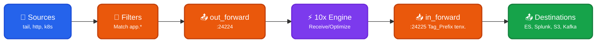

Runs 10x Engine as a [sidecar](https://doc.log10x.com/engine/launcher/sidecar) to Fluent Bit for reporting, receiving, and optimizing events before they ship to their destination (Elasticsearch, Splunk, S3, Kafka, …). Fluent Bit and Log10x run as peer processes and exchange events over the [Fluent Forward protocol](https://docs.fluentbit.io/manual/pipeline/outputs/forward) in both directions — works against any stock Fluent Bit build and the official Fluent Bit Helm chart with a values overlay.

## Architecture

<div style="text-align: center;">


```mermaid
graph LR
    A["<div style='font-size: 14px;'>📂 Sources</div><div style='font-size: 10px;'>tail, http, k8s</div>"] --> F["<div style='font-size: 14px;'>🧪 Filters</div><div style='font-size: 10px;'>Match app.*</div>"]
    F --> B["<div style='font-size: 14px;'>📤 out_forward</div><div style='font-size: 10px;'>:24224</div>"]
    B --> E["<div style='font-size: 14px;'>⚡ 10x Engine</div><div style='font-size: 10px;'>Receive/Optimize</div>"]
    E --> C["<div style='font-size: 14px;'>📥 in_forward</div><div style='font-size: 10px;'>:24225 Tag_Prefix tenx.</div>"]
    C --> D["<div style='font-size: 14px;'>📤 Destinations</div><div style='font-size: 10px;'>ES, Splunk, S3, Kafka</div>"]

    classDef input fill:#2563eb,stroke:#1d4ed8,color:#ffffff,stroke-width:2px,rx:8,ry:8
    classDef filter fill:#ea580c,stroke:#c2410c,color:#ffffff,stroke-width:2px,rx:8,ry:8
    classDef engine fill:#7c3aed,stroke:#6d28d9,color:#ffffff,stroke-width:2px,rx:8,ry:8
    classDef output fill:#16a34a,stroke:#15803d,color:#ffffff,stroke-width:2px,rx:8,ry:8

    class A input
    class B filter
    class C filter
    class D output
    class E engine
    class F filter
```

</div>

### Data Flow

- 📂 **Sources** — Your existing Fluent Bit inputs (`tail`, `http`, `forward`, `systemd`, …) tag events with your normal scheme (e.g. `app.*`, `k8s.*`).
- 🧪 **Filters** — Your enrichment filters (`kubernetes`, `modify`, `parser`, `lua`, …) `Match` your source tags only (e.g. `Match app.*`). They run exactly once before the event is handed off to Log10x.
- 📤 **out_forward** → Log10x — A `forward` output with `Match app.*` (or whatever your source tag pattern is) ships the enriched event to the Log10x sidecar over TCP `:24224`.
- ⚡ **10x Engine** — The Receiver app applies rate/policy-based filtering and optionally compacts events for volume reduction.
- 📥 **in_forward → destinations** — Processed events come back to Fluent Bit on `:24225` via a `forward` input with `Tag_Prefix tenx.`, which prepends `tenx.` to every returning tag. Your destination outputs `Match tenx.*`; the `tenx.` namespace is what keeps filters from re-firing and the `out_forward` to Log10x from looping events back. Fluent Bit has no label/scope concept, so **tag-prefix namespacing is the bypass mechanism**.
- 📤 **Destinations** — Your destination outputs (`es`, `splunk`, `kafka`, `s3`, …) `Match tenx.*` and ship to the real destinations. The original tag is preserved after the prefix (`tenx.app.foo`), so destinations that route on the suffix still work.

### What an event looks like on the way back

The record structure of the original Fluent Bit event is preserved end-to-end — every field comes back to your destination outputs with the same name and same position. The wire tag has a `tenx.` prefix prepended on egress (the bypass mechanism); the original tag is the suffix. What changes in the record body depends on the Receiver app mode:

| Mode | Difference vs the event Fluent Bit sent in |
|------|--------------------------------------------|
| Receive (default) | None. Same record. Tag is `tenx.<original>`. |
| Receive + `symbolMessageHashField <name>` | Adds one new field with the symbol-pattern hash (a stable identifier for the message pattern — usable as a dedup key, metric dimension, or correlation ID). |
| `receiverOptimize true` | The value of the message field (`log` by default, or whatever `fluentbitInputMessageField` is set to) is replaced with a compact encoded form. A separate `tenx-template` event is emitted with the template needed to decode it. All other fields stay verbatim. |
| `receiverOptimize true` + `symbolMessageHashField <name>` | Both of the above. |

The original Fluent Bit tag is carried by the Forward protocol itself and surfaces on the event as its `source` inside Log10x — used for rate-based grouping and re-emitted as the wire tag on the return path (with `tenx.` prepended by the egress `forward` input). Internally, Log10x's Fluent Bit input module reads the message text from the field named by `fluentbitInputMessageField` (default `log`); when the Receiver app is configured with `k8sExtractorName: fluentK8s`, the `kubernetes.*` sub-object is also materialized as enrichment fields for use by message-pattern and rate filtering.

??? tenx-keyfiles "Key Files"

    | File | Purpose |
    |------|---------|
    | [`stream.yaml`](https://github.com/log-10x/modules/blob/main/pipelines/run/modules/input/forwarder/fluentbit/stream.yaml) | Fluent Bit Forward input + output stream definitions |
    | [`conf/tenx-sidecar.conf`](https://github.com/log-10x/modules/blob/main/pipelines/run/modules/input/forwarder/fluentbit/conf/tenx-sidecar.conf) | Reference Fluent Bit config showing tag-prefix bypass via `Tag_Prefix tenx.` |

## Quickstart

**1. Run Log10x:**

```bash
tenx @run/input/forwarder/fluentbit @apps/receiver
```

**2. Wire up your Fluent Bit config** — include the sidecar recipe and `Match` your sources with the recipe's tag conventions:

```ini title="fluent-bit.conf"
@INCLUDE ${TENX_MODULES}/pipelines/run/modules/input/forwarder/fluentbit/conf/tenx-sidecar.conf

[INPUT]
    Name         tail
    Path         /var/log/app.log
    Tag          app.logs           # any tag NOT starting with `tenx.`
    Parser       json
```

**3. Point destination outputs at the `tenx.*` namespace** (the recipe defaults to `stdout` for testing):

```ini
[OUTPUT]
    Name         your_output_plugin
    Match        tenx.*             # only matches events that came back from Log10x
    # ... destination config
```

For Splunk integration see the [10x for Splunk](https://doc.log10x.com/apps/receiver/splunk/) documentation. For Kubernetes deployment via the official Fluent Bit Helm chart see the [Helm sidecar overlay](https://doc.log10x.com/apps/receiver/deploy/#fluent-bit).
