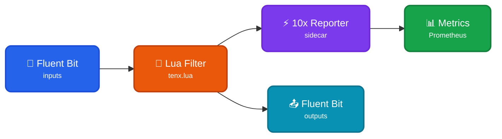

Read events from a Fluent Bit forwarder to transform into typed [TenXObjects](https://doc.log10x.com/api/js/#TenXObject) to aggregate and report on. This module is a component of the [Edge Reporter](https://doc.log10x.com/apps/edge/reporter/) app.

## Architecture

### Data Flow

- 📂 **Fluent Bit Inputs** - Collect logs from files, containers, or other sources
- 🔧 **Lua Filter** - Intercepts events and pipes them to the 10x sidecar process
- ⚡ **10x Reporter** - Transforms events into TenXObjects, aggregates metrics
- 📊 **Metrics Output** - Publishes time-series data to Prometheus/metrics backends
- 📤 **Fluent Bit Outputs** - Original events continue unchanged to final destinations

### Key Characteristics

| Feature | Description |
|---------|-------------|
| 📊 **Read-Only** | Reporter observes events without modifying the pipeline |
| 🔗 **Parallel Flow** | Events flow to both 10x Reporter AND original outputs |
| 📈 **Metrics Publishing** | Aggregates and publishes to time-series backends |
| 🔧 **Lua Filter** | Uses Fluent Bit's native Lua scripting for sidecar launch |

### :material-swap-horizontal-circle-outline: Sidecar Relay

This [module](https://doc.log10x.com/engine/module/) configures a Fluent Bit [Lua filter](https://docs.fluentbit.io/manual/pipeline/filters/lua) and Unix/TCP input. The Lua filter launches a 10x [sidecar process](https://doc.log10x.com/engine/launcher/sidecar) and passes it collected events to aggregate and publish to [time-series](https://doc.log10x.com/run/output/metric/) outputs.

### :material-download-outline: Install

=== ":material-laptop: Nix/Win/OSX"

    See the Log10x Edge Reporter Fluent Bit [run instructions](https://doc.log10x.com/apps/edge/reporter/run/#fluent-bit)

=== ":material-kubernetes: k8s"

    Deploy to k8s via [Helm](https://helm.sh/){target="_blank"}

    See the Log10x Edge Reporter Fluent Bit [deployment instructions](https://doc.log10x.com/apps/edge/reporter/deploy/#fluent-bit)
