Runs 10x Engine as a [sidecar](https://doc.log10x.com/engine/launcher/sidecar) to Fluentd for reporting, regulating, and optimizing events _before_ shipping to output (Elasticsearch, Splunk, S3).

## Architecture

```mermaid
graph LR
    A["<div style='font-size: 14px;'>📂 Input</div><div style='font-size: 10px;'>tail, k8s</div>"] --> B["<div style='font-size: 14px;'>🔧 exec_filter</div><div style='font-size: 10px;'>plugin</div>"]
    B --> E["<div style='font-size: 14px;'>⚡ 10x Engine</div><div style='font-size: 10px;'>Optimize/Regulate/Report</div>"]
    E --> C["<div style='font-size: 14px;'>🔌 Unix Socket</div><div style='font-size: 10px;'>return path</div>"]
    C --> D["<div style='font-size: 14px;'>📤 Output</div><div style='font-size: 10px;'>ES, S3</div>"]

    classDef input fill:#2563eb,stroke:#1d4ed8,color:#ffffff,stroke-width:2px,rx:8,ry:8
    classDef filter fill:#ea580c,stroke:#c2410c,color:#ffffff,stroke-width:2px,rx:8,ry:8
    classDef socket fill:#0891b2,stroke:#0e7490,color:#ffffff,stroke-width:2px,rx:8,ry:8
    classDef output fill:#16a34a,stroke:#15803d,color:#ffffff,stroke-width:2px,rx:8,ry:8
    classDef engine fill:#7c3aed,stroke:#6d28d9,color:#ffffff,stroke-width:2px,rx:8,ry:8

    class A input
    class B filter
    class C socket
    class D output
    class E engine
```

<div style="text-align: center;">



</div>

### Data Flow

| Component | Protocol | Description |
|-----------|----------|-------------|
| 🔧 exec_filter | Native plugin | Launches 10x with `child_respawn -1` (auto-restart) |
| 🔧 `<format>` | JSON/stdin | Fluentd's native `@type json` formatter |
| 🔧 `<inject>` | tag_key | Adds `tenx_tag` field for tag preservation |
| ⚡ 10x Engine | Internal | Processes event (report/regulate/optimize) |
| 🔌 Forward output | Unix socket | Returns via native Fluentd forward protocol |

### Expected Event Format

The 10x Engine expects JSON events from Fluentd containing:

| Field | Description | Used For |
|-------|-------------|----------|
| `tenx_tag` | Event tag injected by Fluentd's `<inject>` directive | Source identification via `sourcePattern` |
| `log` | The actual log message (configurable via `fluentdMessageField`) | Message extraction |

The `sourcePattern` regex `\"tenx_tag\":\"(.*?)\"` extracts the event source from the `tenx_tag` field for rate regulation grouping.

??? tenx-keyfiles "Key Files"

    | File | Purpose |
    |------|---------|
    | [`conf/auxiliary/tenx-unix-exec-filter.conf`](https://github.com/log-10x/modules/blob/main/pipelines/run/modules/input/forwarder/fluentd/conf/auxiliary/tenx-unix-exec-filter.conf){target="_blank"} | exec_filter plugin configuration for Unix socket mode |
    | [`conf/auxiliary/tenx-unix-source.conf`](https://github.com/log-10x/modules/blob/main/pipelines/run/modules/input/forwarder/fluentd/conf/auxiliary/tenx-unix-source.conf){target="_blank"} | Unix socket input for return path |
    | [`conf/tenx-optimize-unix.conf`](https://github.com/log-10x/modules/blob/main/pipelines/run/modules/input/forwarder/fluentd/conf/tenx-optimize-unix.conf){target="_blank"} | Optimize mode with Unix socket return |
    | [`conf/tenx-optimize-stdio.conf`](https://github.com/log-10x/modules/blob/main/pipelines/run/modules/input/forwarder/fluentd/conf/tenx-optimize-stdio.conf){target="_blank"} | Optimize mode with stdio return (alternative) |
    | [`input/stream.yaml`](https://github.com/log-10x/modules/blob/main/pipelines/run/modules/input/forwarder/fluentd/input/stream.yaml){target="_blank"} | 10x stdin input configuration |
    | [`output/unix/stream.yaml`](https://github.com/log-10x/modules/blob/main/pipelines/run/modules/input/forwarder/fluentd/output/unix/stream.yaml){target="_blank"} | 10x Forward protocol output configuration |

## Quickstart

**1. Set environment variables:**

```bash
export TENX_MODULES=/path/to/config/modules
export TENX_HOME=/path/to/tenx/binary
```

**2. Include optimizer in your Fluentd config:**

```xml title="fluentd.conf"
# Route your inputs to the 10x label
<source>
  @type tail
  path /var/log/app.log
  tag app.logs
  @label @TENX
  <parse>
    @type none
  </parse>
</source>

# Include the 10x optimizer configuration
@include "#{ENV['TENX_MODULES']}/pipelines/run/modules/input/forwarder/fluentd/conf/tenx-optimize-unix.conf"

# Configure your output (e.g., Splunk, Elasticsearch)
<match **>
  @type your_output_plugin
  # ... output config
</match>
```

**3. Run Fluentd:**

```bash
fluentd -c /path/to/fluentd.conf
```

For Splunk integration, see the [10x for Splunk](https://doc.log10x.com/apps/regulator/splunk/) documentation.