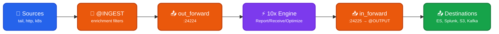

Runs 10x Engine as a [sidecar](https://doc.log10x.com/engine/launcher/sidecar) to Fluentd for reporting, receiving, and optimizing events before they ship to their destination (Elasticsearch, Splunk, S3, Kafka, …). In the VM/host recipe, Fluentd and Log10x run as peer processes and exchange events over the [Fluent Forward protocol](https://docs.fluentd.org/output/forward); works against any stock Fluentd build (td-agent, fluent-package, OSS) and the official Fluentd Helm chart on Kubernetes via a `log10x/edge-10x` sidecar container (kustomize post-renderer overlay).

## Architecture

<div style="text-align: center;">


```mermaid
graph LR
    A["<div style='font-size: 14px;'>📂 Sources</div><div style='font-size: 10px;'>tail, http, k8s</div>"] --> F["<div style='font-size: 14px;'>🧪 @INGEST</div><div style='font-size: 10px;'>enrichment filters</div>"]
    F --> B["<div style='font-size: 14px;'>📤 out_forward</div><div style='font-size: 10px;'>:24224</div>"]
    B --> E["<div style='font-size: 14px;'>⚡ 10x Engine</div><div style='font-size: 10px;'>Report/Receive/Optimize</div>"]
    E --> C["<div style='font-size: 14px;'>📥 in_forward</div><div style='font-size: 10px;'>:24225 → @OUTPUT</div>"]
    C --> D["<div style='font-size: 14px;'>📤 Destinations</div><div style='font-size: 10px;'>ES, Splunk, S3, Kafka</div>"]

    classDef input fill:#2563eb,stroke:#1d4ed8,color:#ffffff,stroke-width:2px,rx:8,ry:8
    classDef filter fill:#ea580c,stroke:#c2410c,color:#ffffff,stroke-width:2px,rx:8,ry:8
    classDef engine fill:#7c3aed,stroke:#6d28d9,color:#ffffff,stroke-width:2px,rx:8,ry:8
    classDef output fill:#16a34a,stroke:#15803d,color:#ffffff,stroke-width:2px,rx:8,ry:8

    class A input
    class B filter
    class C filter
    class D output
    class E engine
    class F filter
```

</div>

### Data Flow

- 📂 **Sources**, Your existing Fluentd sources (`tail`, `http`, `forward`, syslog, etc.) route their events into the `@INGEST` label.
- 🧪 **@INGEST**, Your enrichment filters (`kubernetes_metadata`, `record_transformer`, parsers, …) run here exactly once before the event is handed off to Log10x.
- 📤 **out_forward** → Log10x, Fluentd forwards the enriched event to the Log10x sidecar over TCP `:24224` (or a Unix socket on Linux/macOS).
- ⚡ **10x Engine**, The Receiver app applies rate/policy-based filtering and optionally compacts events for volume reduction.
- 📥 **in_forward → @OUTPUT**, Processed events come back to Fluentd on `:24225` and are routed directly to the `@OUTPUT` label, which holds your destination `<match>` blocks. Filters defined under `@INGEST` are **not** re-applied, so each event is enriched exactly once.
- 📤 **Destinations**, The original Fluentd tag survives the round trip, so destinations that route on `$TAG` (Splunk index, S3 path, Kafka topic, …) behave the same as if Log10x weren't in the path.

### What an event looks like on the way back

The record structure of the original Fluentd event is preserved end-to-end, every field comes back to your `@OUTPUT` label with the same name and same position. What changes depends on the Receiver app mode:

| Mode | Difference vs the event Fluentd sent in |
|------|-----------------------------------------|
| Receive (default) | None. Same record. |
| Receive + `symbolMessageHashField <name>` | Adds one new field with the symbol-pattern hash (a stable identifier for the message pattern, usable as a dedup key, metric dimension, or correlation ID). |
| `receiverOptimize true` | The value of the message field (`log` by default, or whatever `fluentdInputMessageField` is set to) is replaced with a compact encoded form. A separate `tenx-template` event is emitted with the template needed to decode it. All other fields stay verbatim. |
| `receiverOptimize true` + `symbolMessageHashField <name>` | Both of the above. |

`symbolMessageHashField` is unset by default, which is what makes the first row true: the receive path hands the record back exactly as it arrived. The pattern hash is still computed and still rides the event inside the engine as `tenx_hash` for metrics and aggregation, it just does not reach the wire. Naming a field opts in, either as a launch argument (`tenx @run/input/forwarder/fluentd @apps/receiver symbolMessageHashField my_custom_hash`) or as an environment variable of the same name.

The original Fluentd tag is carried by the Forward protocol itself and surfaces on the event as its `source` inside Log10x, used for rate-based grouping and emitted back to Fluentd as the wire tag on the return path. Internally, Log10x's Fluentd input module reads the message text from the field named by `fluentdInputMessageField` (default `log`); when the Receiver app is configured with `k8sExtractorName: fluentK8s`, the `kubernetes.*` sub-object is also materialized as enrichment fields for use by message-pattern and rate filtering.

??? tenx-keyfiles "Key Files"

    | File | Purpose |
    |------|---------|
    | [`stream.yaml`](https://github.com/log-10x/modules/blob/main/pipelines/run/modules/input/forwarder/fluentd/stream.yaml) | Fluentd Forward input + output stream definitions |
    | [`conf/tenx-sidecar.conf`](https://github.com/log-10x/modules/blob/main/pipelines/run/modules/input/forwarder/fluentd/conf/tenx-sidecar.conf) | Reference Fluentd config showing `@INGEST` / `@OUTPUT` label routing |

## Quickstart

**1. Run Log10x:**

```bash
tenx @run/input/forwarder/fluentd @apps/receiver
```

**2. Wire up your Fluentd config**, include the sidecar recipe and route your sources to `@INGEST`:

```xml title="fluentd.conf"
@include "#{ENV['TENX_MODULES']}/pipelines/run/modules/input/forwarder/fluentd/conf/tenx-sidecar.conf"

<source>
  @type tail
  path /var/log/app.log
  tag app.logs
  @label @INGEST          # routes the source into the sidecar
  <parse>
    @type json
  </parse>
</source>
```

**3. Point `@OUTPUT` at your real destinations** (the recipe defaults to `stdout` for testing):

```xml
<label @OUTPUT>
  <match **>
    @type your_output_plugin
    # ... destination config
  </match>
</label>
```

For Splunk integration see the [10x for Splunk](https://doc.log10x.com/apps/receiver/compact/splunk/) documentation. For Kubernetes deployment, add the `log10x/edge-10x` sidecar on top of the official Fluentd chart via a kustomize post-renderer overlay, see the [Helm chart overlay](https://doc.log10x.com/apps/receiver/deploy/#fluentd).
