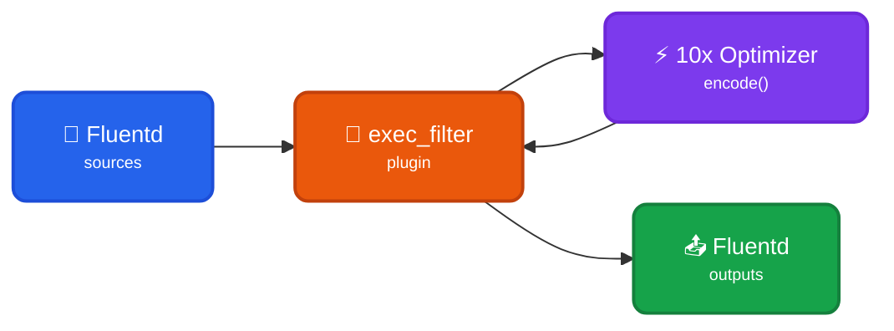

[Losslessly compact](https://doc.log10x.com/run/transform/#compact) events collected by Fluentd forwarders ***before*** they ship to output (e.g., ElasticSearch, S3). This module is a component of the [Edge Optimizer](https://doc.log10x.com/apps/edge/optimizer/) app.

## Architecture

### Data Flow

- 📂 **Fluentd Sources** - Collect logs from files, TCP, HTTP, or other sources
- 🔧 **exec_filter Plugin** - Pipes events to 10x sidecar via stdin
- ⚡ **10x Optimizer** - Losslessly [compacts](https://doc.log10x.com/run/transform/#compact) events to reduce log volume 50-80%
- 🔄 **Bidirectional Pipe** - COMPACT events return via stdout to exec_filter
- 📤 **Fluentd Outputs** - Compact events ship to final destinations at reduced size

### Key Characteristics

| Feature | Description |
|---------|-------------|
| 📦 **Lossless Compact** | Compacts events to reduce log volume 50-80% |
| 🔗 **Template Extraction** | Repetitive structures become reusable templates |
| 💰 **Cost Savings** | Reduced storage and transfer costs |
| 🔧 **exec_filter** | Uses Fluentd's native exec_filter for stdin/stdout piping |

### :material-swap-horizontal-circle-outline: Sidecar Relay

This [module](https://doc.log10x.com/engine/module/) configures a Fluentd [exec-filter](https://docs.fluentd.org/output/exec_filter) that launches a 10x [sidecar process](https://doc.log10x.com/engine/launcher/sidecar) and passes it collected events to encode. The sidecar relays compact events back to the Fluentd filter to ship to outputs (e.g., Splunk, S3).

### :material-download-outline: Install

=== ":material-laptop: Nix/Win/OSX"

    See the Log10x Edge Optimizer Fluentd [run instructions](https://doc.log10x.com/apps/edge/optimizer/run/#fluentd)

=== ":material-kubernetes: k8s"

    Deploy to k8s via [Helm](https://helm.sh/){target="_blank"}

    See the Log10x Edge Optimizer Fluentd [deployment instructions](https://doc.log10x.com/apps/edge/optimizer/deploy/#fluentd)
