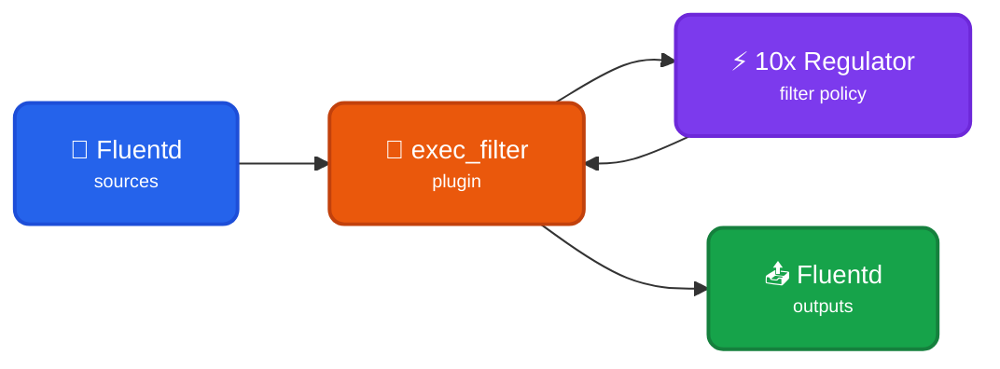

Read events from a Fluentd forwarder to transform them into typed [TenXObjects](https://doc.log10x.com/api/js/#TenXObject) to filter using local/centralized [regulator](https://doc.log10x.com/run/output/regulate) policy. This module is a component of the [Regulator](https://doc.log10x.com/apps/regulator/) app.

## Architecture

### Data Flow

- 📂 **Fluentd Sources** - Collect logs from files, TCP, HTTP, or other sources
- 🔧 **exec_filter Plugin** - Pipes ALL events to 10x sidecar via stdin
- ⚡ **10x Regulator** - Applies rate/policy-based filtering, drops noisy events
- 🔄 **Bidirectional Pipe** - FILTERED events return via stdout to exec_filter
- 📤 **Fluentd Outputs** - Only filtered events ship to final destinations

### Key Characteristics

| Feature | Description |
|---------|-------------|
| 🚦 **Rate Limiting** | Filter events based on per-template rate limits |
| 📋 **Policy-Based** | Apply local or centralized filtering policies |
| 💰 **Cost Control** | Reduce log volume and costs by dropping noisy events |
| 🔧 **exec_filter** | Uses Fluentd's native exec_filter for stdin/stdout piping |

### :material-swap-horizontal-circle-outline: Sidecar Relay

This [module](https://doc.log10x.com/engine/module/) configures a Fluentd [exec-filter](https://docs.fluentd.org/output/exec_filter) that launches a 10x [sidecar process](https://doc.log10x.com/engine/launcher/sidecar) and passes it collected events to regulate using a local/centralized policy. The sidecar relays regulated events back to the Fluentd filter to ship to outputs (e.g., Splunk, S3).

### :material-download-outline: Install

=== ":material-laptop: Nix/Win/OSX"

    See the Log10x Regulator Fluentd [run instructions](https://doc.log10x.com/apps/regulator/run/#fluentd)

=== ":material-kubernetes: k8s"

    Deploy to k8s via [Helm](https://helm.sh/){target="_blank"}

    See the Log10x Regulator Fluentd [deployment instructions](https://doc.log10x.com/apps/regulator/deploy/#fluentd)
