Read events from a Fluentd forwarder over the native [Fluent Forward protocol](https://docs.fluentd.org/output/forward) and write processed events back to a Fluentd `in_forward` source over the same protocol. Log10x runs as a peer process (not as a Fluentd subprocess) — recommended for Kubernetes deployments and any deployment that uses the official Fluentd Helm chart with a pure values overlay. This module is a component of the [Receiver](https://doc.log10x.com/apps/receiver/) app.

## Architecture

```mermaid
graph LR
    A["<div style='font-size: 14px;'>📂 Fluentd</div><div style='font-size: 10px;'>sources + enrichment</div>"] --> B["<div style='font-size: 14px;'>📤 out_forward</div><div style='font-size: 10px;'>:24224</div>"]
    B --> C["<div style='font-size: 14px;'>⚡ 10x Receiver</div><div style='font-size: 10px;'>filter / compact</div>"]
    C --> D["<div style='font-size: 14px;'>📥 in_forward</div><div style='font-size: 10px;'>:24225 → @OUTPUT</div>"]
    D --> E["<div style='font-size: 14px;'>📤 Fluentd</div><div style='font-size: 10px;'>destinations</div>"]

    classDef input fill:#2563eb,stroke:#1d4ed8,color:#ffffff,stroke-width:2px,rx:8,ry:8
    classDef filter fill:#ea580c,stroke:#c2410c,color:#ffffff,stroke-width:2px,rx:8,ry:8
    classDef engine fill:#7c3aed,stroke:#6d28d9,color:#ffffff,stroke-width:2px,rx:8,ry:8
    classDef output fill:#16a34a,stroke:#15803d,color:#ffffff,stroke-width:2px,rx:8,ry:8

    class A input
    class B filter
    class C engine
    class D filter
    class E output
```

### Data Flow

- 📂 **Fluentd Sources + Enrichment** — Sources collect logs; events flow through enrichment filters under the `@INGEST` label.
- 📤 **out_forward** — Sends events to Log10x via Fluent Forward (TCP `:24224` or Unix socket).
- ⚡ **10x Receiver** — Applies rate/policy-based filtering, optionally compacts events.
- 📥 **in_forward → @OUTPUT** — Receives processed events back from Log10x, routed straight to a dedicated `@label` so they bypass the `@INGEST` enrichment chain on the return path.
- 📤 **Fluentd Destinations** — Final outputs (Splunk, S3, Elastic, Kafka, …) see events with their original tag preserved.

### Key Characteristics

| Feature | Description |
|---------|-------------|
| 🪶 **Stock Fluentd** | No `exec_filter`, no Lua — works against any Fluentd build (td-agent, fluent-package, OSS). |
| 🎁 **Pure Helm overlay** | Compatible with the official Fluentd Helm chart via a `values.yaml` overlay; no fork required. |
| 🏷️ **Tag preservation** | Original Fluentd tag is preserved across the round trip — destinations routing on `$TAG` see the same value. |
| 🚧 **Bypass routing** | Returning events route to `@OUTPUT` via Fluentd's native `<label>` scope, so enrichment filters do not fire twice. |

### :material-download-outline: Install

=== ":material-laptop: Nix/Win/OSX"

    Recipe at [`conf/tenx-sidecar.conf`](../conf/tenx-sidecar.conf) — adapt the example `<source>` and `@OUTPUT`'s `<match>` to your own.

=== ":material-kubernetes: k8s"

    Deploy as a values overlay on the official Fluentd Helm chart (no fork required). See the Log10x Fluentd [sidecar deployment instructions](https://doc.log10x.com/run/input/forwarder/fluentd/sidecar/#install).
