Runs a 10x Engine as a [sidecar process](https://doc.log10x.com/engine/launcher/sidecar) to report, regulate, and optimize events _before_ they ship to output (e.g., ElasticSearch, Splunk, AWS S3).

## Architecture

```mermaid
graph LR
    A["<div style='font-size: 14px;'>📂 Input</div><div style='font-size: 10px;'>beats, file</div>"] --> B["<div style='font-size: 14px;'>🔧 pipe output</div><div style='font-size: 10px;'>plugin</div>"]
    B --> E["<div style='font-size: 14px;'>⚡ 10x Engine</div><div style='font-size: 10px;'>Optimize/Regulate/Report</div>"]
    E --> C["<div style='font-size: 14px;'>🔌 Unix/TCP</div><div style='font-size: 10px;'>return path</div>"]
    C --> D["<div style='font-size: 14px;'>📤 Output</div><div style='font-size: 10px;'>ES, S3</div>"]

    classDef input fill:#2563eb,stroke:#1d4ed8,color:#ffffff,stroke-width:2px,rx:8,ry:8
    classDef filter fill:#ea580c,stroke:#c2410c,color:#ffffff,stroke-width:2px,rx:8,ry:8
    classDef socket fill:#0891b2,stroke:#0e7490,color:#ffffff,stroke-width:2px,rx:8,ry:8
    classDef output fill:#16a34a,stroke:#15803d,color:#ffffff,stroke-width:2px,rx:8,ry:8
    classDef engine fill:#7c3aed,stroke:#6d28d9,color:#ffffff,stroke-width:2px,rx:8,ry:8

    class A input
    class B filter
    class C socket
    class D output
    class E engine
```

### Data Flow

| Component | Protocol | Description |
|-----------|----------|-------------|
| 🔧 pipe output | Logstash plugin | Launches 10x subprocess via pipe |
| 🔧 json codec | JSON/stdin | Logstash's native JSON codec |
| ⚡ 10x Engine | Internal | Processes event (report/regulate/optimize) |
| 🔌 Unix/TCP output | Socket | Returns processed event to Logstash pipeline |
| 🔌 unix/tcp input | json_lines | Logstash receives processed events |

### Expected Event Format

The 10x Engine expects JSON events from Logstash containing:

| Field | Description | Used For |
|-------|-------------|----------|
| `file` | Source file path from Logstash's file input | Source identification via `sourcePattern` |
| `message` | The actual log message (configurable via `logstashMessageField`) | Message extraction |

The `sourcePattern` regex `\"file\":\"(.*?)\"` extracts the event source from the `file` field for rate regulation grouping.

??? tenx-keyfiles "Key Files"

    | File | Purpose |
    |------|---------|
    | [`optimize/tenx-pipe-in-unix.conf`](https://github.com/log-10x/modules/blob/main/pipelines/run/modules/input/forwarder/logstash/optimize/tenx-pipe-in-unix.conf){target="_blank"} | Logstash pipe + Unix socket config |
    | [`optimize/tenx-pipe-in-tcp.conf`](https://github.com/log-10x/modules/blob/main/pipelines/run/modules/input/forwarder/logstash/optimize/tenx-pipe-in-tcp.conf){target="_blank"} | Logstash pipe + TCP config (Windows) |
    | [`input/stream.yaml`](https://github.com/log-10x/modules/blob/main/pipelines/run/modules/input/forwarder/logstash/input/stream.yaml){target="_blank"} | 10x stdin input configuration |
    | [`output/unix/stream.yaml`](https://github.com/log-10x/modules/blob/main/pipelines/run/modules/input/forwarder/logstash/output/unix/stream.yaml){target="_blank"} | 10x Unix socket output configuration |
    | [`output/tcp/stream.yaml`](https://github.com/log-10x/modules/blob/main/pipelines/run/modules/input/forwarder/logstash/output/tcp/stream.yaml){target="_blank"} | 10x TCP socket output configuration |
