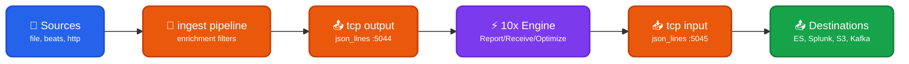

Runs 10x Engine as a [sidecar](https://doc.log10x.com/engine/launcher/sidecar) to Logstash for reporting, receiving, and optimizing events before they ship to their destination (Elasticsearch, OpenSearch, Splunk, S3, Kafka, …). Logstash and Log10x run as peer processes and exchange events as newline-delimited JSON over TCP — Logstash's built-in `tcp` input and output plugins with `codec => json_lines` on both legs. Works against any stock Logstash build (OSS or Elastic distribution) and the official `elastic/logstash` Helm chart with a values overlay.

## Architecture

<div style="text-align: center;">


```mermaid
graph LR
    A["<div style='font-size: 14px;'>📂 Sources</div><div style='font-size: 10px;'>file, beats, http</div>"] --> F["<div style='font-size: 14px;'>🧪 ingest pipeline</div><div style='font-size: 10px;'>enrichment filters</div>"]
    F --> B["<div style='font-size: 14px;'>📤 tcp output</div><div style='font-size: 10px;'>json_lines :5044</div>"]
    B --> E["<div style='font-size: 14px;'>⚡ 10x Engine</div><div style='font-size: 10px;'>Report/Receive/Optimize</div>"]
    E --> C["<div style='font-size: 14px;'>📥 tcp input</div><div style='font-size: 10px;'>json_lines :5045</div>"]
    C --> D["<div style='font-size: 14px;'>📤 Destinations</div><div style='font-size: 10px;'>ES, Splunk, S3, Kafka</div>"]

    classDef input fill:#2563eb,stroke:#1d4ed8,color:#ffffff,stroke-width:2px,rx:8,ry:8
    classDef filter fill:#ea580c,stroke:#c2410c,color:#ffffff,stroke-width:2px,rx:8,ry:8
    classDef engine fill:#7c3aed,stroke:#6d28d9,color:#ffffff,stroke-width:2px,rx:8,ry:8
    classDef output fill:#16a34a,stroke:#15803d,color:#ffffff,stroke-width:2px,rx:8,ry:8

    class A input
    class B filter
    class C filter
    class D output
    class E engine
    class F filter
```

</div>

### Data Flow

- 📂 **Sources** — Your existing Logstash inputs (`file`, `beats`, `tcp`, `http`, …) feed into the `ingest` pipeline.
- 🧪 **ingest pipeline** — Your enrichment filters (`grok`, `mutate`, `kv`, `geoip`, `date`, …) run here exactly once before the event is handed off to Log10x. The pipeline also stamps a `tag` field that survives the round trip and surfaces as the event's source inside Log10x.
- 📤 **tcp output** → Log10x — Logstash's `tcp` output plugin (`codec => json_lines`) ships the enriched event to the Log10x sidecar on TCP `:5044` (or a Unix socket on Linux/macOS via the `unix` output plugin).
- ⚡ **10x Engine** — The Receiver app applies rate/policy-based filtering and optionally compacts events for volume reduction.
- 📥 **tcp input → destinations pipeline** — Processed events come back to Logstash on `:5045` and are picked up by a separate `destinations` pipeline whose `output` block holds your real destinations. Filters defined under `ingest` are **not** re-applied — Logstash's [multi-pipeline routing](https://www.elastic.co/guide/en/logstash/current/multiple-pipelines.html) keeps each pipeline's filter chain isolated.
- 📤 **Destinations** — The original `tag` field survives the round trip, so destinations that route on it (Splunk index, S3 prefix, Kafka topic, …) behave the same as if Log10x weren't in the path.

### What an event looks like on the way back

The record structure of the original Logstash event is preserved end-to-end — every field comes back to your `destinations` pipeline with the same name and same position. What changes depends on the Receiver app mode:

| Mode | Difference vs the event Logstash sent in |
|------|------------------------------------------|
| Receive (default) | None. Same record. |
| Receive + `symbolMessageHashField <name>` | Adds one new field with the symbol-pattern hash (a stable identifier for the message pattern — usable as a dedup key, metric dimension, or correlation ID). |
| `receiverOptimize true` | The value of the message field (`message` by default, or whatever `logstashMessageField` is set to) is replaced with a compact encoded form. A separate event with `tag` set to `tenx-template` is emitted with the template needed to decode it. All other fields stay verbatim. |
| `receiverOptimize true` + `symbolMessageHashField <name>` | Both of the above. |

The `tag` field that the ingest pipeline stamps becomes the event's `source` inside Log10x — used for rate-based grouping and preserved on each event as it returns to Logstash. The message text is read from the `message` field by default (override with `logstashMessageField`). When the Receiver app is configured with `k8sExtractorName: fluentK8s`, the `kubernetes.*` sub-object is also lifted into pod/container metadata fields used by message-pattern and rate filtering.

??? tenx-keyfiles "Key Files"

    | File | Purpose |
    |------|---------|
    | [`input/stream.yaml`](https://github.com/log-10x/modules/blob/main/pipelines/run/modules/input/forwarder/logstash/input/stream.yaml) | Logstash JSON socket input — reads NDJSON and captures the message field |
    | [`output/stream.yaml`](https://github.com/log-10x/modules/blob/main/pipelines/run/modules/input/forwarder/logstash/output/stream.yaml) | Logstash JSON socket output — sends processed events back to Logstash |
    | [`conf/tenx-sidecar.conf`](https://github.com/log-10x/modules/blob/main/pipelines/run/modules/input/forwarder/logstash/conf/tenx-sidecar.conf) | Reference Logstash pipeline config showing the `ingest` / `destinations` split |

## Quickstart

**1. Run Log10x:**

```bash
tenx @run/input/forwarder/logstash @apps/receiver
```

**2. Wire up your Logstash config** — split your work into two pipelines via `pipelines.yml`, with an ingest leg that ends in `tcp { codec => json_lines }` and a destinations leg that starts with `tcp { codec => json_lines }`:

```yaml title="pipelines.yml"
- pipeline.id: ingest
  path.config: "${TENX_MODULES}/pipelines/run/modules/input/forwarder/logstash/conf/tenx-sidecar.conf"
- pipeline.id: destinations
  path.config: "/etc/logstash/conf.d/destinations.conf"
```

**3. Point the `destinations` pipeline at your real outputs** (the recipe defaults to `stdout` for testing):

```ruby title="destinations.conf"
input {
  tcp {
    host  => "0.0.0.0"
    port  => 5045
    codec => json_lines
  }
}
output {
  # ... your real destinations ...
}
```

For Kubernetes deployment via the official `elastic/logstash` Helm chart see the [Helm sidecar overlay](https://doc.log10x.com/apps/receiver/deploy/#logstash).
