Read events from a Logstash forwarder to transform them into typed [TenXObjects](https://doc.log10x.com/api/js/#TenXObject) to filter using local/centralized [regulator](https://doc.log10x.com/run/output/regulate) policy. This module is a component of the [Edge Regulator](https://doc.log10x.com/apps/edge/regulator/) app.

## Architecture

```mermaid
graph LR
    A["<div style='font-size: 14px;'>📂 Logstash</div><div style='font-size: 10px;'>inputs</div>"] --> B["<div style='font-size: 14px;'>🔧 Pipe Output</div><div style='font-size: 10px;'>plugin</div>"]
    B --> C["<div style='font-size: 14px;'>⚡ 10x Regulator</div><div style='font-size: 10px;'>filter policy</div>"]
    C --> D["<div style='font-size: 14px;'>🔌 Unix/TCP</div><div style='font-size: 10px;'>input</div>"]
    D --> E["<div style='font-size: 14px;'>📤 Logstash</div><div style='font-size: 10px;'>outputs</div>"]

    classDef input fill:#2563eb,stroke:#1d4ed8,color:#ffffff,stroke-width:2px,rx:8,ry:8
    classDef filter fill:#ea580c,stroke:#c2410c,color:#ffffff,stroke-width:2px,rx:8,ry:8
    classDef engine fill:#7c3aed,stroke:#6d28d9,color:#ffffff,stroke-width:2px,rx:8,ry:8
    classDef socket fill:#0891b2,stroke:#0e7490,color:#ffffff,stroke-width:2px,rx:8,ry:8
    classDef output fill:#16a34a,stroke:#15803d,color:#ffffff,stroke-width:2px,rx:8,ry:8

    class A input
    class B filter
    class C engine
    class D socket
    class E output
```

### Data Flow

- 📂 **Logstash Inputs** - Collect logs from files, beats, TCP, or other sources
- 🔧 **Pipe Output Plugin** - Pipes ALL events to 10x sidecar via stdin
- ⚡ **10x Regulator** - Applies rate/policy-based filtering, drops noisy events
- 🔌 **Unix/TCP Input** - Receives FILTERED events back from the sidecar
- 📤 **Logstash Outputs** - Only filtered events ship to final destinations

### Key Characteristics

| Feature | Description |
|---------|-------------|
| 🚦 **Rate Limiting** | Filter events based on per-template rate limits |
| 📋 **Policy-Based** | Apply local or centralized filtering policies |
| 💰 **Cost Control** | Reduce log volume and costs by dropping noisy events |
| 🔧 **Pipe Output** | Uses Logstash's pipe output plugin for stdin piping |

### :material-swap-horizontal-circle-outline: Sidecar Relay

This [module](https://doc.log10x.com/engine/module/) configures a Logstash [pipe output](https://www.elastic.co/guide/en/logstash/current/plugins-outputs-pipe.html) plugin and Unix/TCP input plugin. The Logstash output plugin launches a 10x [sidecar process](https://doc.log10x.com/engine/launcher/sidecar) and pipes events to it to regulate using a local/centralized policy. The sidecar relays regulated events back to Logstash Unix/TCP input plugin to ship to output (e.g., ElasticSearch).

### :material-download-outline: Install

=== ":material-laptop: Nix/Win/OSX"

    See the Log10x Edge Regulator Logstash [run instructions](https://doc.log10x.com/apps/edge/regulator/run/#logstash)

=== ":material-kubernetes: k8s"

    Currently not supported
