Integrate Log10x with OpenTelemetry Collector to report, regulate, and optimize log events _before_ shipping to outputs (Elasticsearch, Splunk, S3).

## Architecture

```mermaid
graph LR
    A["<div style='font-size: 14px;'>📂 OTel Collector</div><div style='font-size: 10px;'>receivers</div>"] --> B["<div style='font-size: 14px;'>📤 syslog exporter</div><div style='font-size: 10px;'>Unix socket</div>"]
    B --> C["<div style='font-size: 14px;'>⚡ 10x Engine</div><div style='font-size: 10px;'>Report/Regulate/Optimize</div>"]
    C --> D["<div style='font-size: 14px;'>📥 fluentforward</div><div style='font-size: 10px;'>receiver</div>"]
    D --> E["<div style='font-size: 14px;'>📤 OTel Collector</div><div style='font-size: 10px;'>exporters</div>"]

    classDef input fill:#2563eb,stroke:#1d4ed8,color:#ffffff,stroke-width:2px,rx:8,ry:8
    classDef exporter fill:#ea580c,stroke:#c2410c,color:#ffffff,stroke-width:2px,rx:8,ry:8
    classDef engine fill:#7c3aed,stroke:#6d28d9,color:#ffffff,stroke-width:2px,rx:8,ry:8
    classDef output fill:#16a34a,stroke:#15803d,color:#ffffff,stroke-width:2px,rx:8,ry:8

    class A input
    class B exporter
    class C engine
    class D exporter
    class E output
```

<div style="text-align: center;">



</div>

### Data Flow

- 📂 **Receivers** - OTel Collector receives logs via `filelog`, `otlp`, or other receivers
- 📤 **Syslog Exporter** - Sends events as RFC5424 syslog to Log10x via Unix socket
- ⚡ **10x Engine** - Processes events (report metrics / regulate / optimize encoding)
- 🔌 **Forward Output** - Returns processed events via Forward protocol (Unix socket)
- 📥 **FluentForward Receiver** - OTel Collector receives processed events
- 📤 **Final Exporters** - Ships to Elasticsearch, Splunk, S3, etc.

### Component Details

| Component | Protocol | Description |
|-----------|----------|-------------|
| 📤 `syslog/tenx` | RFC5424 / Unix | Sends logs to Log10x for processing |
| ⚡ 10x Engine | Internal | Report metrics, filter (regulate), or encode (optimize) |
| 📥 `fluentforward/tenx` | Forward / Unix | Receives processed logs back from Log10x |
| 🔀 Separate Pipelines | N/A | `logs/to-tenx` and `logs/from-tenx` prevent loops |

### Loop Prevention

OTel Collector's **separate pipelines** naturally prevent infinite loops:

- `logs/to-tenx` - Original logs flow TO Log10x
- `logs/from-tenx` - Processed logs flow FROM Log10x to final destinations

Events in `logs/from-tenx` never feed back to `logs/to-tenx`.

??? tenx-keyfiles "Key Files"

    | File | Purpose |
    |------|---------|
    | [`conf/tenx-report-linux.yaml`](https://github.com/log-10x/modules/blob/main/pipelines/run/modules/input/forwarder/otel-collector/conf/tenx-report-linux.yaml){target="_blank"} | OTel Collector config for Reporter mode |
    | [`conf/tenx-regulate-linux.yaml`](https://github.com/log-10x/modules/blob/main/pipelines/run/modules/input/forwarder/otel-collector/conf/tenx-regulate-linux.yaml){target="_blank"} | OTel Collector config for Regulator mode |
    | [`conf/tenx-optimize-linux.yaml`](https://github.com/log-10x/modules/blob/main/pipelines/run/modules/input/forwarder/otel-collector/conf/tenx-optimize-linux.yaml){target="_blank"} | OTel Collector config for Optimizer mode |
    | [`input/stream.yaml`](https://github.com/log-10x/modules/blob/main/pipelines/run/modules/input/forwarder/otel-collector/input/stream.yaml){target="_blank"} | 10x Unix socket input with syslog parsing |
    | [`output/unix/stream.yaml`](https://github.com/log-10x/modules/blob/main/pipelines/run/modules/input/forwarder/otel-collector/output/unix/stream.yaml){target="_blank"} | 10x Forward protocol output configuration |

## Quickstart

**1. Set environment variables:**

```bash
export TENX_MODULES=/path/to/config/modules
export TENX_CONFIG=/path/to/config/config
export TENX_API_KEY=your-api-key
```

**2. Start Log10x first:**

```bash
# Reporter (read-only analytics)
tenx run @run/input/forwarder/otel-collector/report @apps/edge/reporter

# Regulator (filter noisy logs)
tenx run @run/input/forwarder/otel-collector/regulate @apps/edge/regulator

# Optimizer (Lossless Compact)
tenx run @run/input/forwarder/otel-collector/optimize @apps/edge/optimizer
```

**3. Copy and customize OTel Collector config:**

```bash
cp $TENX_MODULES/pipelines/run/modules/input/forwarder/otel-collector/conf/tenx-regulate-linux.yaml /etc/otelcol-contrib/
```

**4. Start OTel Collector:**

```bash
otelcol-contrib --config=/etc/otelcol-contrib/tenx-regulate-linux.yaml
```

!!! note "Requirements"
    - **OTel Collector Contrib v0.143.0+** - Required for syslog exporter Unix socket support (`network: unix`)
    - Components needed: `syslogexporter` and `fluentforwardreceiver`

!!! warning "Message Attribute"
    The syslog exporter uses the `message` **attribute** for the MSG field, NOT the log body.
    Ensure your logs have a `message` attribute set, or use a transform processor to copy the body to a message attribute before the syslog exporter.

