[Losslessly compact](https://doc.log10x.com/run/transform/#compact) events collected by OpenTelemetry Collector ***before*** they ship to output (e.g., ElasticSearch, S3). This module is a component of the [Edge Optimizer](https://doc.log10x.com/apps/edge/optimizer/) app.

## Architecture

```mermaid
graph LR
    A["<div style='font-size: 14px;'>📂 OTel Receivers</div><div style='font-size: 10px;'>filelog, otlp</div>"] --> B["<div style='font-size: 14px;'>📤 syslog</div><div style='font-size: 10px;'>exporter</div>"]
    B --> C["<div style='font-size: 14px;'>🔌 Unix Socket</div><div style='font-size: 10px;'>RFC5424</div>"]
    C --> D["<div style='font-size: 14px;'>⚡ 10x Optimizer</div><div style='font-size: 10px;'>encode()</div>"]
    D --> E["<div style='font-size: 14px;'>🔌 Unix Socket</div><div style='font-size: 10px;'>Forward</div>"]
    E --> F["<div style='font-size: 14px;'>📥 fluentforward</div><div style='font-size: 10px;'>receiver</div>"]
    F --> G["<div style='font-size: 14px;'>📤 Final Exporters</div><div style='font-size: 10px;'>ES, Splunk, S3</div>"]

    classDef receiver fill:#2563eb,stroke:#1d4ed8,color:#ffffff,stroke-width:2px,rx:8,ry:8
    classDef exporter fill:#ea580c,stroke:#c2410c,color:#ffffff,stroke-width:2px,rx:8,ry:8
    classDef socket fill:#0891b2,stroke:#0e7490,color:#ffffff,stroke-width:2px,rx:8,ry:8
    classDef engine fill:#7c3aed,stroke:#6d28d9,color:#ffffff,stroke-width:2px,rx:8,ry:8
    classDef output fill:#16a34a,stroke:#15803d,color:#ffffff,stroke-width:2px,rx:8,ry:8

    class A receiver
    class B,F exporter
    class C,E socket
    class D engine
    class G output
```

### Data Flow

- 📂 **OTel Receivers** - Collect logs from files, OTLP, or other sources
- 📤 **Syslog Exporter** - Sends logs to Log10x via Unix socket (RFC5424 format)
- ⚡ **10x Optimizer** - Losslessly [compacts](https://doc.log10x.com/run/transform/#compact) events to reduce log volume 50-80%
- 🔌 **Forward Output** - Returns COMPACT events via Forward protocol
- 📥 **FluentForward Receiver** - OTel Collector receives compact events
- 📤 **Final Exporters** - Compact events ship to final destinations at reduced size

### Key Characteristics

| Feature | Description |
|---------|-------------|
| 📦 **Lossless Compact** | Compacts events to reduce log volume 50-80% |
| 🔗 **Template Extraction** | Repetitive structures become reusable templates |
| 💰 **Cost Savings** | Reduced storage and transfer costs |
| 🔄 **Two Pipelines** | `logs/to-tenx` sends original, `logs/from-tenx` receives compact |

### :material-swap-horizontal-circle-outline: Sidecar Relay

This [module](https://doc.log10x.com/engine/module/) configures a Unix socket input/output pair that receives syslog events from OpenTelemetry Collector, losslessly compacts events, and returns compact events via Forward protocol. The sidecar relays compact events back to OTel Collector to ship to outputs (e.g., Splunk, S3).

### :material-download-outline: Install

=== ":material-laptop: Nix/Win/OSX"

    See the Log10x Edge Optimizer OTel Collector [run instructions](https://doc.log10x.com/apps/edge/optimizer/run/#otel-collector)

=== ":material-kubernetes: k8s"

    Deploy to k8s via [Helm](https://helm.sh/){target="_blank"}

    See the Log10x Edge Optimizer OTel Collector [deployment instructions](https://doc.log10x.com/apps/edge/optimizer/deploy/#otel-collector)

