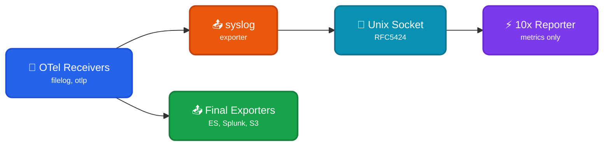

Read events from OpenTelemetry Collector to transform into typed [TenXObjects](https://doc.log10x.com/api/js/#TenXObject) for aggregation and reporting. This module is a component of the [Edge Reporter](https://doc.log10x.com/apps/edge/reporter/) app.

## Architecture

### Data Flow

- 📂 **OTel Receivers** - Collect logs from files, OTLP, or other sources
- 📤 **Syslog Exporter** - Sends logs to Log10x via Unix socket (RFC5424 format)
- ⚡ **10x Reporter** - Transforms events, aggregates metrics, publishes to time-series DBs
- 📤 **Final Exporters** - Logs flow in parallel to final destinations (unmodified)

### Key Characteristics

| Feature | Description |
|---------|-------------|
| 📊 **Read-Only** | Reporter only collects metrics - does not modify event flow |
| 🔀 **Parallel Flow** | Logs go to BOTH Log10x AND final exporters simultaneously |
| 📈 **Metrics Output** | Publishes aggregated metrics to Prometheus, Datadog, etc. |
| 🚫 **No Return Path** | No `fluentforward` receiver needed for reporter mode |

### :material-swap-horizontal-circle-outline: Unix Socket Input

This [module](https://doc.log10x.com/engine/module/) configures a Unix socket input that receives RFC5424 syslog events from OpenTelemetry Collector's `syslogexporter` to aggregate and publish to [time-series](https://doc.log10x.com/run/output/metric/) outputs.

### :material-download-outline: Install

=== ":material-laptop: Nix/Win/OSX"

    See the Log10x Edge Reporter OTel Collector [run instructions](https://doc.log10x.com/apps/edge/reporter/run/#otel-collector)

=== ":material-kubernetes: k8s"

    Deploy to k8s via [Helm](https://helm.sh/){target="_blank"}

    See the Log10x Edge Reporter OTel Collector [deployment instructions](https://doc.log10x.com/apps/edge/reporter/deploy/#otel-collector)

