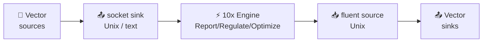

Integrate Log10x with [Vector](https://vector.dev) to report, regulate, and optimize log events _before_ shipping to outputs (Elasticsearch, Splunk, S3).

## Architecture



### Data Flow

- 📂 **Sources** — Vector reads logs from `file`, `kubernetes_logs`, `journald`, `vector` (gRPC), etc.
- 📤 **Socket Sink** — Vector writes events as newline-delimited text/JSON to a Unix socket.
- ⚡ **10x Engine** — Processes events (report metrics / regulate filtering / optimize encoding).
- 📥 **Fluent Source** — Vector receives processed events back via the Fluent Forward protocol over a Unix socket.
- 📤 **Final Sinks** — Vector ships processed events to Elasticsearch, Splunk, S3, etc.

### Component Details

| Component | Protocol | Description |
|---|---|---|
| 📤 `sinks.tenx_in` (`socket`, `mode: unix`) | newline-delimited text | Sends logs to Log10x for processing |
| ⚡ 10x Engine | Internal | Report metrics, filter (regulate), or encode (optimize) |
| 📥 `sources.tenx_out` (`fluent`) | Forward / Unix | Receives processed logs back from Log10x |
| 🔀 Disconnected component graph | N/A | The to-tenx and from-tenx legs are not wired together, so loops are impossible |

### Why no syslog framing

Vector's `socket` sink does not natively emit RFC5424 syslog (the OTel Collector integration uses syslog only because it is the cleanest way to get bytes out an OTel exporter to a Unix socket). Vector writes the encoded log directly to the socket, so the 10x input reads plain newline-delimited records — no envelope to strip.

### Why no Fluent Forward sink

Vector does not ship a Fluent Forward sink (only a `fluent` source). This integration relies on that asymmetry: 10x emits Fluent Forward on the return leg (it already does, see `run/modules/output/event/forward`) and Vector consumes it via the `fluent` source. The inbound leg goes plain text/JSON over a Unix socket instead.

### Key Files

| File | Purpose |
|---|---|
| `conf/tenxNix.yaml` | Vector config for Reducer mode (Linux/macOS, Unix sockets) |
| `input/stream.yaml` | 10x Unix socket input, plain newline-delimited records |
| `output/unix/stream.yaml` | 10x Forward protocol output configuration |

## Quickstart

**1. Set environment variables:**

```bash
export TENX_MODULES=/path/to/config/modules
export TENX_CONFIG=/path/to/config/config
export TENX_API_KEY=your-api-key
```

**2. Start Log10x first:**

All three modes share a single launch — the regulate wrapper plus the reducer
app. Mode is selected by flags. The dedicated `apps/reporter` app is reserved
for the bundled fluent-bit DaemonSet; for any forwarder including Vector, use
the reducer with `reducerReadOnly` for non-intervening read-only analytics.

```bash
# Read-only (no return loop to Vector — metrics only)
tenx run @run/input/forwarder/vector/regulate @apps/reducer reducerReadOnly true

# Reducer (filter noisy logs)
tenx run @run/input/forwarder/vector/regulate @apps/reducer

# Optimizer (Lossless Compact)
tenx run @run/input/forwarder/vector/regulate @apps/reducer reducerOptimize true
```

**3. Copy and customize Vector config:**

```bash
cp $TENX_MODULES/pipelines/run/modules/input/forwarder/vector/conf/tenxNix.yaml /etc/vector/
```

**4. Start Vector:**

```bash
vector --config /etc/vector/tenxNix.yaml
```

!!! note "Requirements"
    Vector v0.34+ — the `fluent` source and `socket` sink with `mode: unix` are stable in current releases.
