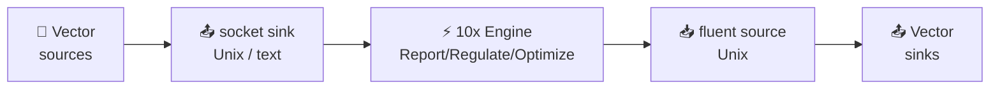

Integrate Log10x with [Vector](https://vector.dev) to report, regulate, and optimize log events _before_ shipping to outputs (Elasticsearch, Splunk, S3).

## Architecture



### Data Flow

- 📂 **Sources** — Vector reads logs from `file`, `kubernetes_logs`, `journald`, `vector` (gRPC), etc.
- 📤 **Socket Sink** — Vector writes events as newline-delimited text/JSON to a Unix socket.
- ⚡ **10x Engine** — Processes events (report metrics / regulate filtering / optimize encoding).
- 📥 **Fluent Source** — Vector receives processed events back via the Fluent Forward protocol over a Unix socket.
- 📤 **Final Sinks** — Vector ships processed events to Elasticsearch, Splunk, S3, etc.

### Component Details

| Component | Protocol | Description |
|---|---|---|
| 📤 `sinks.tenx_in` (`socket`, `mode: unix`) | newline-delimited text | Sends logs to Log10x for processing |
| ⚡ 10x Engine | Internal | Report metrics, filter (regulate), or encode (optimize) |
| 📥 `sources.tenx_out` (`fluent`) | Forward / Unix | Receives processed logs back from Log10x |
| 🔀 Disconnected component graph | N/A | The to-tenx and from-tenx legs are not wired together, so loops are impossible |

### Key Files

| File | Purpose |
|---|---|
| `regulate/tenxNix.yaml` | Vector config for Reducer mode (Linux/macOS, Unix sockets) |
| `input/stream.yaml` | 10x Unix socket input, plain newline-delimited records |
| `output/unix/stream.yaml` | 10x Forward protocol output configuration |

## Quickstart

**1. Set environment variables:**

```bash
export TENX_MODULES=/path/to/config/modules
export TENX_CONFIG=/path/to/config/config
export TENX_API_KEY=your-api-key
```

**2. Start Log10x first:**

```bash
# Read-only (no return loop to Vector — metrics only)
tenx run @run/input/forwarder/vector/regulate @apps/reducer reducerReadOnly true

# Reducer (filter noisy logs)
tenx run @run/input/forwarder/vector/regulate @apps/reducer

# Optimizer (Lossless Compact)
tenx run @run/input/forwarder/vector/regulate @apps/reducer reducerOptimize true
```

**3. Copy and customize Vector config:**

```bash
cp $TENX_MODULES/pipelines/run/modules/input/forwarder/vector/regulate/tenxNix.yaml /etc/vector/
```

**4. Start Vector:**

```bash
vector --config /etc/vector/tenxNix.yaml
```

!!! note "Requirements"
    Vector v0.34+ — the `fluent` source and `socket` sink with `mode: unix` are stable in current releases.

## :material-kubernetes: Kubernetes sidecar

The Kubernetes integration uses the official [vector/vector](https://helm.vector.dev) chart with a values overlay that adds the 10x sidecar container, a shared `emptyDir` for the Unix sockets, and the matching Vector socket sink + fluent source.

If Vector is already installed in your cluster, this is the only change needed to wire it into Log10x.

### Helm values overlay

Add the blocks below to your existing Vector `values.yaml` (or create a `tenx-overlay.yaml` and pass it as `helm upgrade -f values.yaml -f tenx-overlay.yaml`):

```yaml title="tenx-overlay.yaml"
# Shared emptyDir for the Unix sockets between Vector and the 10x sidecar.
extraVolumes:
  - name: tenx-sockets
    emptyDir: {}

extraVolumeMounts:
  - name: tenx-sockets
    mountPath: /tmp/tenx-sockets

# 10x sidecar container.
extraContainers:
  - name: tenx
    image: log10x/edge-10x:1.0.7
    args:
      - "run"
      - "@run/input/forwarder/vector/regulate"
      - "@apps/reducer"
    env:
      - name: TENX_API_KEY
        value: "YOUR-LOG10X-API-KEY"
      - name: vectorInputPath
        value: "/tmp/tenx-sockets/tenx-vector-in.sock"
      - name: vectorOutputForwardAddress
        value: "/tmp/tenx-sockets/tenx-vector-out.sock"
      # Read-only mode (no return loop, metrics-only). Omit for full
      # regulate/optimize round-trip back to Vector.
      # - name: reducerReadOnly
      #   value: "true"
      # Optimize mode (lossless compaction). Mutually exclusive with read-only.
      # - name: reducerOptimize
      #   value: "true"
    volumeMounts:
      - name: tenx-sockets
        mountPath: /tmp/tenx-sockets

# Both containers must be able to read/write the shared Unix sockets.
# `runAsUser: 0` is the simplest portable choice for a quick test;
# in production align both containers to a UID with permission to
# the emptyDir.
podSecurityContext:
  runAsUser: 0
  runAsGroup: 0
  fsGroup: 0

# Vector side of the contract: write events to the 10x input socket,
# receive regulated events back from the 10x output socket, ship from there.
customConfig:
  data_dir: /vector-data-dir

  sources:
    # ... your existing Vector sources ...

    tenx_out:
      type: fluent
      mode: unix
      path: /tmp/tenx-sockets/tenx-vector-out.sock

  sinks:
    tenx_in:
      type: socket
      inputs:
        - YOUR-EXISTING-SOURCE-NAMES
      mode: unix
      path: /tmp/tenx-sockets/tenx-vector-in.sock
      encoding:
        codec: text

    # Replace `tenx_in` with your existing destination sink(s) and switch
    # them to consume `tenx_out` instead — that is the leg that ships
    # processed events to your final destination.
    your_destination:
      type: elasticsearch  # or splunk_hec, kafka, s3, …
      inputs:
        - tenx_out
      # ... destination-specific options ...
```

Apply with:

```bash
helm upgrade --install vector vector/vector \
  --namespace YOUR-VECTOR-NAMESPACE \
  --values your-existing-values.yaml \
  --values tenx-overlay.yaml
```

### Mode selection (read-only / regulate / optimize)

All three modes share the same launch — only one env var changes:

| Mode | Env var | Behavior |
|---|---|---|
| **regulate** (default) | none | Filter events; surviving events return to Vector |
| **read-only** | `reducerReadOnly: "true"` | Read + aggregate + publish metrics; do **not** write events back |
| **optimize** | `reducerOptimize: "true"` | Filter + losslessly compact surviving events for 50–80% volume reduction |

In read-only mode the 10x sidecar binds the input socket but never connects the output socket — Vector's `fluent` source receives nothing, so Vector's existing direct-to-destination sinks are unaffected; 10x is a passive observer publishing metrics to the Log10x backend.

### Startup race

When both containers start at the same time, Vector's `socket` sink may briefly fail to connect because the 10x input socket isn't bound yet (a few hundred milliseconds). Vector retries with backoff and recovers automatically — this shows up in Vector's logs as one or two `Unable to connect` errors followed by suppression. No action needed.

### Verifying the sidecar is wired

Look for these signals in `kubectl logs <pod> -c tenx`:

- `🚦 Applying local rate reducer to: vector` — the Vector input wrapper loaded
- `📈 Publishing TenXSummary metrics to the log10x backend` — metrics are flowing to the Log10x backend
- `📝 Writing TenXObject fields: 'fullText' → Fluentd: /tmp/tenx-sockets/tenx-vector-out.sock` — return-loop is wired (absent in read-only mode, by design)

If logs show only `[level] timestamp` with no message text, set `TENX_LOG_LAYOUT="[%-5level] %d{yyyy-MM-dd HH:mm:ss.SSS} %c{1} - %msg%n"` on the sidecar to expose warnings/errors.
