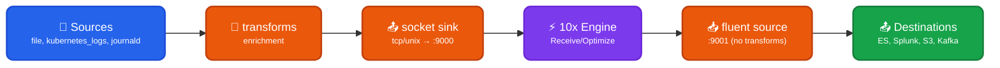

Runs 10x Engine as a [sidecar](https://doc.log10x.com/engine/launcher/sidecar) to [Vector](https://vector.dev) for reporting, receiving, and optimizing events before they ship to their destination (Elasticsearch, Splunk, S3, Kafka, …). Vector and Log10x run as peer processes — Vector sends events to Log10x via its native `socket` sink (newline-delimited JSON over TCP or Unix socket) and receives processed events back via its native `fluent` source (Fluent Forward protocol). Works against any stock Vector build (Linux/macOS/Windows) and the official `vector/vector` Helm chart with a values overlay.

## Architecture

<div style="text-align: center;">


```mermaid
graph LR
    A["<div style='font-size: 14px;'>📂 Sources</div><div style='font-size: 10px;'>file, kubernetes_logs, journald</div>"] --> F["<div style='font-size: 14px;'>🧪 transforms</div><div style='font-size: 10px;'>enrichment</div>"]
    F --> B["<div style='font-size: 14px;'>📤 socket sink</div><div style='font-size: 10px;'>tcp/unix → :9000</div>"]
    B --> E["<div style='font-size: 14px;'>⚡ 10x Engine</div><div style='font-size: 10px;'>Receive/Optimize</div>"]
    E --> C["<div style='font-size: 14px;'>📥 fluent source</div><div style='font-size: 10px;'>:9001 (no transforms)</div>"]
    C --> D["<div style='font-size: 14px;'>📤 Destinations</div><div style='font-size: 10px;'>ES, Splunk, S3, Kafka</div>"]

    classDef input fill:#2563eb,stroke:#1d4ed8,color:#ffffff,stroke-width:2px,rx:8,ry:8
    classDef filter fill:#ea580c,stroke:#c2410c,color:#ffffff,stroke-width:2px,rx:8,ry:8
    classDef engine fill:#7c3aed,stroke:#6d28d9,color:#ffffff,stroke-width:2px,rx:8,ry:8
    classDef output fill:#16a34a,stroke:#15803d,color:#ffffff,stroke-width:2px,rx:8,ry:8

    class A input
    class B filter
    class C filter
    class D output
    class E engine
    class F filter
```

</div>

### Data Flow

- 📂 **Sources** — Your existing Vector sources (`file`, `kubernetes_logs`, `journald`, `socket`, …) feed events into the enrichment transforms.
- 🧪 **Transforms** — Your enrichment transforms (`remap`, `filter`, `route`, …) run here exactly once before the event is handed off to Log10x. The recipe places them between your sources and the `tenx_in` sink — so the bypass is structural, not configured.
- 📤 **socket sink** → Log10x — Vector forwards the enriched event to the Log10x sidecar over TCP `:9000` (or a Unix socket on Linux/macOS) as newline-delimited JSON.
- ⚡ **10x Engine** — The Receiver app applies rate/policy-based filtering and optionally compacts events for volume reduction.
- 📥 **fluent source** — Processed events come back to Vector on `:9001` over the Fluent Forward protocol. Only your destination sinks consume `tenx_out`; no transforms sit between them, so enrichment never re-fires.
- 📤 **Destinations** — Vector's destination sinks (`elasticsearch`, `splunk_hec`, `kafka`, `aws_s3`, …) consume `tenx_out` and ship to the real destinations.

### What an event looks like on the way back

The record structure of the original Vector event is preserved end-to-end — every field comes back to your destination sinks with the same name and same position. What changes depends on the Receiver app mode:

| Mode | Difference vs the event Vector sent in |
|------|----------------------------------------|
| Receive (default) | None. Same record. |
| Receive + `symbolMessageHashField <name>` | Adds one new field with the symbol-pattern hash (a stable identifier for the message pattern — usable as a dedup key, metric dimension, or correlation ID). |
| `receiverOptimize true` | The value of the message field (`message` by default, or whatever `vectorMessageField` is set to) is replaced with a compact encoded form. A separate `tenx-template` event is emitted with the template needed to decode it. All other fields stay verbatim. |
| `receiverOptimize true` + `symbolMessageHashField <name>` | Both of the above. |

The `tag` field stamped by Vector's ingest transform (typically from `.source_type`) is carried on the Forward wire as the Fluent tag, and surfaces as the event's `source` inside Log10x — used for rate-based grouping and emitted back to Vector on the return Forward record. Internally, Log10x's Vector input module reads the message text from the field named by `vectorMessageField` (default `message`); when the Receiver app is configured with `k8sExtractorName: fluentK8s`, the `kubernetes.*` sub-object is also materialized as enrichment fields for use by message-pattern and rate filtering.

??? tenx-keyfiles "Key Files"

    | File | Purpose |
    |------|---------|
    | [`input/stream.yaml`](https://github.com/log-10x/modules/blob/main/pipelines/run/modules/input/forwarder/vector/input/stream.yaml) | Vector socket input — reads newline-delimited JSON from Vector's `socket` sink |
    | [`output/stream.yaml`](https://github.com/log-10x/modules/blob/main/pipelines/run/modules/input/forwarder/vector/output/stream.yaml) | Vector Fluent Forward output — sends processed events back to Vector's `fluent` source |
    | [`conf/tenx-sidecar.yaml`](https://github.com/log-10x/modules/blob/main/pipelines/run/modules/input/forwarder/vector/conf/tenx-sidecar.yaml) | Reference Vector config showing the ingest sink + egress source with no return-path transforms |

## Quickstart

**1. Run Log10x:**

```bash
tenx @run/input/forwarder/vector @apps/receiver
```

**2. Wire up your Vector config** — start from the sidecar recipe and add your real sources + destinations:

```yaml title="vector.yaml"
sources:
  app_logs:
    type: file
    include: [/var/log/app.log]
    read_from: end

  # Receive processed events back from Log10x
  tenx_out:
    type: fluent
    mode: tcp
    address: 127.0.0.1:9001

transforms:
  # Enrichment runs here exactly once — the return path skips this block.
  ingest:
    type: remap
    inputs: [app_logs]
    source: |
      .cluster = get_env_var("CLUSTER_NAME") ?? "unset"
      .tag = .source_type

sinks:
  # Hand off to the Log10x sidecar
  tenx_in:
    type: socket
    inputs: [ingest]
    mode: tcp
    address: 127.0.0.1:9000
    encoding: { codec: json }
    framing: { method: newline_delimited }

  # Destinations consume tenx_out (not the raw sources or `ingest`) so
  # enrichment never re-fires on the return path.
  destinations:
    type: console
    inputs: [tenx_out]
    encoding: { codec: json }
```

For Splunk integration see the [10x for Splunk](https://doc.log10x.com/apps/receiver/splunk/) documentation. For Kubernetes deployment via the official Vector Helm chart see the [Helm sidecar overlay](https://doc.log10x.com/apps/receiver/deploy/#vector).
