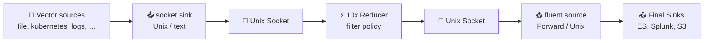

Read events from Vector and filter them using local/centralized [reducer](https://doc.log10x.com/run/output/regulate) policy. This module is a component of the [Reducer](https://doc.log10x.com/apps/reducer/) app.

## Architecture

### Data Flow

- 📂 **Vector sources** — Collect logs from files, Kubernetes, journald, OTLP, etc.
- 📤 **Socket Sink** — Sends ALL logs to Log10x via Unix socket (newline-delimited text or JSON).
- ⚡ **10x Reducer** — Applies rate/policy-based filtering, drops noisy events.
- 🔌 **Forward Output** — Returns FILTERED events via Fluent Forward protocol.
- 📥 **Fluent Source** — Vector receives filtered events.
- 📤 **Final Sinks** — Only filtered events ship to final destinations.

### Sidecar Relay

This module configures a Unix socket input/output pair that receives events from Vector, applies regulation policy, and returns filtered events via the Fluent Forward protocol. The sidecar relays regulated events back to Vector to ship to outputs (e.g., Splunk, S3).

### Install

=== "Linux/macOS"

    See the Log10x Reducer Vector [run instructions](https://doc.log10x.com/apps/reducer/run/#vector)

=== "k8s"

    Deploy to k8s via [Helm](https://helm.sh/) (see the Vector Helm chart fork with the `tenx.*` block).
