Object storage inputs provide a method for [querying](https://doc.log10x.com/run/input/objectStorage/query/) events in an [Object Storage](https://en.wikipedia.org/wiki/Object_storage) (e.g., AWS S3, Azure blobs) directly, without requiring data to be copied to a log analyzer.

The object storage [module](https://doc.log10x.com/engine/module/) comprises of index output, query input and storage access sub-modules. These components execute jointly to index, query and stream event data with speed at any scale.
 

### :material-target: Index

```mermaid
graph LR
    A["<div style='font-size: 14px;'>📥 Trigger</div><div style='font-size: 10px;'>S3 → SQS</div>"] --> B["<div style='font-size: 14px;'>📦 Fetch Blob</div><div style='font-size: 10px;'>new upload</div>"]
    B --> C["<div style='font-size: 14px;'>⚡ 10x Engine</div><div style='font-size: 10px;'>Transform to TenXObjects</div>"]
    C --> D["<div style='font-size: 14px;'>🏷️ Generate Filters</div><div style='font-size: 10px;'>TenXTemplate</div>"]
    D --> E["<div style='font-size: 14px;'>💾 Store Index</div><div style='font-size: 10px;'>metadata</div>"]

    classDef trigger fill:#2563eb,stroke:#1d4ed8,color:#ffffff,stroke-width:2px,rx:8,ry:8
    classDef blob fill:#ea580c,stroke:#c2410c,color:#ffffff,stroke-width:2px,rx:8,ry:8
    classDef engine fill:#7c3aed,stroke:#6d28d9,color:#ffffff,stroke-width:2px,rx:8,ry:8
    classDef filter fill:#0891b2,stroke:#0e7490,color:#ffffff,stroke-width:2px,rx:8,ry:8
    classDef store fill:#16a34a,stroke:#15803d,color:#ffffff,stroke-width:2px,rx:8,ry:8

    class A trigger
    class B blob
    class C engine
    class D filter
    class E store
```

[Index](https://doc.log10x.com/run/input/objectStorage/index) outputs execute when S3 event notifications are sent directly to [SQS queues](https://doc.log10x.com/apps/streamer/#sqs-based-architecture), triggering index workers to fetch and transform log/trace events enclosed within new blobs into typed TenXObjects.

A dedicated output stream utilizes the TenXObjects to generate lightweight [TenXTemplate Filters](https://doc.log10x.com/run/input/objectStorage/index/#tenxtemplate-filters) to enable fast querying of the blob's enclosed event in-place, without first requiring its contents to be duplicated to a log analyzer.

### :octicons-filter-24: Query

```mermaid
graph LR
    A["<div style='font-size: 14px;'>🔍 Query</div><div style='font-size: 10px;'>REST / scheduled</div>"] --> B["<div style='font-size: 14px;'>🏷️ Filter Index</div><div style='font-size: 10px;'>TenXTemplate</div>"]
    B --> C["<div style='font-size: 14px;'>📦 Fetch Ranges</div><div style='font-size: 10px;'>byte-range reads</div>"]
    C --> D["<div style='font-size: 14px;'>⚡ 10x Engine</div><div style='font-size: 10px;'>Transform/Aggregate</div>"]
    D --> E["<div style='font-size: 14px;'>📤 Output</div><div style='font-size: 10px;'>Analyzers, TSDB</div>"]

    classDef query fill:#2563eb,stroke:#1d4ed8,color:#ffffff,stroke-width:2px,rx:8,ry:8
    classDef filter fill:#0891b2,stroke:#0e7490,color:#ffffff,stroke-width:2px,rx:8,ry:8
    classDef blob fill:#ea580c,stroke:#c2410c,color:#ffffff,stroke-width:2px,rx:8,ry:8
    classDef engine fill:#7c3aed,stroke:#6d28d9,color:#ffffff,stroke-width:2px,rx:8,ry:8
    classDef output fill:#16a34a,stroke:#15803d,color:#ffffff,stroke-width:2px,rx:8,ry:8

    class A query
    class B filter
    class C blob
    class D engine
    class E output
```

[Queries](https://doc.log10x.com/run/input/objectStorage/query/) can execute [periodically](https://doc.log10x.com/engine/launcher/job) or in response to ad-hoc [REST API](https://doc.log10x.com/api/launch/#quarkus) requests to stream selected TenXObjects from a storage container (e.g., S3 bucket) to log analyzers and time-series DBs.

Queries utilizes storage-filters to pinpoint blob byte-ranges that match specified criteria to transform into TenXObjects for further filtering, aggregation and output. 

### :material-cloud-cog-outline: Storage Access

Access to an object storage (e.g., AWS S3, Azure Blobs, Google, IBM Cloud Storage) is defined
by implementing of the [ObjectStorageIndexAccessor](https://github.com/log-10x/pipeline-extensions/blob/main/cloud-extensions/src/main/java/com/log10x/ext/cloud/index/interfaces/ObjectStorageIndexAccessor.java) interface. 

This interface is designed to have minimal requirements for put, store and list operations to support virtually any on-premises/hosted key-value object storage.

For an example implementation, see [AWSIndexAccess](https://github.com/log-10x/pipeline-extensions/blob/main/cloud-extensions/src/main/java/com/log10x/ext/cloud/index/access/AWSIndexAccess.java).
