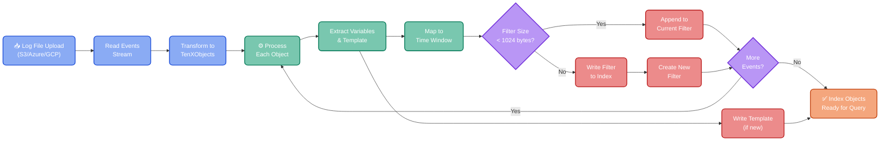

The Index module enables [storage queries](https://doc.log10x.com/run/input/objectStorage/query) to fetch blob byte ranges (e.g., [AWS S3](https://docs.aws.amazon.com/whitepapers/latest/s3-optimizing-performance-best-practices/use-byte-range-fetches.html), [Azure](https://learn.microsoft.com/en-us/rest/api/storageservices/specifying-the-range-header-for-blob-service-operations))
matching a specified app/service name, search term(s) and timestamp range predictably at scale.

### :material-hammer-wrench: Workflow

The index [module](https://doc.log10x.com/engine/module/) executes when S3 event notifications are sent directly to [SQS queues](https://doc.log10x.com/apps/cloud/streamer/#sqs-based-architecture), triggering index workers to process uploaded files.

The module comprises an _input_ and _output_ stream:

- The [input stream](https://github.com/log-10x/modules/blob/main/pipelines/run/modules/input/objectStorage/query/stream.yaml) reads the events from the uploaded file to transform them into [TenXObjects](https://doc.log10x.com/api/js/#TenXObject).

- The [output stream](https://github.com/log-10x/modules/blob/main/pipelines/run/modules/input/objectStorage/index/stream.yaml) performs the following actions for each TenXObject:   

1. Write its [template](https://doc.log10x.com/api/js/#TenXBaseObject+template) to the [index](#indexwritecontainer) container (if not exists). 
2. Map its [timestamp](https://doc.log10x.com/api/js/#TenXObject+timestamp) to a [Bloom filter](https://en.wikipedia.org/wiki/Bloom_filter) associated with a rolling time window specified by [indexWriteResolution](#indexwriteresolution).
3. Append its [templateHash](https://doc.log10x.com/api/js/#TenXBaseObject+templateHash) and [vars](https://doc.log10x.com/api/js/#TenXBaseObject+vars) to the Bloom filter's hash set. Once a filter's size exceeds the Object storage's key byte length (e.g., for AWS S3 [1024 bytes](https://docs.aws.amazon.com/AmazonS3/latest/userguide/object-keys.html)), the stream writes it to the [index](#indexwritecontainer) container and assigns a new filter to the time window.

### :material-filter-variant: TenXTemplate Filters

TenXTemplate Bloom filters enable parallel traversal of the [index container](#indexwritecontainer) (e.g., S3 bucket) with high [test accuracy](https://doc.log10x.com/run/input/objectStorage/index/#accuracy) for fetching required byte ranges to scan for matching log/trace events.

Separating low-cardinality [symbol](https://doc.log10x.com/run/transform/structure/#symbols) values into TenXTemplates and writing only template hashes and high-cardinality [variables](https://doc.log10x.com/run/transform/structure/#variables) to Bloom filters reduces their volume by over 75% compared to appending both low and high-cardinality values.

Restricting Bloom filter size to the object storage's key length enables batch retrieval of filters via *list* operations (e.g., [AWS S3](https://docs.aws.amazon.com/AmazonS3/latest/API/API_ListObjects.html): 1000 keys/request, [Azure](https://learn.microsoft.com/en-us/rest/api/storageservices/list-blobs?tabs=microsoft-entra-id): 5000 keys/request, [GCP](https://cloud.google.com/storage/docs/json_api/v1/objects/list): 1000 keys/request).

    <button class="md-button md-button--primary enlarge-diagram" onclick="enlargeDiagram(this)" data-tooltip="Click to enlarge diagram">
        
            <svg xmlns="http://www.w3.org/2000/svg" viewBox="0 0 24 24" width="16" height="16">
                <path d="M10 2c4.42 0 8 3.58 8 8 0 1.85-.63 3.55-1.69 4.9L20.59 19l-1.41 1.41-4.09-4.09A7.84 7.84 0 0 1 10 18c-4.42 0-8-3.58-8-8s3.58-8 8-8m0 2a6 6 0 1 0 0 12 6 6 0 0 0 0-12m1 3h2v2h-2V7m-4 0h2v2H7V7m2 4h2v2H9v-2Z"/>
            </svg>
        
        Enlarge Diagram
    </button>

<!-- Mermaid enhanced diagram functionality loaded via external files -->

### :material-server-outline: Compute Resources

Indexing is CPU and memory intensive during file parsing. Default k8s pod resources:

- **1 CPU** and **2GB memory** per pod (see [deployment guide](https://doc.log10x.com/apps/cloud/streamer/deploy/#step-4-configure-application))
- **Autoscaling:** 2–10 replicas depending on queue depth (default 2 min, scales to 10 if backlog grows)
- **Throughput:** One pod handles ~10–50 GB/day depending on event size and CPU availability

Indexing runs asynchronously — triggered by S3 event notifications, in parallel with queries. Multiple index workers process files concurrently from the SQS queue. Indexes are built once at ingest time and never recomputed.

### :material-currency-usd: Cost

Index building cost is part of the k8s pod resource costs — no per-GB indexing fee. You pay:

- k8s pod (CPU + memory) running the index workers
- S3 storage for index objects (~1–5% overhead vs. original data size)
- SQS queue operations (~$0.40 per million messages)

### :material-arrow-up-bold: Scaling

If files upload faster than indexing, the SQS queue buffers pending work — no events are lost. Index worker pods scale up automatically via Kubernetes HPA.

Unindexed files remain queryable via full scan (slower than indexed queries but functional).

**Deployment topologies:**

- **All-in-one:** Single pod cluster handles index, query, and stream roles (suitable for <100 GB/day)
- **Separate clusters:** Dedicated index/query/stream pods allow independent scaling (recommended for >500 GB/day)

See the [deployment guide](https://doc.log10x.com/apps/cloud/streamer/deploy/#step-4-configure-application) for sizing guidance.

