Defines a search query against an object storage container (e.g., AWS S3 bucket) [index](https://doc.log10x.com/run/input/objectStorage/index). 

Queries can execute periodically (e.g., k8s CronJob) or ad-demand via the [REST API](https://doc.log10x.com/api/launch/#quarkus) to populate log analytics dashboards, alerts, and ad-hoc queries.

Each query specifies _criteria_ and _actions_.

**Criteria** select events to fetch and transform into [TenXObjects](https://doc.log10x.com/api/js/#tenxobject):

- [**Target**](#queryfiltertarget): target app/service whose events to query (e.g., 'myApp').
- [**Time range**](#queryfrom): of log/trace events to fetch.
- [**Terms**](#querysearch): query to execute against the underling storage
- [**Filters**](#queryfilters): list of JavaScript expressions which allows for more complex filtering of which TenXObjects matching the search terms to select.

**Actions** specify how to further filter, [enrich](https://doc.log10x.com/run/transform/script/object/#enrich), aggregate, and stream TenXObjects to log analyzers and metric outputs (e.g., AWS CloudWatch, Prometheus).

## :material-floor-plan: Architecture

A distributed [Stream Processing Architecture](https://docs.aws.amazon.com/whitepapers/latest/build-modern-data-streaming-analytics-architectures/what-is-a-modern-streaming-data-architecture.html) executes queries via parallel [scan](#scan) and [stream](#stream) workers to select, transform and stream TenXObjects to target output(s).  

### :material-filter-variant: Scan

Scan workers process [TenXTemplate Filters](https://doc.log10x.com/run/input/objectStorage/index/#tenxtemplate-filters) to identify blobs matching a target prefix (i.e., app/service name), time frame (e.g., last 10min) and search terms (e.g., ERROR).

Multiple scan workers perform this workload in parallel, submitting matching byte ranges to stream workers via SQS.

### :material-set-split: Stream

Stream workers read object storage blob byte ranges identified by the scan workers and transform them into TenXObjects
on which they perform the [actions](#queryactions) specified by the query.

## :material-sitemap-outline: Architecture Flow

The following diagram illustrates the complete distributed, parallel architecture for query execution:

```mermaid
graph TD
    Client["🔍 Query Request<br/>API /search"] --> S3["☁️ S3 Object Storage<br/>Log Files + Bloom Filters"]
    
    S3 --> ScanLayer
    
    subgraph ScanLayer["⚡ Parallel Scan Functions<br/> "]
        Scan1["Scan #1<br/>Time: 00:00-05:00<br/>• Filter prefix<br/>• Test Bloom filters<br/>• Find byte ranges"]
        Scan2["Scan #2<br/>Time: 05:00-10:00<br/>• Filter prefix<br/>• Test Bloom filters<br/>• Find byte ranges"]
        Scan3["Scan #3<br/>Time: 10:00-15:00<br/>• Filter prefix<br/>• Test Bloom filters<br/>• Find byte ranges"]
        ScanN["Scan #N<br/>Time: N+5:00<br/>• Filter prefix<br/>• Test Bloom filters<br/>• Find byte ranges"]
    end
    
    ScanLayer --> StreamLayer
    
    subgraph StreamLayer["🌊 Parallel Stream Functions<br/> "]
        Stream1["Stream #1<br/>• Fetch ranges<br/>• Parse logs<br/>• Create TenXObjects<br/>• Filter & enrich"]
        Stream2["Stream #2<br/>• Fetch ranges<br/>• Parse logs<br/>• Create TenXObjects<br/>• Filter & enrich"]
        Stream3["Stream #3<br/>• Fetch ranges<br/>• Parse logs<br/>• Create TenXObjects<br/>• Filter & enrich"]
        StreamM["Stream #M<br/>• Fetch ranges<br/>• Parse logs<br/>• Create TenXObjects<br/>• Filter & enrich"]
    end
    
    StreamLayer --> OutputLayer
    
    subgraph OutputLayer["📊 Output Targets<br/> "]
        Elastic["Elasticsearch<br/>Events & Logs"]
        Prometheus["Prometheus<br/>Metrics & Gauges"]
        Datadog["Datadog<br/>Custom Metrics"]
        Splunk["Splunk<br/>Search Indexes"]
    end
    
    %% Elegant dark theme styling
    classDef default fill:#2d3748,stroke:#4a5568,stroke-width:2px,color:#e2e8f0
    classDef client fill:#2b6cb0,stroke:#3182ce,stroke-width:2px,color:#ffffff
    classDef storage fill:#d69e2e,stroke:#ed8936,stroke-width:2px,color:#ffffff
    classDef scan fill:#38a169,stroke:#48bb78,stroke-width:2px,color:#ffffff
    classDef stream fill:#d53f8c,stroke:#ed64a6,stroke-width:2px,color:#ffffff
    classDef output fill:#805ad5,stroke:#9f7aea,stroke-width:2px,color:#ffffff
    
    class Client client
    class S3 storage
    class Scan1,Scan2,Scan3,ScanN scan
    class Stream1,Stream2,Stream3,StreamM stream
    class Elastic,Prometheus,Datadog,Splunk output
```

### :material-check: Benefits

- **Scalability**: Functions auto-scale based on query complexity and data volume
- **Parallelism**: Time-based partitioning enables concurrent processing across multiple workers
- **Efficiency**: Bloom filters minimize unnecessary data reads from object storage
- **Flexibility**: Multiple output targets support different analytics use cases (logs, metrics, alerts)
- **Cost-Effective**: SQS-based execution model scales with demand

## :material-speedometer: Performance

Index lookups identify matching files in under 1 second. Fetching and streaming events depends on result set size and parallel worker configuration.

### Baseline

- **~10K events:** 10–30 seconds with default parallel scan/stream configuration
- **Index filters:** Identify matching files in <1 second ([accuracy](https://doc.log10x.com/run/input/objectStorage/index/#accuracy) is configurable, default ~1% false positive rate)
- **Network limits:** S3 API throughput and network bandwidth are the practical limits at scale

### Parallelism

Parallel [scan](#scan) and [stream](#stream) workers fetch and parse events concurrently. Three configuration options control parallelism:

- [`queryScanFunctionParallelTimeslice`](#queryscanfunctionparalleltimeslice) — max time range per scan worker (e.g., `1m` = each worker scans 1 minute of index)
- [`queryScanFunctionParallelMaxInstances`](#queryscanfunctionparallelmaxinstances) — max number of parallel scan workers (default 1000)
- [`queryStreamFunctionParallelObjects`](#querystreamfunctionparallelobjects) — max byte ranges per stream worker (default 50)

**Example:** 100K events over a 10-minute time range with a 1-minute timeslice produces ~10 parallel scan workers. Total query time approaches the single-worker baseline (~10–30 sec) rather than scaling linearly with result set size. Actual time depends on file size distribution, S3 API rate limits, network bandwidth, and log parsing overhead.

### Optimization Tips

- Use narrow [time ranges](#queryfrom) to reduce scan volume
- Add service/host filters to narrow scope
- For massive result sets (>10M events), split into smaller time windows
- Use [query limits](#querylimitprocessingtime) to prevent runaway queries
