The policy module queries a Prometheus endpoint (e.g., 10x SaaS/self-hosted) for event types exhibiting the highest volume rates, storing the results in a [lookup](https://doc.log10x.com/api/js/#TenXLookup) file locally or on Github.

Instances of the [Edge regulator](https://doc.log10x.com/run/regulate/policy/ "Generate a centralized GitOps regulator policy lookup file") app running alongside log forwarders can fetch and use the lookup to filter 'noisy' events from shipping to log analyzers (e.g., Splunk, Elastic).

## :material-cog-transfer-outline: Workflow

The policy regulator executes the following periodic process:

```mermaid
graph LR
    A["<div style='font-size: 14px;'>⏰ Scheduler</div><div style='font-size: 10px; text-align: center;'>Periodic Job</div>"] --> B["<div style='font-size: 14px;'>📊 Query</div><div style='font-size: 10px; text-align: center;'>Prometheus</div>"]
    B --> C["<div style='font-size: 14px;'>🔧 Build Policy</div><div style='font-size: 10px; text-align: center;'>Lookup Table</div>"]
    C --> D["<div style='font-size: 14px;'>📤 Push</div><div style='font-size: 10px; text-align: center;'>to GitHub</div>"]
    D --> E["<div style='font-size: 14px;'>📥 Pull</div><div style='font-size: 10px; text-align: center;'>Edge Regulators</div>"]
    E --> F["<div style='font-size: 14px;'>🚫 Filter</div><div style='font-size: 10px; text-align: center;'>Collected Events</div>"]
    
    classDef schedule fill:#7c3aed88,stroke:#6d28d9,color:#ffffff,stroke-width:2px,rx:8,ry:8
    classDef query fill:#9333ea88,stroke:#7c3aed,color:#ffffff,stroke-width:2px,rx:8,ry:8
    classDef filter fill:#2563eb88,stroke:#1d4ed8,color:#ffffff,stroke-width:2px,rx:8,ry:8
    classDef Push fill:#059669,stroke:#047857,color:#ffffff,stroke-width:2px,rx:8,ry:8
    classDef pull fill:#dc2626,stroke:#b91c1c,color:#ffffff,stroke-width:2px,rx:8,ry:8
    classDef regulate fill:#ea580c88,stroke:#c2410c,color:#ffffff,stroke-width:2px,rx:8,ry:8
    
    class A schedule
    class B query
    class C filter
    class D Push
    class E pull
    class F regulate
```

⏰ **Periodic Invocation**: Scheduled [job](https://doc.log10x.com/engine/launcher/job) triggers policy generation at configured intervals

📊 **Prometheus Query**: Retrieves cost metrics using [range queries](https://prometheus.io/docs/prometheus/latest/querying/api/#range-queries) for event pattern analysis

🔧 **Policy Building**: Creates [lookup table](https://doc.log10x.com/api/js/#TenXLookup) from high-cost event patterns exceeding thresholds

📤 **GitHub Push**: Commits policy lookup file to [centralized repository](https://doc.log10x.com/run/output/event/github/) for distribution (optional)

📥 **Edge Regulator Pull**: Distributed regulators fetch [updated policies](https://doc.log10x.com/config/github/) from central config

🚫 **Event Filtering**: Downstream edge regulators apply policies to [regulate events](https://doc.log10x.com/apps/edge/regulator/) before shipping

### :material-table-eye: Output Lookup

The policy lookup file can either be pushed to [GitHub](https://doc.log10x.com/config/github/) for GitOps distribution or stored locally for custom distribution mechanisms.

=== ":simple-github: GitHub Output"

    The module uses a [GitHub output](https://doc.log10x.com/run/output/event/github/ "Commit TenXObject field/template values to GitHub") to push the calculated event rates as [lookup file](https://doc.log10x.com/api/js/#TenXLookup "Load and query the values of text lookup tables (.csv, .tsv) and geoIP DB files (.mmdb).") containing the [identities](https://doc.log10x.com/run/transform/#metric-name) of the highest-rate event patterns for use by downstream Edge regulators.

    The GitHub approach enables centralized GitOps workflows where edge regulators automatically pull policy updates from the repository, ensuring consistent regulation across distributed deployments.

=== ":material-file-eye-outline: Local Output"

    The module can emit the policy lookup table to a local file on disk, allowing users to distribute it using their preferred mechanism to downstream edge regulators.

    **Distribution Examples:**

    - **Kubernetes ConfigMaps**: Mount the lookup file as a ConfigMap volume across edge regulator pods
    - **S3 Distribution**: Upload the file to S3 and configure edge regulators to periodically download updates
    - **Network File Systems**: Place the file on shared storage accessible by all edge nodes
    - **Container Images**: Bundle the lookup file into custom container images for immutable deployments

    This approach provides flexibility for organizations with existing distribution infrastructure or specific compliance requirements that prevent external repository usage. 

