Prevent log analytics over-billing while ensuring critical events always reach your analysis tools.

The rate regulator uses automatic [message](https://doc.log10x.com/run/initialize/message/ "Enrich TenXObjects with logical message symbol sequence and origin values") enrichment combined with byte-based cost calculation to apply sampling based on actual ingestion costs per logical event type. 

By tracking costs (event byte size × vendor ingestion rate), the regulator provides business-aligned budget enforcement that accounts for variable event sizes (i.e., 10KB error log is correctly weighted against a 100-byte debug message).

This approach enables more precise control than regex-based rules which require manual configuration and lack logical event type, [severity](https://doc.log10x.com/run/initialize/level/), and cost awareness.

## :material-filter-multiple-outline: Control Strategies

The rate regulator supports both `Local` and `global` controls which differ in how they track and apply cost-based budgets for event sampling.

=== ":material-check-network-outline: Local Control"

    Forwarders maintain independent cost counters without cross-node communication, tracking spend per event type (symbolMessage) based on byte volume and configured ingestion costs. Value lies in simple per-service setup, quick processing without network delays, and fault isolation that contains issues to single nodes. 

    **Trade-offs** include decisions limited to local data (risking cluster-wide budget overruns), no visibility into cross-service patterns.

    **Example**: A single application forwarder tracks its own $0.01/min budget, throttling high-cost debug logs based solely on its own traffic, ignoring cluster-wide spending patterns.

=== ":material-server-network: Global Control"

    Forwarders share cost data via [lookup tables](https://doc.log10x.com/run/regulate/policy/) (synchronized through centralized storage like GitHub) for unified budget decisions. Value comes from enforcing organization-wide budgets, detecting cross-service cost patterns, and applying consistent policies everywhere based on cluster-wide spend.

    **Trade-offs** involve requiring cluster communication, added setup complexity for coordination, and minor decision latency.

    **Example**: Cluster aggregates spend data showing "api_trace" events cost $0.08/min across all nodes. Global lookup shares this intelligence, allowing all forwarders to throttle this pattern proportionally to stay under budget.

## :material-kubernetes: Multi-App Regulation

For central forwarders handling logs from multiple applications (common in Kubernetes), the rate regulator prevents individual apps from bypassing budget caps by scaling pods. Use the [k8s container name](https://doc.log10x.com/run/initialize/k8s/) field to aggregate spend per app across all replicas. Two approaches available:

### **Option A: Cap Total App Spend (All Event Types)**

Prevents any single app from dominating the budget regardless of how many event types it emits.

```yaml
rateRegulatorFieldNames: [container]  # App only
rateRegulatorMaxSharePerFieldSet: 0.2
rateRegulatorBudgetPerHour: 1.50
```

**Result:**
- Frontend app (all events, 5 pods): Cannot exceed 20% of total budget ($0.30/hour)
- Backend app (all events, 2 pods): Cannot exceed 20% ($0.30/hour)
- Payment app (all events, 1 pod): Cannot exceed 20% ($0.30/hour)

**Trade-off**: Loses event-type intelligence—can't prioritize ERROR over DEBUG within an app.

### **Option B: Cap Per Event Type Per App**

Enforces fairness within each app—prevents a single noisy event type from dominating that app's spend.

```yaml
rateRegulatorFieldNames: [symbolMessage, container]  # Event type + app
rateRegulatorMaxSharePerFieldSet: 0.2
rateRegulatorBudgetPerHour: 1.50
```

**Result:**
- "heartbeat_debug|frontend" (5 pods): Cannot exceed 20% of total budget
- "error_login|frontend" (5 pods): Separate 20% cap
- "timeout|payment-service" (1 pod): Separate 20% cap

**Trade-off**: Each (event type × app) combo gets its own 20% cap—apps with many event types could theoretically exceed 20% total (though unlikely in practice).

**Key Insight**: Use `container` (not `pod`) for aggregation—`container` name is stable across replicas, while `pod` names are unique per instance. Scaling from 1→10 pods doesn't bypass limits.

## :material-cog-transfer-outline: Workflow

The rate regulator executes the following steps:

```mermaid
graph LR
    A["<div style='font-size: 14px;'>📥 Input</div><div style='font-size: 10px; text-align: center;'>TenXObject</div>"] --> B["<div style='font-size: 14px;'>💰 Cost Calc</div><div style='font-size: 10px; text-align: center;'>Bytes × $/GB</div>"]
    B --> C{"<div style='font-size: 14px;'>🗂️ Global</div><div style='font-size: 10px; text-align: center;'>Has Lookup?</div>"}
    C -->|Yes| D["<div style='font-size: 14px;'>🌐 Global</div><div style='font-size: 10px; text-align: center;'>Cluster Spend</div>"]
    C -->|No| E["<div style='font-size: 14px;'>📈 Local</div><div style='font-size: 10px; text-align: center;'>Node Spend</div>"]
    D --> F["<div style='font-size: 14px;'>⚖️ Budget Check</div><div style='font-size: 10px; text-align: center;'>vs Target Rate</div>"]
    E --> F
    F --> G["<div style='font-size: 14px;'>📊 Event Share</div><div style='font-size: 10px; text-align: center;'>vs Max %</div>"]
    G --> H["<div style='font-size: 14px;'>🎯 Boost</div><div style='font-size: 10px; text-align: center;'>by Severity</div>"]
    H --> I{"<div style='font-size: 14px;'>🎲 Sample</div><div style='font-size: 10px; text-align: center;'>Decision</div>"}
    I -->|Drop| J["<div style='font-size: 14px;'>🗑️ Drop</div><div style='font-size: 10px; text-align: center;'>TenXObject</div>"]
    I -->|Keep| K["<div style='font-size: 14px;'>✅ Retain</div><div style='font-size: 10px; text-align: center;'>TenXObject</div>"]
    
    classDef input fill:#3b82f688,stroke:#2563eb,color:#ffffff,stroke-width:2px,rx:8,ry:8
    classDef decision fill:#eab30888,stroke:#d97706,color:#ffffff,stroke-width:2px,rx:8,ry:8
    classDef process fill:#059669,stroke:#047857,color:#ffffff,stroke-width:2px,rx:8,ry:8
    classDef rate fill:#7c3aed88,stroke:#6d28d9,color:#ffffff,stroke-width:2px,rx:8,ry:8
    classDef retain fill:#16a34a,stroke:#15803d,color:#ffffff,stroke-width:2px,rx:8,ry:8
    classDef drop fill:#dc2626,stroke:#b91c1c,color:#ffffff,stroke-width:2px,rx:8,ry:8
    
    class A input
    class B,G decision
    class C,D,F process
    class E rate
    class I retain
    class H drop
```

<div style="text-align: center;">



</div>

<div class="diagram-controls">
    <button class="md-button md-button--primary enlarge-diagram" onclick="enlargeThresholdDiagram(this)" data-tooltip="Click to enlarge diagram">
        <span class="twemoji">
            <svg xmlns="http://www.w3.org/2000/svg" viewBox="0 0 24 24" width="16" height="16">
                <path d="M10 2c4.42 0 8 3.58 8 8 0 1.85-.63 3.55-1.69 4.9L20.59 19l-1.41 1.41-4.09-4.09A7.84 7.84 0 0 1 10 18c-4.42 0-8-3.58-8-8s3.58-8 8-8m0 2a6 6 0 1 0 0 12 6 6 0 0 0 0-12m1 3h2v2h-2V7m-4 0h2v2H7V7m2 4h2v2H9v-2Z"/>
            </svg>
        </span>
        Enlarge Diagram
    </button>
</div>

<!-- Mermaid enhanced diagram functionality loaded via external files -->

<script>
function enlargeThresholdDiagram(button) {
    const thresholdDiagramCode = `graph LR
    A["<div style='font-size: 14px;'>📥 Input</div><div style='font-size: 10px; text-align: center;'>TenXObject</div>"] --> B["<div style='font-size: 14px;'>💰 Cost Calc</div><div style='font-size: 10px; text-align: center;'>Bytes × $/GB</div>"]
    B --> C{"<div style='font-size: 14px;'>🗂️ Global</div><div style='font-size: 10px; text-align: center;'>Has Lookup?</div>"}
    C -->|Yes| D["<div style='font-size: 14px;'>🌐 Global</div><div style='font-size: 10px; text-align: center;'>Cluster Spend</div>"]
    C -->|No| E["<div style='font-size: 14px;'>📈 Local</div><div style='font-size: 10px; text-align: center;'>Node Spend</div>"]
    D --> F["<div style='font-size: 14px;'>⚖️ Budget Check</div><div style='font-size: 10px; text-align: center;'>vs Target Rate</div>"]
    E --> F
    F --> G["<div style='font-size: 14px;'>📊 Event Share</div><div style='font-size: 10px; text-align: center;'>vs Max %</div>"]
    G --> H["<div style='font-size: 14px;'>🎯 Boost</div><div style='font-size: 10px; text-align: center;'>by Severity</div>"]
    H --> I{"<div style='font-size: 14px;'>🎲 Sample</div><div style='font-size: 10px; text-align: center;'>Decision</div>"}
    I -->|Drop| J["<div style='font-size: 14px;'>🗑️ Drop</div><div style='font-size: 10px; text-align: center;'>TenXObject</div>"]
    I -->|Keep| K["<div style='font-size: 14px;'>✅ Retain</div><div style='font-size: 10px; text-align: center;'>TenXObject</div>"]
    
    classDef input fill:#3b82f688,stroke:#2563eb,color:#ffffff,stroke-width:2px,rx:8,ry:8
    classDef decision fill:#eab30888,stroke:#d97706,color:#ffffff,stroke-width:2px,rx:8,ry:8
    classDef process fill:#059669,stroke:#047857,color:#ffffff,stroke-width:2px,rx:8,ry:8
    classDef rate fill:#7c3aed88,stroke:#6d28d9,color:#ffffff,stroke-width:2px,rx:8,ry:8
    classDef retain fill:#16a34a,stroke:#15803d,color:#ffffff,stroke-width:2px,rx:8,ry:8
    classDef drop fill:#dc2626,stroke:#b91c1c,color:#ffffff,stroke-width:2px,rx:8,ry:8
    
    class A input
    class B,G decision
    class C,D,F process
    class E rate
    class I retain
    class H drop`;
    
    if (window.enlargeDiagram) {
        window.enlargeDiagram(button, thresholdDiagramCode);
    } else {
        console.error('enlargeDiagram function not found');
    }
}
</script>

### **Local Mode (Without Lookup): Per-Node Filtering**

**Scenario:** A Kubernetes node running 3 pods with config:
- Budget: $1.50/hour ($0.025/min)
- Max share per event type: 20%
- Ingestion cost: $1.50/GB (Splunk)
- 5-minute tracking window

**Step-by-step for a [Kubernetes pod error event](https://doc.log10x.com/run/transform/#plain) (ERROR level, 1.8KB):**

1. **📥 Event Arrives**: Pod emits a CrashLoopBackOff error with full Kubernetes metadata ([see raw JSON](https://doc.log10x.com/run/transform/#plain), 1835 bytes)

2. **💰 Cost Calculated**: `1835 bytes / 1GB × $1.50 = $0.0000028` per event

3. **📊 Field Set Identified**: `symbolMessage = "Error_syncing_pod"` ([extracted](https://doc.log10x.com/run/transform/#symbol-message) by message enrichment) → counter key: `Error_syncing_pod`

4. **📈 Track Spend (Local)**: 
   - Current 5-min window spend: `Error_syncing_pod` = $0.06, total = $0.10
   - **After increment**: `Error_syncing_pod` = $0.0600028, total = $0.1000028
   - Normalize to per-minute: `Error_syncing_pod` = $0.012/min, total = $0.020/min

5. **⚖️ Budget Check**: Is total over budget?
   - Total spend rate: $0.020/min vs. target $0.025/min → **Under budget** → `globalScale = 1.0` (no throttling)

6. **📊 Event Share Check**: Is "Error_syncing_pod" dominating?
   - Share: $0.06 / $0.10 = 60% vs. max 20% → **Over share limit**
   - Scale down: `fieldSetRate = 0.2 / 0.6 = 0.33` (retain 33% of these events)

7. **🎯 Severity Boost**: ERROR level boost = 2.0
   - `baseRate = 1.0 × 0.33 = 0.33`
   - `finalRate = 0.33 × 2.0 = 0.66` → **66% retention** (boost helps but doesn't fully override)

8. **🎲 Sample Decision**: `random(0-1) = 0.3 < 0.66` → **✅ Event Kept**

**Result:** "Error_syncing_pod" is heavily over the 20% share (at 60%), so it gets throttled to 33% base rate. The ERROR severity boost (2.0×) increases retention to 66%, meaning 2/3 of these ERROR events are kept. If it were DEBUG (boost=0.5), final rate would be 0.165 → 83% chance of being dropped.

---

### **Global Mode (With Lookup): Cluster-Wide Filtering**

**Scenario:** Same app now across 10 nodes (30 pods total) with cluster-wide policy enforcement. The [policy module](https://doc.log10x.com/run/regulate/policy/) generates a lookup from Prometheus with 6-hour average spend:

**Lookup file contents:**
```csv
field_set,cost_per_hour
Error_syncing_pod,0.60
Info_user_action,0.50
Debug_heartbeat,0.40
_global_cost_total,2.00
```

**Step-by-step for same [pod error event](https://doc.log10x.com/run/transform/#plain) on one node:**

1. **📥 Event Arrives**: Same 1.8KB ERROR event ([raw JSON](https://doc.log10x.com/run/transform/#plain))

2. **💰 Cost Calculated**: `1835 bytes / 1GB × $1.50 = $0.0000028`

3. **📊 Field Set Identified**: `Error_syncing_pod`

4. **🌐 Lookup Check**: 
   - Lookup file modified 2 minutes ago (within 5-min retention) → **Fresh**
   - Fetch cluster-wide data: `Error_syncing_pod` = $0.60/hour, total = $2.00/hour

5. **📈 Track Spend (Global)**: Use cluster-wide spend from lookup
   - Cluster spend rate: `Error_syncing_pod` = $0.60/hour = $0.01/min, total = $2.00/hour = $0.0333/min
   - (Local counter still increments for fallback, but decision uses global data)

6. **⚖️ Budget Check (Cluster-Wide)**: Is cluster over budget?
   - Total cluster spend: $0.0333/min vs. per-node target $0.025/min → **Over budget** (33% above)
   - Scale down globally: `globalScale = 0.025 / 0.0333 = 0.75` (retain 75% cluster-wide)

7. **📊 Event Share Check (Cluster-Wide)**: Is "Error_syncing_pod" dominating cluster?
   - Cluster share: $0.60 / $2.00 = 30% vs. max 20% → **Over share**
   - Scale down: `fieldSetRate = 0.2 / 0.3 = 0.67` (retain 67% of "Error_syncing_pod" events)

8. **🎯 Severity Boost**: ERROR level boost = 2.0
   - `baseRate = 0.75 × 0.67 = 0.50`
   - `finalRate = 0.50 × 2.0 = 1.0` (clamped to max 1.0) → **100% retention**

9. **🎲 Sample Decision**: `random(0-1) = 0.7 < 1.0` → **✅ Event Kept**

**Result:** Even though the cluster is over budget (133% of target) and "Error_syncing_pod" exceeds 20% share (at 30%), the ERROR boost ensures full retention. All 10 nodes see the same cluster-wide spend data and make consistent decisions. If this were a DEBUG "Debug_heartbeat" event (boost=0.5), final rate would be `0.50 × 0.5 = 0.25` → 75% dropped cluster-wide.

**Key Difference:** Local mode only sees this node's $0.10 total spend (under budget), while global mode sees cluster's $2.00/hour (over budget), enabling coordinated throttling across all nodes.
