Prevent log analytics over-billing while ensuring critical events always reach your analysis tools.

The rate regulator uses automatic [message](https://doc.log10x.com/run/initialize/message/ "Enrich TenXObjects with logical message symbol sequence and origin values") enrichment combined with byte-based cost calculation to apply sampling based on actual ingestion costs per logical event type. 

By tracking costs (event byte size × vendor ingestion rate), the regulator provides business-aligned budget enforcement that accounts for variable event sizes (i.e., 10KB error log is correctly weighted against a 100-byte debug message).

This approach enables more precise control than regex-based rules which require manual configuration and lack logical event type, [severity](https://doc.log10x.com/run/initialize/level/), and cost awareness.

## :material-filter-multiple-outline: Control Strategies

The rate regulator supports two independent strategies for filtering events. They answer different questions and can be run in the same pipeline as layers — mute file as the surgical human-intent layer, per-node budget as the always-on safety net.

=== ":material-check-network-outline: Per-Node Budget (Local)"

    Forwarders maintain independent cost counters without cross-node communication, tracking spend per event type (`symbolMessage`) based on byte volume and configured ingestion costs. Value lies in simple per-service setup, quick processing without network delays, and fault isolation that contains issues to single nodes.

    **Trade-offs** include decisions limited to local data (risking cluster-wide budget overruns) and no visibility into cross-service patterns.

    **Example**: A single application forwarder tracks its own $0.025/min budget, throttling high-cost debug logs probabilistically based solely on its own traffic.

    **Activated when** `rateRegulatorLookupFile` is **not** set.

=== ":material-file-document-edit-outline: Mute File (Declarative)"

    A declarative file keyed by the joined `rateRegulatorFieldNames` values (the same key the local regulator uses for its per-node counters) caps specific patterns with an explicit sample rate and expiry. Typically committed to a git repo alongside the pipeline config and pulled via gitops, so each mute has a diff, a reviewer, and an audit trail.

    **File format**:
    ```
    <fieldSet>=<sampleRate>:<untilEpochSec>[:<reason>]
    ```

    With `rateRegulatorFieldNames: [symbolMessage]` the key is just the `symbolMessage` value (e.g. `Error_syncing_pod`); with `[symbolMessage, container]` it becomes `<symbolMessage>_<container>` (e.g. `heartbeat_debug_frontend`).

    **Trade-offs**: does nothing about unknown patterns or runaway nodes — this is human-declared intent, not adaptive control. Pair with per-node budget mode (in a separate regulator instance) if you need a fallback safety net.

    **Example**: An operator notices the Reporter attributing $12K/month to `Error_syncing_pod`. They append `Error_syncing_pod=0.10:1744848000:pod error spam OPS-4821` to the mute file, open a PR, merge it. All forwarders pulling the file apply the mute on their next reload. The mute self-expires at the epoch, so nobody has to remember to clean it up.

    **Activated when** `rateRegulatorLookupFile` points at a mute file.

## :material-kubernetes: Multi-App Regulation

For central forwarders handling logs from multiple applications (common in Kubernetes), the rate regulator prevents individual apps from bypassing budget caps by scaling pods. Use the [k8s container name](https://doc.log10x.com/run/initialize/k8s/) field to aggregate spend per app across all replicas. Two approaches available:

### **Option A: Cap Total App Spend (All Event Types)**

Prevents any single app from dominating the budget regardless of how many event types it emits.

```yaml
rateRegulatorFieldNames: [container]  # App only
rateRegulatorMaxSharePerFieldSet: 0.2
rateRegulatorBudgetPerHour: 1.50
```

**Result:**
- Frontend app (all events, 5 pods): Cannot exceed 20% of total budget ($0.30/hour)
- Backend app (all events, 2 pods): Cannot exceed 20% ($0.30/hour)
- Payment app (all events, 1 pod): Cannot exceed 20% ($0.30/hour)

**Trade-off**: Loses event-type intelligence—can't prioritize ERROR over DEBUG within an app.

### **Option B: Cap Per Event Type Per App**

Enforces fairness within each app—prevents a single noisy event type from dominating that app's spend.

```yaml
rateRegulatorFieldNames: [symbolMessage, container]  # Event type + app
rateRegulatorMaxSharePerFieldSet: 0.2
rateRegulatorBudgetPerHour: 1.50
```

**Result:**
- "heartbeat_debug|frontend" (5 pods): Cannot exceed 20% of total budget
- "error_login|frontend" (5 pods): Separate 20% cap
- "timeout|payment-service" (1 pod): Separate 20% cap

**Trade-off**: Each (event type × app) combo gets its own 20% cap—apps with many event types could theoretically exceed 20% total (though unlikely in practice).

**Key Insight**: Use `container` (not `pod`) for aggregation—`container` name is stable across replicas, while `pod` names are unique per instance. Scaling from 1→10 pods doesn't bypass limits.

## :material-cog-transfer-outline: Workflow

The rate regulator executes the following steps:

```mermaid
graph LR
    A["<div style='font-size: 14px;'>📥 Input</div><div style='font-size: 10px; text-align: center;'>TenXObject</div>"] --> B["<div style='font-size: 14px;'>💰 Cost Calc</div><div style='font-size: 10px; text-align: center;'>Bytes × $/GB</div>"]
    B --> C{"<div style='font-size: 14px;'>🗂️ Mute File</div><div style='font-size: 10px; text-align: center;'>Set?</div>"}
    C -->|Yes| D["<div style='font-size: 14px;'>🔇 Lookup</div><div style='font-size: 10px; text-align: center;'>Field Set</div>"]
    C -->|No| E["<div style='font-size: 14px;'>📈 Local</div><div style='font-size: 10px; text-align: center;'>Node Spend</div>"]
    D --> F["<div style='font-size: 14px;'>⚖️ Budget Check</div><div style='font-size: 10px; text-align: center;'>vs Target Rate</div>"]
    E --> F
    F --> G["<div style='font-size: 14px;'>📊 Event Share</div><div style='font-size: 10px; text-align: center;'>vs Max %</div>"]
    G --> H["<div style='font-size: 14px;'>🎯 Boost</div><div style='font-size: 10px; text-align: center;'>by Severity</div>"]
    H --> I{"<div style='font-size: 14px;'>🎲 Sample</div><div style='font-size: 10px; text-align: center;'>Decision</div>"}
    I -->|Drop| J["<div style='font-size: 14px;'>🗑️ Drop</div><div style='font-size: 10px; text-align: center;'>TenXObject</div>"]
    I -->|Keep| K["<div style='font-size: 14px;'>✅ Retain</div><div style='font-size: 10px; text-align: center;'>TenXObject</div>"]
    
    classDef input fill:#3b82f688,stroke:#2563eb,color:#ffffff,stroke-width:2px,rx:8,ry:8
    classDef decision fill:#eab30888,stroke:#d97706,color:#ffffff,stroke-width:2px,rx:8,ry:8
    classDef process fill:#059669,stroke:#047857,color:#ffffff,stroke-width:2px,rx:8,ry:8
    classDef rate fill:#7c3aed88,stroke:#6d28d9,color:#ffffff,stroke-width:2px,rx:8,ry:8
    classDef retain fill:#16a34a,stroke:#15803d,color:#ffffff,stroke-width:2px,rx:8,ry:8
    classDef drop fill:#dc2626,stroke:#b91c1c,color:#ffffff,stroke-width:2px,rx:8,ry:8
    
    class A input
    class B,G decision
    class C,D,F process
    class E rate
    class I retain
    class H drop
```

<div style="text-align: center;">



</div>

<div class="diagram-controls">
    <button class="md-button md-button--primary enlarge-diagram" onclick="enlargeThresholdDiagram(this)" data-tooltip="Click to enlarge diagram">
        <span class="twemoji">
            <svg xmlns="http://www.w3.org/2000/svg" viewBox="0 0 24 24" width="16" height="16">
                <path d="M10 2c4.42 0 8 3.58 8 8 0 1.85-.63 3.55-1.69 4.9L20.59 19l-1.41 1.41-4.09-4.09A7.84 7.84 0 0 1 10 18c-4.42 0-8-3.58-8-8s3.58-8 8-8m0 2a6 6 0 1 0 0 12 6 6 0 0 0 0-12m1 3h2v2h-2V7m-4 0h2v2H7V7m2 4h2v2H9v-2Z"/>
            </svg>
        </span>
        Enlarge Diagram
    </button>
</div>

<!-- Mermaid enhanced diagram functionality loaded via external files -->

<script>
function enlargeThresholdDiagram(button) {
    const thresholdDiagramCode = `graph LR
    A["<div style='font-size: 14px;'>📥 Input</div><div style='font-size: 10px; text-align: center;'>TenXObject</div>"] --> B["<div style='font-size: 14px;'>💰 Cost Calc</div><div style='font-size: 10px; text-align: center;'>Bytes × $/GB</div>"]
    B --> C{"<div style='font-size: 14px;'>🗂️ Mute File</div><div style='font-size: 10px; text-align: center;'>Set?</div>"}
    C -->|Yes| D["<div style='font-size: 14px;'>🔇 Lookup</div><div style='font-size: 10px; text-align: center;'>Field Set</div>"]
    C -->|No| E["<div style='font-size: 14px;'>📈 Local</div><div style='font-size: 10px; text-align: center;'>Node Spend</div>"]
    D --> F["<div style='font-size: 14px;'>⚖️ Budget Check</div><div style='font-size: 10px; text-align: center;'>vs Target Rate</div>"]
    E --> F
    F --> G["<div style='font-size: 14px;'>📊 Event Share</div><div style='font-size: 10px; text-align: center;'>vs Max %</div>"]
    G --> H["<div style='font-size: 14px;'>🎯 Boost</div><div style='font-size: 10px; text-align: center;'>by Severity</div>"]
    H --> I{"<div style='font-size: 14px;'>🎲 Sample</div><div style='font-size: 10px; text-align: center;'>Decision</div>"}
    I -->|Drop| J["<div style='font-size: 14px;'>🗑️ Drop</div><div style='font-size: 10px; text-align: center;'>TenXObject</div>"]
    I -->|Keep| K["<div style='font-size: 14px;'>✅ Retain</div><div style='font-size: 10px; text-align: center;'>TenXObject</div>"]
    
    classDef input fill:#3b82f688,stroke:#2563eb,color:#ffffff,stroke-width:2px,rx:8,ry:8
    classDef decision fill:#eab30888,stroke:#d97706,color:#ffffff,stroke-width:2px,rx:8,ry:8
    classDef process fill:#059669,stroke:#047857,color:#ffffff,stroke-width:2px,rx:8,ry:8
    classDef rate fill:#7c3aed88,stroke:#6d28d9,color:#ffffff,stroke-width:2px,rx:8,ry:8
    classDef retain fill:#16a34a,stroke:#15803d,color:#ffffff,stroke-width:2px,rx:8,ry:8
    classDef drop fill:#dc2626,stroke:#b91c1c,color:#ffffff,stroke-width:2px,rx:8,ry:8
    
    class A input
    class B,G decision
    class C,D,F process
    class E rate
    class I retain
    class H drop`;
    
    if (window.enlargeDiagram) {
        window.enlargeDiagram(button, thresholdDiagramCode);
    } else {
        console.error('enlargeDiagram function not found');
    }
}
</script>

### **Local Mode (Without Lookup): Per-Node Filtering**

**Scenario:** A Kubernetes node running 3 pods with config:
- Budget: $1.50/hour ($0.025/min)
- Max share per event type: 20%
- Ingestion cost: $1.50/GB (Splunk)
- 5-minute tracking window

**Step-by-step for a [Kubernetes pod error event](https://doc.log10x.com/run/transform/#plain) (ERROR level, 1.8KB):**

1. **📥 Event Arrives**: Pod emits a CrashLoopBackOff error with full Kubernetes metadata ([see raw JSON](https://doc.log10x.com/run/transform/#plain), 1835 bytes)

2. **💰 Cost Calculated**: `1835 bytes / 1GB × $1.50 = $0.0000028` per event

3. **📊 Field Set Identified**: `symbolMessage = "Error_syncing_pod"` ([extracted](https://doc.log10x.com/run/transform/#symbol-message) by message enrichment) → counter key: `Error_syncing_pod`

4. **📈 Track Spend (Local)**: 
   - Current 5-min window spend: `Error_syncing_pod` = $0.06, total = $0.10
   - **After increment**: `Error_syncing_pod` = $0.0600028, total = $0.1000028
   - Normalize to per-minute: `Error_syncing_pod` = $0.012/min, total = $0.020/min

5. **⚖️ Budget Check**: Is total over budget?
   - Total spend rate: $0.020/min vs. target $0.025/min → **Under budget** → `globalScale = 1.0` (no throttling)

6. **📊 Event Share Check**: Is "Error_syncing_pod" dominating?
   - Share: $0.06 / $0.10 = 60% vs. max 20% → **Over share limit**
   - Scale down: `fieldSetRate = 0.2 / 0.6 = 0.33` (retain 33% of these events)

7. **🎯 Severity Boost**: ERROR level boost = 2.0
   - `baseRate = 1.0 × 0.33 = 0.33`
   - `finalRate = 0.33 × 2.0 = 0.66` → **66% retention** (boost helps but doesn't fully override)

8. **🎲 Sample Decision**: `random(0-1) = 0.3 < 0.66` → **✅ Event Kept**

**Result:** "Error_syncing_pod" is heavily over the 20% share (at 60%), so it gets throttled to 33% base rate. The ERROR severity boost (2.0×) increases retention to 66%, meaning 2/3 of these ERROR events are kept. If it were DEBUG (boost=0.5), final rate would be 0.165 → 83% chance of being dropped.

---

### **Mute File Mode: Declarative Field-Set Caps**

**Scenario:** A platform engineer sees the [Reporter](https://doc.log10x.com/apps/dev/) attributing $12K/month to the `Error_syncing_pod` event type. They want to cap it at 10% sample rate for 24 hours while the application team ships a fix. The pipeline is configured with `rateRegulatorFieldNames: [symbolMessage]`, so mute keys are `symbolMessage` values.

**Mute file contents** (`mutes.csv`, pulled via gitops from a config repo):

```
Error_syncing_pod=0.10:1744848000:pod error spam OPS-4821
heartbeat_debug=0.00:1744416000:k8s liveness 200s
jwt_validated=0.25:1744502400:auth flood after deploy
```

**Step-by-step for an incoming pod error event** (INFO level, 1.2KB, `symbolMessage = "Error_syncing_pod"`):

1. **📥 Event Arrives**: Forwarder receives the event and builds the field-set key by joining `rateRegulatorFieldNames` values — here just `Error_syncing_pod`.

2. **🗂️ Mute File Check**: Look up `Error_syncing_pod` in the mute file → entry found: `0.10:1744848000:...`

3. **⏰ Expiry Check**: Compare `untilEpochSec = 1744848000` against current time.
   - If **past expiry**: mute self-heals, event is retained with no further checks.
   - If **still active**: proceed to the sample-rate decision.

4. **🎯 Severity Floor**: This is an INFO event.
   - `minRetentionThreshold = 0.1`, `levelBoost[INFO] = 1.0` → floor = `0.1`
   - `retentionThreshold = max(0.10, 0.10) = 0.10`
   - Had this been an ERROR event, the floor would be `0.1 × 2.0 = 0.20`, raising the retention to `max(0.10, 0.20) = 0.20` — even under a 10% mute, ERRORs stay at 20%.

5. **🎲 Sample Decision**: `random(0-1) = 0.73 > 0.10` → **🗑️ Event Dropped**

**Result:** On average, 10% of `Error_syncing_pod` events are retained for the next 24 hours. Events with any other field-set are unaffected — the mute is surgical. When the engineer ships the fix, the mute expires automatically; no cleanup required.

**Key Difference from per-node budget mode:**

- **Scope**: per-node mode throttles *any* pattern that pushes spend over a budget; mute-file mode only touches explicitly declared field-sets and leaves everything else alone.
- **Authority**: per-node mode makes autonomous probabilistic decisions based on counters; mute-file mode applies human-declared intent reviewed via PR.
- **Workflow fit**: the mute file is edited by operators (often via an AI assistant like Claude Code using the [Log10x MCP](https://github.com/log-10x/log10x-mcp) + GitHub MCP), committed to git, and pulled into each forwarder's config via gitops. The file is the interface.
