Groups [TenXObjects](https://doc.log10x.com/api/js/#TenXObject) by specified field values and generates [TenXSummary](https://doc.log10x.com/api/js/#TenXSummary) instances for [metric outputs](https://doc.log10x.com/run/output/metric) (Prometheus, Datadog, CloudWatch).

### :material-table: How It Works

Each configured aggregator maintains an in-memory table where each row correlates to a unique combination of field values extracted from input TenXObjects. 

When the number of TenXObjects _upserted_ into the table exceeds a target threshold (e.g., 1000) or a specified interval (e.g., 2s) elapses, the aggregator creates a [TenXSummary](https://doc.log10x.com/api/js/#TenXSummary) instance for each of the table's rows and flushes it to [output](https://doc.log10x.com/run/output/). 
Once summaries are flushes, in-memory table is cleared for the next set of TenXObjects to aggregate, and so on.

###  :material-cog-transfer-outline: Workflow

The aggregation process follows these key steps:

```mermaid
graph LR
    A["<div style='font-size: 14px;'>📥 Receive</div><div style='font-size: 10px; text-align: center;'>TenXObjects</div>"] --> B["<div style='font-size: 14px;'>🔍 Extract</div><div style='font-size: 10px; text-align: center;'>Field Values</div>"]
    B --> C["<div style='font-size: 14px;'>🗃️ Group</div><div style='font-size: 10px; text-align: center;'>In-Memory Table</div>"]
    C --> D{"<div style='font-size: 14px;'>⏰ Trigger</div><div style='font-size: 10px; text-align: center;'>Threshold/Interval</div>"}
    D -->|Yes| E["<div style='font-size: 14px;'>📊 Generate</div><div style='font-size: 10px; text-align: center;'>TenXSummaries</div>"]
    D -->|No| C
    E --> F["<div style='font-size: 14px;'>📤 Flush</div><div style='font-size: 10px; text-align: center;'>To Output</div>"]
    F --> G["<div style='font-size: 14px;'>🧹 Clear</div><div style='font-size: 10px; text-align: center;'>Table</div>"]
    G --> A
    
    classDef receive fill:#7c3aed88,stroke:#6d28d9,color:#ffffff,stroke-width:2px,rx:8,ry:8
    classDef extract fill:#9333ea88,stroke:#7c3aed,color:#ffffff,stroke-width:2px,rx:8,ry:8
    classDef group fill:#2563eb88,stroke:#1d4ed8,color:#ffffff,stroke-width:2px,rx:8,ry:8
    classDef trigger fill:#059669,stroke:#047857,color:#ffffff,stroke-width:2px,rx:8,ry:8
    classDef generate fill:#dc2626,stroke:#b91c1c,color:#ffffff,stroke-width:2px,rx:8,ry:8
    classDef flush fill:#ea580c88,stroke:#c2410c,color:#ffffff,stroke-width:2px,rx:8,ry:8
    classDef clear fill:#7c2d12,stroke:#9a3412,color:#ffffff,stroke-width:2px,rx:8,ry:8
    
    class A receive
    class B extract
    class C group
    class D trigger
    class E generate
    class F flush
    class G clear
```

<button onclick="enlargeAggregateDiagram(this)" class="md-button md-button--primary" style="margin: 10px;">
    Click to enlarge
</button>

📥 **Receive TenXObjects**: Receives [TenXObjects](https://doc.log10x.com/api/js/#TenXObject) from the processing pipeline

🔍 **Extract Field Values**: Extracts configured [field values](https://doc.log10x.com/run/aggregate/#aggregatorfields) from each TenXObject for grouping

🗃️ **Group in Table**: Maintains [in-memory table](https://doc.log10x.com/run/aggregate/#aggregatormaxcardinality) where rows correspond to unique field value combinations

⏰ **Check Triggers**: Monitors [flush threshold](https://doc.log10x.com/run/aggregate/#aggregatorflushthreshold) and [flush interval](https://doc.log10x.com/run/aggregate/#aggregatorflushinterval) conditions

📊 **Generate Summaries**: Creates [TenXSummary](https://doc.log10x.com/api/js/#TenXSummary) instances from each table row when triggered

📤 **Flush to Output**: Sends TenXSummaries to configured [outputs](https://doc.log10x.com/run/output/) for metric publishing

🧹 **Clear Table**: Resets in-memory table to begin next aggregation cycle

### :material-group: Grouped Instances

Aggregators operate on [grouped instances](https://doc.log10x.com/run/transform/group/) (e.g., stack traces) as a single logical unit allowing them to be reported collectively vs. aggregating each element. b (e.g., tallying stack traces jointly vs. generating a metric for each separate line) .

### :material-sigma: Summary Fields

Each generated [TenXSummary](https://doc.log10x.com/api/js/#TenXSummary) instance provides access to the following intrinsic fields:

| Field                                                                            | Description                                                                                                                                                                                                                                                                                           |
|----------------------------------------------------------------------------------|-------------------------------------------------------------------------------------------------------------------------------------------------------------------------------------------------------------------------------------------------------------------------------------------------------|              
| [summaryVolume](https://doc.log10x.com/api/js/#TenXSummary+summaryVolume)         | Number of TenXObjects aggregated into this summary instance                                                                                                                                                                                                                                           |
| [summaryBytes](https://doc.log10x.com/api/js/#TenXSummary+summaryBytes)           | Accumulative number of bytes in the `text` field value of TenXObjects aggregated into this instance                                                                                                                                                                                                   |
| [summaryValues](https://doc.log10x.com/api/js/#TenXSummary+summaryValues)         | Array of values by which TenXObjects were aggregated into this instance. This value commonly specifies [metric tags](https://www.baeldung.com/micrometer#1-tags) when writing TenXSummaries to [time-series](https://doc.log10x.com/run/output/metric/) outputs.                                       |
| [summaryTotals](https://doc.log10x.com/api/js/#TenXSummary+summaryTotals)         |The sum values of the [aggregatorTotalFields](https://doc.log10x.com/run/aggregate/#aggregatortotalfields) value of TenXObjects aggregated into this instance. This value commonly specifies [metric counter](https://www.baeldung.com/micrometer#2-counter) values when writing TenXSummaries to [time-series](https://doc.log10x.com/run/output/metric/) outputs.   |
| [summaryValuesHash](https://doc.log10x.com/api/js/#TenXSummary+summaryValuesHash) | Hash value of the [summaryValues](https://doc.log10x.com/api/js/#TenXSummary+summaryValues) field, providing a concise alphanumeric hash representation of the values of TenXObjects aggregated into this TenXSummary instance.                                                                        |
