Transform raw log events into typed objects with direct access to fields, timestamps, and structure — without per-event parsing or regex. The resulting `TenXObjects` support enrichment, filtering, aggregation, and lossless volume reduction.

Raw logs are costly, inefficient, and hard to analyze due to:

:material-forest-outline: **Repetitive Structure**
:   Identical log patterns repeat millions of times with varying values

:material-shape-plus-outline: **Mixed Formats**
:   combined timestamps, JSON, and free text demand complex parsing

:material-speedometer: **Performance Overhead**
:   Every event parsed from scratch — same JSON structure, same regex, millions of times per hour

## :material-language-javascript: Capabilities

Transforming an input log/trace event into a typed [TenXObject](https://doc.log10x.com/api/js/)
provides access to the following JavaScript capabilities:

```mermaid
graph LR
    A["<div style='font-size: 16px;'>🏗️ TenXTemplate</div><div style='font-size: 14px;'>Shared Schema</div>"] --> B["<div style='font-size: 16px;'>🔢 Variables</div><div style='font-size: 14px;'>Direct Access</div>"]
    B --> C["<div style='font-size: 16px;'>⏰ Timestamps</div><div style='font-size: 14px;'>Auto-Parsed</div>"]
    C --> D["<div style='font-size: 16px;'>📋 JSON/KV</div><div style='font-size: 14px;'>Named Fields</div>"]
    D --> E["<div style='font-size: 16px;'>🎁 Enrichment</div><div style='font-size: 14px;'>Calculated Fields</div>"]
    E --> F["<div style='font-size: 16px;'>🗜️ 10x-Encoding</div><div style='font-size: 14px;'>Optimized Data</div>"]
    
    classDef template fill:#9333ea88,stroke:#7c3aed,color:#ffffff,stroke-width:2px,rx:8,ry:8
    classDef variables fill:#2563eb88,stroke:#1d4ed8,color:#ffffff,stroke-width:2px,rx:8,ry:8
    classDef timestamps fill:#059669,stroke:#047857,color:#ffffff,stroke-width:2px,rx:8,ry:8
    classDef jsonkv fill:#ea580c88,stroke:#c2410c,color:#ffffff,stroke-width:2px,rx:8,ry:8
    classDef enrichment fill:#dc262688,stroke:#b91c1c,color:#ffffff,stroke-width:2px,rx:8,ry:8
    classDef encoding fill:#16a34a88,stroke:#15803d,color:#ffffff,stroke-width:2px,rx:8,ry:8
    
    class A template
    class B variables
    class C timestamps
    class D jsonkv
    class E enrichment
    class F encoding
```

<div style="text-align: center;">



</div>

<div class="grid cards" markdown>

-   :material-forest-outline:{ .lg .middle } **Template**
    
    ___
    
    One schema per event type, shared across all instances.
    
    [:octicons-arrow-right-24: More info](#template)

-   :material-variable:{ .lg .middle } **Variables**
    
    ___
    
    Direct access to changing values (IDs, IPs, percentages) per event.
    
    [:octicons-arrow-right-24: More info](#variables)

-   :material-clock-time-four-outline:{ .lg .middle } **Timestamps**
    
    ___
    
    Automatically parse Unix/alphanumeric timestamps into 64bit epoch values.
    
    [:octicons-arrow-right-24: More info](#timestamps)

-   :material-eye-arrow-right-outline:{ .lg .middle } **JSON/KV Fields**
    
    ___
    
    Named and dynamic access to embedded JSON/KV fields and arrays.
    
    [:octicons-arrow-right-24: More info](#jsonkv-fields)

-   :material-function-variant:{ .lg .middle } **Enrichment**
    
    ___
    
    Additional context calculated from symbols, timestamps, and lookup tables.
    
    [:octicons-arrow-right-24: More info](#enrichment)

-   :octicons-file-binary-24:{ .lg .middle } **Compact**

    ___

    Store structure once, ship only the values that change per event.

    [:octicons-arrow-right-24: More info](#compact)

</div>

Transform capabilities are illustrated below for the following k8s log event ([:material-github: source](https://github.com/kubernetes/kubernetes/blob/master/pkg/kubelet/pod_workers.go#L1324)), collected by Fluentd:

<a name="plain"></a>

???+ tenx-log "Sample Kubernetes Event JSON"

    <div style="word-wrap: break-word; overflow-wrap: break-word;">

    ```json
    {
      "stream": "stdout",
      "log": "E0925 14:32:45.678901 12345 pod_workers.go:836] Error syncing pod abc123-4567-890 (UID: def456-7890-1234-5678), skipping: failed to \"StartContainer\" for \"web\" with CrashLoopBackOff: \"back-off 5m0s restarting failed container=web pod=web-app_production(abc123-4567-890) in namespace=default, reason: high memory pressure on node worker-3.us-west-2 with current usage 89.45% (threshold: 80%), affected resources include disk I/O at 1200 ops/sec and network traffic of 4.56GB from source IP 192.168.5.42\"",
      "docker": {
        "container_id": "a7ce4c736be5beb8ef0859791b3c77de7bcce8bfc307e017c2fb7bcfa29ccde7"
      },
      "kubernetes": {
        "container_name": "fluentd-10x",
        "namespace_name": "default",
        "pod_name": "foo-fluentd-10x-68s2p",
        "container_image": "ghcr.io/log-10x/fluentd-10x:0.22.0-jit",
        "container_image_id": "ghcr.io/log-10x/fluentd-10x@sha256:b5263a6bef925f47c1f43ee06bb46674461da74059bd99a773e5cef1a4e4f8f8",
        "pod_id": "5a9cc9c8-3a71-41af-bffe-0a0914253361",
        "pod_ip": "192.168.33.78",
        "host": "ip-192-168-57-207.ec2.internal",
        "labels": {
          "app.kubernetes.io/instance": "foo",
          "app.kubernetes.io/name": "fluentd-10x",
          "controller-revision-hash": "f4789b8fd",
          "pod-template-generation": "1"
        }
      },
      "tenx_tag": "kubernetes.var.log.containers.foo-fluentd-10x-68s2p_default_fluentd-10x-a7ce4c736be5beb8ef0859791b3c77de7bcce8bfc307e017c2fb7bcfa29ccde7.log"
    }
    ```

    </div>

### :material-forest-outline: Template

TenXTemplates are shared hidden classes — one per event type. Each template maps the fixed structure (symbols like "Error syncing pod") separately from the changing values (IDs, IPs, timestamps). The engine processes events by referencing the template, not by parsing each instance.

=== ":material-format-text: TenXTemplate"

    The [template](https://doc.log10x.com/api/js/#TenXBaseObject+template) member returns a representation of the underlying structure shared  across all instances of a logical app/infra event, omitting instance-specific values (e.g., timestamp, IPs, numeric values).
    
    For the sample [event](#plain): 
    
    ??? tenx-template "TenXTemplate JSON Structure"

        ``` json
        {
          "stream": "stdout",
          "log": "$('E'MMdd HH:mm:ss.SSSSSS) $ pod_workers.go:$] Error syncing pod abc123$$ (UID: def456$$$), skipping: failed to \\\"StartContainer\\\" for \\\"web\\\" with CrashLoopBackOff: \\\"back-off $ restarting failed container=web pod=web-app_production(abc123$6$5) in namespace=default, reason: high memory pressure on node worker$.us-west$ with current usage $.$% (threshold: $%), affected resources include disk $//$ at $ ops//sec and network traffic of $.$ from source IP $.$.$.$\\\"",
          "docker": {
            "container_id": "$"
          },
          "kubernetes": {
            "container_name": "fluentd-$",
            "namespace_name": "default",
            "pod_name": "foo-fluentd-$-$",
            "container_image": "ghcr.io//log-$//fluentd-$:$.$.$-jit",
            "container_image_id": "ghcr.io//log-$//fluentd-$@sha256:$",
            "pod_id": "$-$-$-$-$",
            "pod_ip": "$.$.$.$",
            "host": "ip$$$$.ec2.internal",
            "labels": {
              "app.kubernetes.io//instance": "foo",
              "app.kubernetes.io//name": "fluentd-$",
              "controller-revision-hash": "$",
              "pod-template-generation": "$"
            }
          },
          "$_tag": "kubernetes.var.log.containers.foo-fluentd-$-$_default_fluentd-$-$.log"
        }
        ```
    
=== ":material-alphabetical: Symbol Message"

    The [Message enrichment](https://doc.log10x.com/run/initialize/message) module calculates a shared Prometheus-compliant logical identity for all instances of an app/infra event type. 
    
    This field is used by apps such as the [Cloud Reporter](https://doc.log10x.com/apps/cloud/reporter/) to aggregate and report on costly event types to [time-series](https://doc.log10x.com/run/output/metric/) outputs.
    
    For the sample [event](#plain) above: 
    
    ``` console
    Error_syncing_pod
    ```

### :material-variable: Variables

**Variables** are the changing values in each event instance - timestamps, IDs, percentages, and other high-cardinality data that make each event unique.

The 10x Engine automatically extracts these values and makes them accessible via the [vars](https://doc.log10x.com/api/js/#TenXBaseObject+vars) array and [ipAddress](https://doc.log10x.com/api/js/#TenXObject+ipAddress) arrays without requiring manual regex extraction.

=== ":material-variable: Extract Variables"

    Use the [token](https://doc.log10x.com/api/js/#TenXBaseObject+token) function to extract specific variable values from the event text:
    
    ``` js
    // Extract backoff duration after "back-off" in the event
    this.backoff = this.token(0, "back-off", "variable"); 
    
    // Extract memory usage percentage after "current usage"  
    this.memoryUsage = TenXMath.parseFloat(this.token(0, "current usage", "variable"));
    ```
    
    For the sample [event](#plain) above: `backoff=5m0s`, `memoryUsage=89.45`

=== ":material-ip-outline: IP Address"

    The example below utilizes a [GeoIP lookup](https://doc.log10x.com/api/js/#TenXLookup.loadGeoIPDB) to geo-reference an embedded IP value via the [ipAddress](https://doc.log10x.com/api/js/#TenXObject+ipAddress):
    
    ``` js
    this.region = TenXLookup.get("geoIP", this.ipAddress, "region"); 
    ```
    For the sample [event](#plain) above: `region=California`. To learn more see [GeoIP enrichment](https://doc.log10x.com/run/initialize/geoIP/).


### :material-function-variant: Enrichment

TenXObjects can be enriched with [calculated fields](https://doc.log10x.com/run/transform/script/object/#enrich) that provide additional context for aggregation and [filtering](https://doc.log10x.com/run/output/regulate/).

The 10x Engine includes built-in enrichment [modules](com/concepts/module/) that add calculated fields such as severity level, k8s context, multi-line grouping, and more.

=== ":material-information-outline: Level"

    Enrich TenXObjects with a calculated severity level by searching for specific [symbol](https://doc.log10x.com/run/transform/structure/#symbols) values (e.g.,`Debug`, `Traceback most recent call last`) or [timestamp](https://doc.log10x.com/run/transform/timestamp/) formats that include a severity level (e.g., `'I'MMdd HH:mm:ss.S`).

    For example, in the k8s example [event](#plain) above, the severity is automatically computed as `ERROR` from the `E` prefix in the timestamp `E0925 14:32:45.678901`.
    
    **NOTE**: Calculations are performed once per [TenXTemplate](https://doc.log10x.com/engine/design/#optimization-model) rather than for each event instance. This approach makes severity classification extremely efficient at scale. To learn more see [Severity Level Enrichment](https://doc.log10x.com/run/initialize/level/).


=== ":material-kubernetes: K8s"

    Enrich TenXObjects with Kubernetes metadata by extracting container, pod, and namespace [k8s names](https://kubernetes.io/docs/concepts/overview/working-with-objects/names/){target="\_blank"} from their surrounding text or JSON structure.
    
    For example, for the sample [event](#plain) with Fluentd metadata, this module extracts Kubernetes metadata such as `container_name: "fluentd-10x"`, `pod_name: "foo-fluentd-10x-68s2p"`, and `namespace_name: "default"` as named fields for further processing and aggregation. To learn more see [k8s Enrichment](https://doc.log10x.com/run/initialize/k8s/).

=== ":material-language-javascript: Custom Enrichment"

    Enrich and drop TenXObjects using the [class API](https://doc.log10x.com/api/js/#TenXObject).

    For example, define a custom JavaScript constructor to extract memory usage and threshold values and calculate severity scores for instances of the example [event](#plain) using the [token()](https://doc.log10x.com/api/js/#TenXBaseObject+token) variable function:

    ``` js
    export class K8sPodObject extends TenXObject {
      constructor() {
        // Extract memory usage percentage 
        this.memoryUsage = TenXMath.parseFloat(this.token(0, "current usage", "variable"));
        
        // Extract threshold percentage
        this.threshold = TenXMath.parseFloat(this.token(0, "threshold:", "variable"));
        
        // Calculate severity score based on usage vs threshold
        this.severityScore = this.memoryUsage > this.threshold ? 'CRITICAL' : 'NORMAL';
      }
    }
    ```

    To learn more see [TenXObject constructors](https://doc.log10x.com/run/transform/script/object).

### :material-clock-time-four-outline: Timestamps

TenXObjects provide access to parsed timestamps without requiring manual datetime format handling.

Alphanumeric and UNIX Epoch [Timestamps](https://doc.log10x.com/run/transform/timestamp) formatted into the event's body are automatically extracted and accessible via the [timestamp](https://doc.log10x.com/api/js/#TenXObject+timestamp) array and [TenXDate](https://doc.log10x.com/api/js/#TenXDate) functions for efficient manipulation, formatting and [compact output](#compact).

=== ":material-calendar-search: Timestamp"

    The [timestamp](https://doc.log10x.com/api/js/#TenXObject+timestamp) array provides automatic, fast access to 64-bit values representing the Unix epoch values of embedded timestamps.
        
    Shared `TenXTemplate` schemas make the extraction of alphanumeric timestamps in a myriad of datetime formats highly efficient. The efficiency stems from solving and identifying the timestamp structure **once** per event type rather than parsing each individual instance separately.
    
    ``` js
    TenXConsole.log(this.timestamp);
    ```
    
    For the sample [event](#plain) above, this call prints: `[1758825165678901000]`.

=== ":material-calendar-check-outline: Format"

    The [format](https://doc.log10x.com/api/js/#TenXDate) function provides access to specific elements of a timestamp. For example, to get the hour of day from the timestamp:
    
    ``` js
    this.hourOfDay = TenXDate.format(this.timestamp, "HH");
    ```
    
    For the sample [event](#plain) above: `hourOfDay=14`.

### :material-code-json: JSON/KV Fields

[JSON/KV fields](https://doc.log10x.com/run/transform/fields) are automatically accessible as named members or dynamically via the [get()](https://doc.log10x.com/api/js/#TenXBaseObject+get) function without requiring manual parsing and extraction.

The example below selects a [counter](https://doc.log10x.com/api/js/#TenXCounter) based on the pod's namespace and increases it by the memory usage percentage:

```js
TenXCounter.inc(this.namespace, this.memoryUsage);
```

For the sample [event](#plain) above this call increases the `default` counter by `89.45`

TenXObjects can be efficiently serialized for storage and transport with significant space savings.

### :octicons-file-binary-24: Compact

The 10x Engine losslessly compacts events using [TenXTemplate](https://doc.log10x.com/engine/design/#optimization-model) schema references — removing repetitive low-cardinality values, JSON/KV field names, and metadata from each instance.

This approach mirrors [Protocol Buffers](https://blog.calvinsd.in/data-serialization-how-protocol-buffers-achieve-efficiency) which **losslessly serializes** records by referencing structured schemas instead of repeating information shared across instances of the same type.

=== ":octicons-x-12: Raw Event"

    In its original form each instance of the event type below will repeat low-cardinality values (e.g., `Error syncing pod`, `CrashLoopBackOff`) as well as structured patterns potentially millions of times at scale.
    
    ``` json
    {"stream":"stdout","log":"E0925 14:32:45.678901 12345 pod_workers.go:836] Error syncing pod abc123-4567-890 (UID: def456-7890-1234-5678), skipping: failed to \"StartContainer\" for \"web\" with CrashLoopBackOff: \"back-off 5m0s restarting failed container=web pod=web-app_production(abc123-4567-890) in namespace=default, reason: high memory pressure on node worker-3.us-west-2 with current usage 89.45% (threshold: 80%), affected resources include disk I/O at 1200 ops/sec and network traffic of 4.56GB from source IP 192.168.5.42\"","docker":{"container_id":"a7ce4c736be5beb8ef0859791b3c77de7bcce8bfc307e017c2fb7bcfa29ccde7"},"kubernetes":{"container_name":"fluentd-10x","namespace_name":"default","pod_name":"foo-fluentd-10x-68s2p","container_image":"ghcr.io/log-10x/fluentd-10x:0.22.0-jit","container_image_id":"ghcr.io/log-10x/fluentd-10x@sha256:b5263a6bef925f47c1f43ee06bb46674461da74059bd99a773e5cef1a4e4f8f8","pod_id":"5a9cc9c8-3a71-41af-bffe-0a0914253361","pod_ip":"192.168.33.78","host":"ip-192-168-57-207.ec2.internal","labels":{"app.kubernetes.io/instance":"foo","app.kubernetes.io/name":"fluentd-10x","controller-revision-hash":"f4789b8fd","pod-template-generation":"1"}},"tenx_tag":"kubernetes.var.log.containers.foo-fluentd-10x-68s2p_default_fluentd-10x-a7ce4c736be5beb8ef0859791b3c77de7bcce8bfc307e017c2fb7bcfa29ccde7.log"}
    ```

=== ":material-check: Compact"

    The [encode](https://doc.log10x.com/api/js/#TenXObject+encode) function serializes the instance without duplicating schema or low-cardinality values by referring to its TenXTemplate via the [templateHash](https://doc.log10x.com/api/js/#TenXBaseObject+templateHash) field. 
    
    ```
    -1VNUo?i|uV,1758825165678901000,12345,836,-4567,-890,-7890,-1234,-5678,5m0s,-3,-2,89,45,80,I,O,1200,4,56GB,192,168,5,42,a7ce4c736be5beb8ef0859791b3c77de7bcce8bfc307e017c2fb7bcfa29ccde7,10x,10x,68s2p,10x,10x,0,22,0,10x,10x,b5263a6bef925f47c1f43ee06bb46674461da74059bd99a773e5cef1a4e4f8f8,5a9cc9c8,3a71,41af,bffe,0a0914253361,192,168,33,78,-192,-168,-57,-207,10x,f4789b8fd,1,tenx,10x,68s2p,10x,a7ce4c736be5beb8ef0859791b3c77de7bcce8bfc307e017c2fb7bcfa29ccde7
    ```
    
    The first value (`-1VNUo?i|uV`) refers to the shared [templateHash](https://doc.log10x.com/api/js/#TenXBaseObject+templateHash) field which provides a concise representation of the [template](https://doc.log10x.com/api/js/#TenXBaseObject+template) field. This value is followed by the event-specific [epoch timestamp(s)](https://doc.log10x.com/api/js/#TenXObject+timestamp) and high-cardinality [vars](https://doc.log10x.com/api/js/#TenXBaseObject+vars) values.

**:material-piggy-bank-outline: Savings**

In compact form the event's footprint is **36% in volume** (662B vs. 1835B) compared to its raw form with **no loss** of information.

Compacting [Grouped instances](https://doc.log10x.com/run/transform/group/) (e.g., stack traces) can reduce transport and storage volume by *more than 90%* compared to serializing each element of the group separately.

### :material-arrow-expand-all: Expand

The 10x Engine automatically expands serialized instances using [TenXTemplate](https://doc.log10x.com/run/template/) references.

The Template loader reads TenXTemplate schemas as JSON objects from a [template file](https://doc.log10x.com/run/template/#templatefile) or from configured [input](https://doc.log10x.com/run/input/).

At runtime each compact TenXObject will replace its template's `$` variable [placeholders](#varplaceholder) with its own instance-specific [variable](https://doc.log10x.com/api/js/#TenXBaseObject+vars) and [timestamp](https://doc.log10x.com/api/js/#TenXObject+timestamp) values  to render its original full-text representation accessible via the [text](https://doc.log10x.com/api/js/#TenXObject+text) field.
